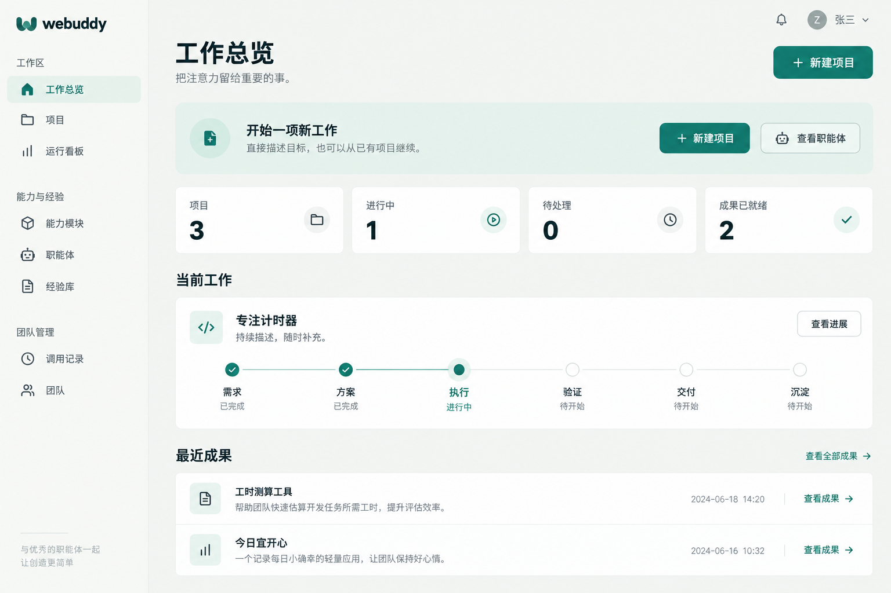
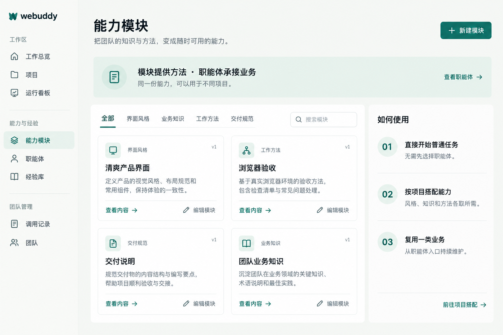
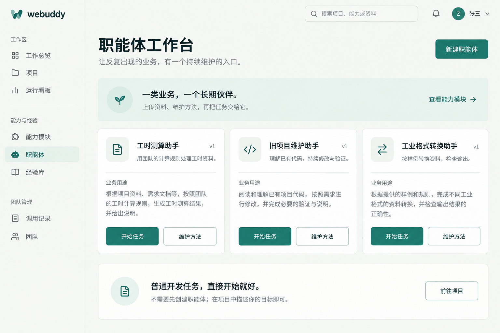

# webuddy · 外置能力与业务入口

2026-09-10。本设计先通过内置图像模型生成三个独立页面，再提取布局、视觉规范和交互要求，最后修改界面。生成提示词完整保存在 [prompts.json](prompts.json)。工具未暴露模型版本选择，因此不宣称使用某个指定版本。

## 设计哲学

webuddy 是持续工作的托管执行底座。普通开发直接进入项目，不强制选择职能体；六环看板帮助梳理目标和观察进展，不增加人工审批关卡。

| 概念 | 职责 | 产品位置 |
| --- | --- | --- |
| 执行底座 | 会话、工具调用、失败恢复、验收和成果归档 | 项目、运行看板 |
| 能力模块 | 可版本化的知识、风格、工作方法和交付规范 | 能力模块库、项目能力组合 |
| 工具插件 | 真实操作能力与环境依赖，如部署、域名绑定 | 后续独立设计；不以提示词赋权 |
| 职能体 | 面向重复业务的长期入口，维护方法、资料与验收要求 | 职能体工作台 |
| 经验库 | 已有执行经验、候选能力与提升记录 | 原“工作能力”页面，数据保留 |

目标关系：职能体引用模块版本与工具配置，而非复制另一套提示词。模块描述适用条件、提供内容、依赖与验收样例。目录先供识别，正文按任务需要加载；一个执行负责人可使用多个模块，模块数不等于子代理数。

以上是演进原则，不意味着本次已完成执行层重构。当前模块仍按项目固定版本、注入任务；原职能体独立管理 Skill 和配置。此次不迁移业务数据、不新增模型调用、不改权限，也不展示尚未实现的“保存组合为职能体”“安装工具”按钮。

## 三张设计参考与提取

### 01 工作总览

视觉优先级：新工作入口 → 当前工作与必要决策 → 六环进展 → 已就绪成果。左侧导航按工作区、能力与经验、团队管理分组。上方浅绿入口带约 100–125px 高，标题 21px、说明 14px，右侧清晰动作。四列摘要使用等宽白色平面；主项目占满内容宽度。成果直接显示，减少折叠寻找。六环仍保留真实阶段计数和可点击入口，不把记录数伪装为验收通过数。

### 02 能力模块

视觉优先级：模块用途 → 类别/搜索 → 内容与编辑 → 如何使用。概念说明使用浅绿横条；库占约三分之二、使用说明约三分之一。模块卡两列，白面细边框，图标 42px、标题 17px、说明 14px；版本保持次要。项目内仍显示实际已选组合和保存动作。全局库导向项目搭配，不虚构当前项目。

### 03 职能体工作台

视觉优先级：业务用途 → 开始任务/维护方法 → 普通开发入口。首页改为三列目录，替代必须先从左栏选择才能看到内容的空白面。卡片以业务名称、当前版本、用途为主，操作直达已有真实路由。进入职能体后保留对话、历史、维护草稿、Skill 上传与成果；提供回到目录的入口。

图像中的张三、通知、全局搜索、具体日期、数字及示例职能体均属模型生成的示例，不作为真实产品数据或新增功能。实现使用已有接口数据；不存在的职能体不自动创建。使用上传 Skill 的准确文案，避免暗示任意 ZIP 都可以作为 Skill 直接运行。

## 视觉规范

- 侧栏 216px；画布 #f3f5f2，侧栏 #f7f8f5，白色内容面。
- 文字 #20332f，说明 #687872，主操作 #16786b，浅绿 #e5f1eb，边框 #dce3dd。
- 主区域约 32–38px 留白；模块/职能体间距 18–22px；面板圆角 12px，按钮 8px。
- 页面标题 27–36px；区块标题 18–21px；正文 14px，行高 1.8。系统中文无衬线字体，无外部字体请求。
- 依赖边框、留白和层级；不添加装饰图表、虚构收益数字、无效按钮或大面积渐变。
- 1200px 以下职能体两列，700px 以下单列；模块说明栏在 1150px 以下下移。移动导航保留原有抽屉与键盘入口。

## 交互与状态

普通任务：总览 → 新建项目 → 描述目标 → 运行看板 → 成果/反馈。

复用业务：职能体目录 → 开始任务（做事模式）或维护方法（维护模式）。维护草稿沿用既有版本更新流程。

组合能力：模块库 → 项目 → 能力与知识 → 选择模块 → 保存组合。保存影响新任务，运行中任务保留版本。

所有列表保留加载、真实空态和错误状态。职能体地址不存在时明确提示返回目录；更新失败不把错误伪装为空目录。模块选择、编辑和保存的版本冲突保护保持不变。

## 后续执行层工作

1. 引入职能体对模块版本的引用及旧配置兼容层，明确项目覆盖与冲突规则；以实际请求中的快照验证。
2. 从全量正文注入演进到能力目录与按需读取，记录读取原因、版本与上下文发送量，验证没有丢失业务规则。
3. 把经过样例验证的项目组合保存为职能体；上传项目 ZIP 与上传 Skill 保持清晰区别。
4. 单独设计工具插件依赖、授权和运行环境；模块声明依赖不自动获取凭据。

本次实现范围为上述三个页面与共享导航、样式；不以视觉改版宣称执行层工作已完成。

## 验证记录

前端构建与类型检查通过；现有 17 个测试文件、146 项测试通过。隔离演练环境中使用真实 Chrome 检查三个页面在 1536、1024、390px 下均无横向溢出；核对截图与参考图的布局关系。实际验证目录进入做事/维护两种模式、模块搜索空态与清空恢复、编辑弹窗及 Escape 关闭，页面无脚本异常。未为验收调用付费模型或创建线上示例职能体。
