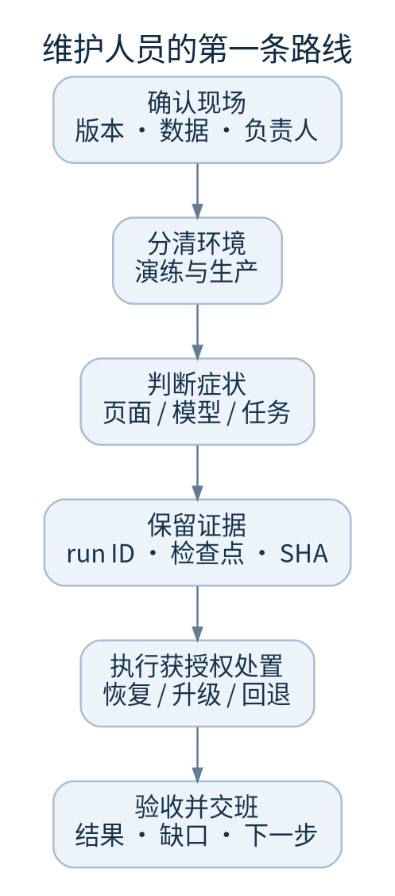

# webuddy 维护人员手册

让接班工程师能找到现场、判断风险、恢复服务，并留下可核验的记录。

本书面向第一次接手 webuddy 的维护人员。重点是当前 Python 控制面、React 工作台、持续编码与证据恢复。阅读前不要求理解所有 Agent 术语。命令默认在仓库根目录执行，示例路径须由维护人员替换；任何生产写入都应经过本组织的变更授权。



## 先做这五件事

1. 记录当前代码提交、服务名、运行用户、数据目录、工作区根目录和公共源地址，使用[交接表](handoff.md)。不要把密钥抄进工单。
2. 区分[本地演练与生产](startup.md)。演练账户只用于脚本创建的隔离目录。
3. 阅读[进程边界](architecture.md)：同一个控制数据库只能有一个持锁协调器。
4. 遇到任务中断，先看[恢复决策](recovery.md)。不要删锁文件、重写数据库状态或重置任务分支来“变绿”。
5. 升级前完成[完整备份与隔离恢复验证](backup-restore.md)。一次运行的导出包不能恢复整套服务。

## 按问题查找

| 你看到的现象 | 先打开 |
| --- | --- |
| 登录不了、页面白屏、接口 403 | [启动与登录排查](troubleshooting.md) |
| 任务一直运行、服务重启后停住 | [任务状态与恢复](recovery.md) |
| 测试明明通过，为什么不复用 | [检查与验收证据](checks-evidence.md) |
| 模型安装了仍不能执行 | [模型与网关](providers.md) |
| 找不到结果、磁盘持续增长 | [数据与存储](storage.md) |
| 计划更新或回退版本 | [升级与回滚](upgrade-rollback.md) |
| 接手值班或交给同事 | [运行检查与交接](handoff.md) |

## 版本和可信范围

- 代码基线：`main` 的 `5ff1f4c530cecd4b60695e6410ba3a310db51a94`；本地恢复增量为 `f10d7ba7cade5159b02eb32c4c835dc279a686a5` 与 `89563d530c6f688b5d3154a3568c0480c11f0925`
- 内容核对日期：2026 年 9 月 30 日；本书应与同一提交的源代码一起交付
- “已实现”表示当前源码和相应测试存在，不等于目标服务器已升级、真实模型已测试或生产负载已验收
- “维护建议”表示操作规程，不是产品自带的自动化功能
- “待确认”表示需要现场证据或业务决策，不应靠文档推断

本书中的架构图、流程图是可编辑说明图，不是运行截图。图源位于 `diagrams/`，PNG 用于 GitBook 稳定显示，SVG 用于放大阅读。真实界面截图若提供，会单独标注演练环境、日期和获取方法。

## 本地阅读

```sh
python3 docs/handbook/tools/handbook.py check
python3 docs/handbook/tools/handbook.py build
python3 -m http.server 8768 --bind 127.0.0.1 --directory docs/handbook/_preview
```

浏览 `http://127.0.0.1:8768`。也可直接打开离线包中的 `index.html`；正文、图像与导航不需要外网。此预览是本仓库提供的静态阅读器，不是 GitBook 官方渲染器。接入 GitBook 的步骤与验证边界见[维护这本手册](maintain-handbook.md)。
