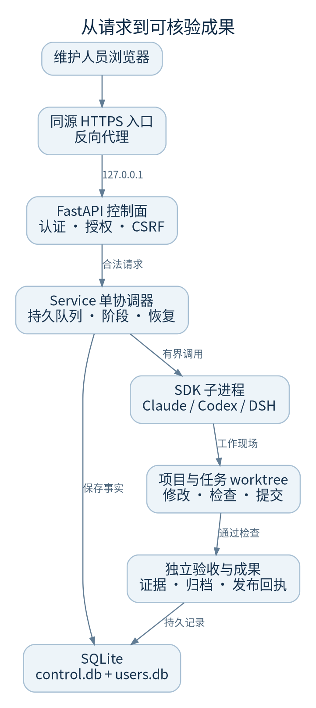
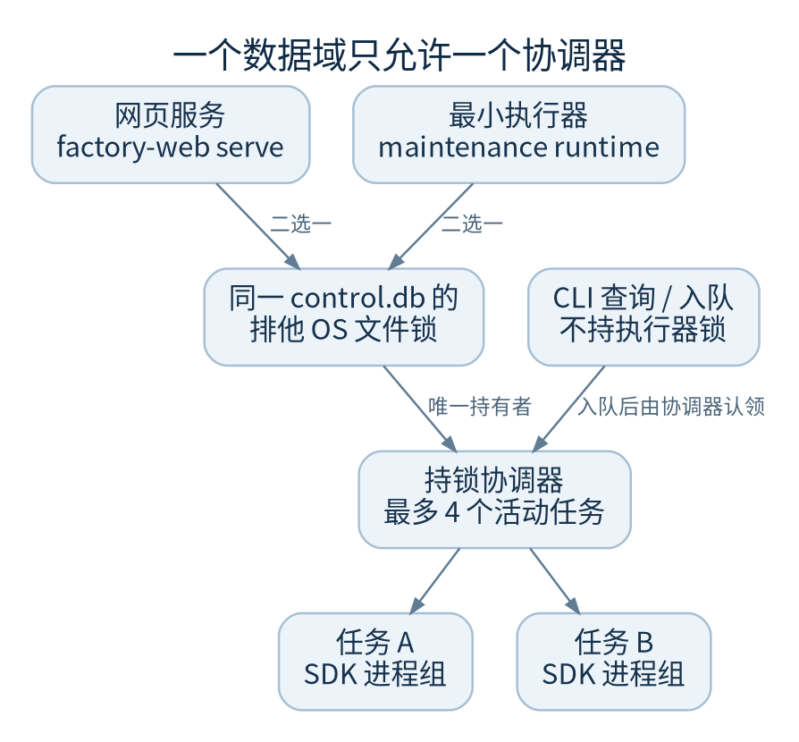
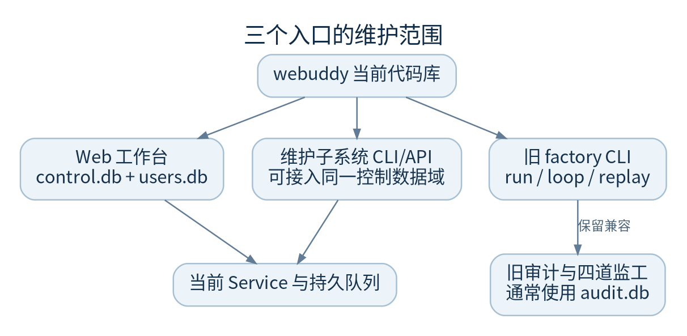

# 架构与进程边界

先分清谁负责接收请求、谁保存事实、谁真正执行。一次浏览器断线只说明连接结束，不能据此认定模型子进程或任务已经停止。

本图描述仓库支持的部署结构，不表示已在任何生产主机配置。公网 HTTPS 入口、服务账户与路径必须现场核对。

## 从界面往下看

- 工作台：`frontend/src/` 的 React 页面，通过相对路径 `/api/*` 请求后端；构建产物为 `frontend/dist/`
- 网关：`factory/control/app.py` 建立 FastAPI 应用，统一认证、来源与 CSRF 边界；正式 CLI 固定监听 `127.0.0.1`
- 服务编排：`Service` 管理持久任务队列、运行阶段、检查点、取消信号与周期操作观察
- 持久记录：`Store` 使用 SQLite 保存项目、运行、事件及多种扩展表；用户、会话与团队授权在独立 `users.db`
- 执行适配：`SDKRunner` 在独立子进程中加载 Claude、Codex 或 DSH SDK；实际模型请求由该适配层发出
- 工程现场：持续编码任务使用独立 Git worktree；配置检查和独立验收是不同步骤

## 单协调器和有界并发不是一回事

`DurableQueue.acquire()` 对控制库同名的 `.worker.lock` 文件使用操作系统 `flock`。网页服务和 `webuddy-maintenance runtime` 是两种执行入口，同一个数据域只能选一个长期运行。CLI 查询或入队不等于再启动一个执行器。

`Service` 内部线程池最多四个工作线程，调度器最多记录四个活动任务；运行配置中的 `max_parallel` 则是执行内部并行限制。它们不是横向扩容方案。不要用多个 Uvicorn worker 或多个副本共享同一个控制库。

锁文件存在不代表进程活着；内核锁及 worker 进程组证据才有意义。手动删除锁文件可能创建两个不同 inode 上的锁，破坏单写者边界。

## 不同名称代表什么

| 名称 | 边界 | 维护时要记住 |
| --- | --- | --- |
| 项目 | 仓库、基线、可信检查、策略 | 同名页面不是独立数据库 |
| 运行 | 一次需求及其阶段与历史 | 记录 run ID 和计划 revision |
| 职能体或能力包 | 版本化岗位配置、工具或 SOP | 有配置不代表依赖与沙箱可用 |
| 模型会话 | 供应商侧连续上下文 | 会话 ID 不是本地任务账本 |
| 成果归档 | 某验收提交及构建文件快照 | 独立于 GitHub PR，也独立于整站备份 |
| 运维维护子系统 | CLI、API、页面共用业务核心 | 不应再配一套冲突的执行器 |

## 新旧产品面分开维护

旧 `factory run / loop / queue / replay` 仍保留，旧审计库通常为 `audit.db`；它的四道监工、预算和落地规则不能直接套用到当前控制面。旧 dashboard HTTP 服务已移除。既有生产主机的部署说明使用 `factoryweb.service`，不要顺手启用 `factoryapi` 或第二个监听器。

组织管理控制台已提供只读管理视图；预算分配、完整组织审批、委派与 Agent 治理不能因页面已有组织树就视为已上线。当前应用的成员项目访问控制也不等于已经通过企业多租户隔离认证。

## 代码落点

`factory/control/app.py::_build_app/main`、`service.py::Service/_dispatch`、`autonomy.py::DurableQueue`、`providers.py::SDKRunner`、`provider_activity.py`、`frontend/src/App.tsx`。继续看[启动](startup.md)或[数据](storage.md)。
