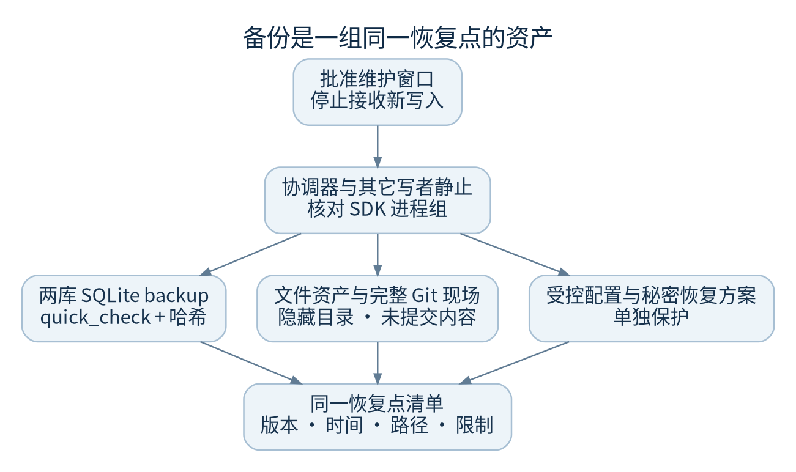
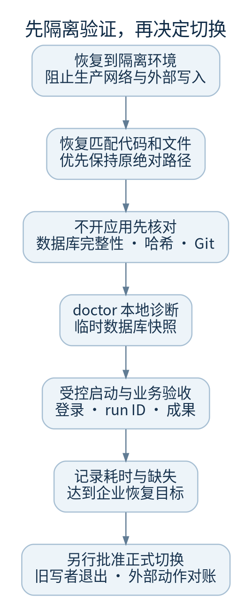

# 备份与恢复演练

先证明能恢复，再把备份任务标为成功。产品没有跨数据库、文件和 Git 的一键事务备份；下面是维护规程，不是自动备份功能声明。



## 备份前的停止条件

- 已批准维护窗口、影响范围与回退方案
- 停止接收新写入，并停止对应数据域的协调器
- 核对没有其它 CLI 写者、SDK 进程组或构建进程继续写工作区
- 外部发布结果已对账；若仍不明，不把该任务标作已完成
- 记录源提交、配置 revision、UTC 时间、数据和工程路径、待处理 run ID

停止 systemd 单元不一定证明所有 SDK 子孙进程已退出。应结合实际服务 cgroup 和 `provider_activity` 的进程组证据检查。未经许可不要杀未知进程。

## 数据库快照

仓库提供 `tools/sqlite_snapshot.py`，只读打开已存在的两份源库，调用 SQLite backup API，检查 `quick_check` 并生成大小/哈希清单。快照输出转换为单文件 DELETE journal 模式并关闭连接后计算哈希；验证拒绝 WAL/SHM/journal 边车文件。目标目录必须不存在；脚本不停止服务、不捕获 worktree、不额外复制外部凭据文件，也不提供跨库原子性。数据库快照本身含账户、会话及业务记录等敏感数据，必须受控保存。

```sh
# 仅在所有写者已静止后；BACKUP_DB 指向新的、受控本地目录
python3 docs/handbook/tools/sqlite_snapshot.py   --source-dir "$FACTORY_CONTROL_DATA"   --destination "$BACKUP_DB"
```

运行中的单库 backup 可得到单库一致快照，但连续备份两库并不能保证跨库同一时点。不要用此命令给活跃生产环境贴“完整一致备份”标签。

## 同一恢复点还应保存

1. 控制数据目录中非数据库文件，包括 `deliverables/` 及现场实际使用的其他资产
2. 项目主仓库、Git 对象库和 linked worktree 元数据、任务目录、未提交文件、导入证据
3. unit、代理配置及版本、锁文件对应的依赖版本、当前前端产物或可复现构建信息
4. 外部凭据、SDK 认证与部署私钥的安全恢复方案，由授权管理员单独保存

保持隐藏文件、权限、可执行位及原目录关系。对静止状态做完整目录快照时，保留存在的 SQLite WAL/SHM/日志文件；不要从不同时点拼接数据库与 WAL。备份仓库应有加密、访问控制及离线/异地副本策略，参数由企业要求决定，本书不臆定保留期限。

## 隔离恢复验证



1. 在不连接生产目标的隔离主机/容器恢复。启动恢复副本可能自动接续队列，因此验证前必须通过环境隔离阻止外部网络和生产写入；不要仅依赖“应该不会触发”
2. 恢复与备份匹配的代码版本、Python/Node 依赖与文件资产；优先保留原绝对路径
3. 先不开应用，运行 `sqlite_snapshot.py verify` 检查两库完整性及清单哈希；核对文件快照清单和 Git 引用
4. 用同版本 `factory-runtime doctor --db ...` 检查临时快照；此时只做本地诊断
5. 授权管理员在隔离副本验证登录、项目/运行数量、指定 run ID、最近事件 ID、成果 manifest 与文件哈希
6. 在明确授权的隔离演练任务上验证检查恢复，不自动恢复生产发布动作
7. 记录恢复耗时、缺失内容和未验证项。只有达到企业设定的恢复目标后，才将此次备份列为可用

校验命令：

```sh
python3 docs/handbook/tools/sqlite_snapshot.py verify --snapshot "$BACKUP_DB"
```

保留快照只读，演练时复制一份使用；不要在原快照上启动应用。SHA-256 清单用于完整性比对，不是防恶意篡改的数字签名，清单本身也须受控保存。

`quick_check=ok` 只说明 SQLite 结构未检测到错误；还要核对业务数据和外部文件，不能单凭这一个结果认定灾难恢复成功。

## 正式恢复与会话风险

正式切换由获授权维护负责人执行，先保存故障现场，再保证旧写者完全退出。代码回滚不自动回滚数据库结构；是否可兼容必须在隔离副本证明。

恢复 `users.db` 会恢复当时的账户、授权和会话记录。恢复前后需按企业安全要求处理旧会话和凭据风险，不手工删除表或恢复弱口令。路径变化和跨机迁移没有通用自动保证，需工程专项验证。

代码：`runtime_cli.py::_make_settings` 展示只读源库 backup 用法；`store.py::Store` 的 WAL；`auth.py`、`governance.py`、`continuous.py`、`deploy_targets.py` 定义其余边界。
