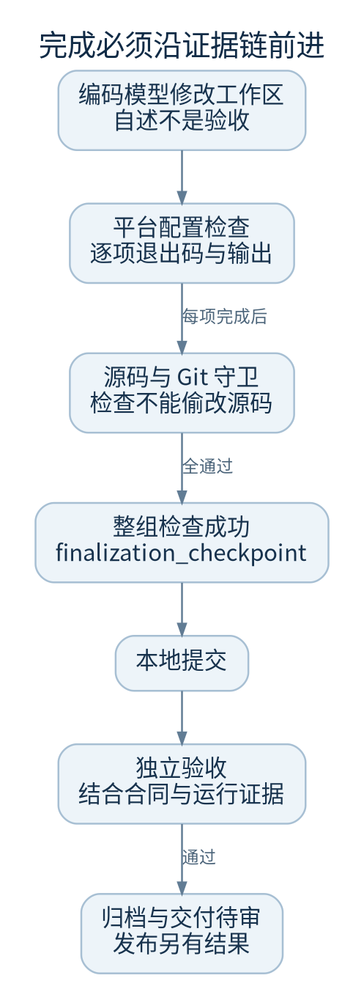
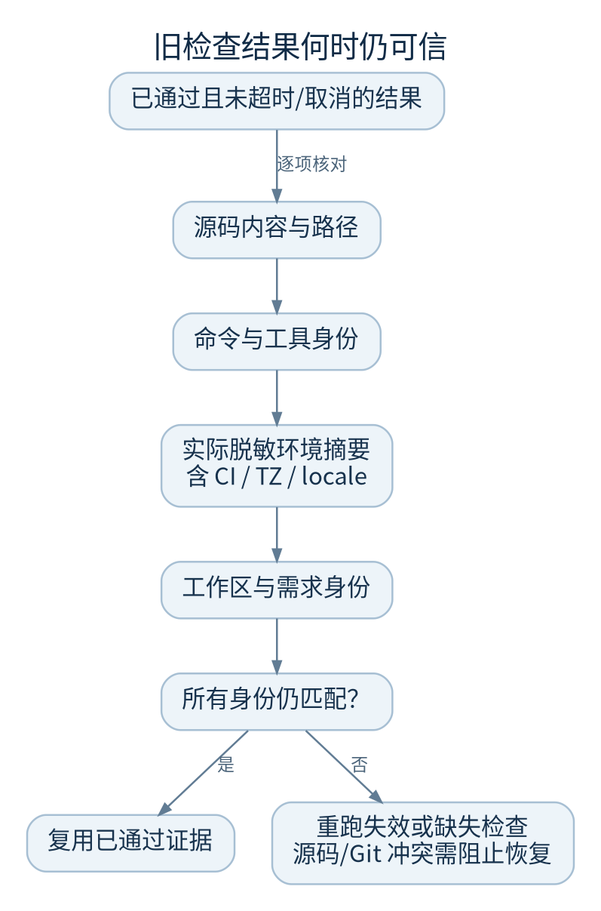

# 检查与验收证据

模型说“完成了”只是一次输出。维护人员需要看到可信命令的结果、源码身份和独立验收，再判断某个提交是否可以交付。

## 三种证据不要混用

1. 编码期间的命令：SDK 转发的结构化工具结果，能说明模型做过什么；未必覆盖项目配置的全部可信检查
2. 平台可信检查：项目保存的命令数组，由平台在编码后执行；缺少要求的检查不能用口头说明替代
3. 独立验收：结合当前合同、代码与运行证据评估结果；不是数学正确性证明，也不能伪造浏览器或部署成功

## 可复用检查的身份

检查身份绑定检查命令及工具信息、源码内容与路径、工作区身份、执行环境摘要和验收要求。当前 v2 环境指纹使用实际经过 `check_env()` 过滤后的完整环境摘要，因此 `CI`、时区、区域设置等变化也会令旧证据失效。检查点不保存原始环境值。

成功退出仍不充分：检查完成后还要确认没有改写受保护的源码或破坏 Git 边界。若检查会自动格式化或改源码，应把格式化放在编码/构建步骤，再用只读检查验收。

## 如何登记靠谱的检查

- 使用明确的 argv 数组；核对命令在新 worktree 中能找到依赖
- 测试数据放临时目录，清理可重复；固定必要随机种子与版本
- 失败用非零退出码；不能只打印 FAILED 却退出 0
- 不把生产发布、外部消息、收费、真实业务迁移混进测试
- 超时与输出应有界；不要依赖交互输入
- 记录检查的适用范围，例如单元测试、构建、端到端和安全隔离各证明什么

## 容器化 Python 检查

维护代码库探测到 `Dockerfile.test`（优先）或 `Dockerfile` 时可建议容器内 `pytest`；采纳建议后才切换，不会静默覆盖已有主机检查。

构建使用无网络模式，容器也禁网、以非 root 执行，源代码只读挂载后复制到容器临时目录。必须预先准备基础镜像与测试依赖。找不到 pytest 或 Docker daemon 时应修复镜像/环境，不能退回不受控的宿主机执行来凑绿灯。

## 证据诊断顺序

读检查名、argv、退出码、超时/取消标记、stdout/stderr，再比较配置 revision 与源码提交。若只是环境指纹变化，重新跑可信检查是预期行为；若源码签名或 Git 归属不符，保留现场并升级处理。

代码：`continuous.py::verify_changed_tree/revalidate_recorded_checks`、`evidence_identity.py`、`verification_evidence.py`、`harness/checkenv.py`、`maintenance_subsystem.py`。测试入口见[测试与 CI](testing-ci.md)。
