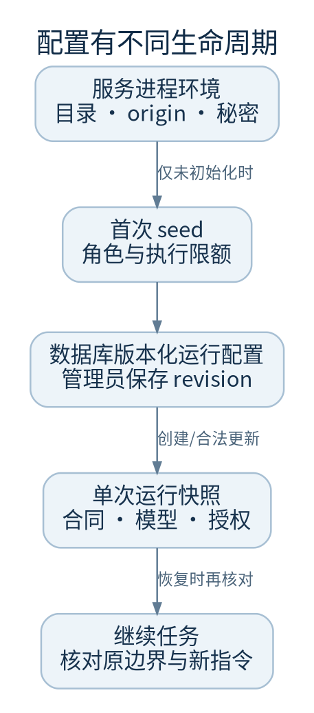

# 配置来源与变更

先确认设置由哪里读取，再修改。进程环境、数据库中的运行配置和单次运行快照有不同生命周期。

## 经代码核对的常用环境变量

| 变量 | 默认或语义 | 注意事项 |
| --- | --- | --- |
| `FACTORY_CONTROL_DATA` | `~/.factory/control` | 控制库和用户库所在目录 |
| `FACTORY_WORKSPACE_ROOT` | `~/projects` | 受管工作区范围；需保留完整 Git 关系 |
| `FACTORY_PUBLIC_ORIGIN` | `http://127.0.0.1:8788` | 无路径，公网 HTTPS，须与浏览器一致 |
| `FACTORY_STATIC_DIR` | 仓库 `frontend/dist` | 空目录会导致页面 503 |
| `FACTORY_TASK_TIMEOUT` | `14400` 秒 | 首次运行配置默认值之一，不代表每轮都从环境刷新 |
| `FACTORY_PLANNER_PROVIDER` 等四角色变量 | 默认 `codex` | 首次种子配置；模型 ID 默认为空 |
| `FACTORY_PLANNER_MODEL` 等四角色变量 | 实际账户支持的模型 ID | 不要填 URL 或命令 |
| `FACTORY_GITHUB_TOKEN` | 空时无 GitHub publisher | 秘密，另行授权与安全保存 |
| `FACTORY_WEBHOOK_SECRET` | GitHub webhook 签名验证 | 秘密；不要公开 webhook 密钥 |
| `FACTORY_DEPLOY_KEY_DIR` | 无有效默认 | 须绝对路径且与数据和工作区隔离 |
| `FACTORY_EMBED_ORIGINS` | 空 | 允许的嵌入来源，不能随意扩大 |

角色为 `planner / cheap / standard / strong`，Provider 为 `claude / codex / dsh`。并非所有 Provider 对所有只读能力都有同样保障。

`FACTORY_CONTROL_DB` 是 doctor 的路径覆盖入口，`factory-web` 不以它代替 `FACTORY_CONTROL_DATA/control.db`。诊断时传 `--db` 最清楚，避免查了另一套库。

## 哪些修改会生效

`RuntimeSettings` 只在尚无配置记录时写入初始种子。数据库已存在时，改模型环境变量不会覆盖保存的角色配置。管理员应在运行配置页面读取当前 revision 后保存；过期 revision 返回 409，先刷新再修改。

项目检查、预算或基线等设置也带 revision。执行、审批、澄清等关键阶段有项目修改限制。不要为绕过冲突直接 UPDATE SQLite。

运行保留自己的合同、权限、模型和执行边界。调整超时后是否用于一次接续，必须看该运行的接续记录；不能假设所有在途调用立即获得新时限。

## 变更前后的证据

1. 记下设置 revision、作用对象、变更理由，不记录秘密值
2. 核对活动任务和兼容影响
3. 保存并重新读取页面，确认新 revision
4. 涉及模型时做有授权的只读连接测试，再做小任务
5. 记录测试 run ID、结果和回退方案

## 费用控制的两个层次

账户余额、账户级 Token 额度和最终扣费由网关决定。当前 `docs/gateway-billing.md` 和 `run_billing.py` 定义另一层边界：有限的项目单次运行预算会停止后续付费调用，`None` 表示仅监测。

维护时以实际运行配置、错误类别、审计事件及同版本代码为证据。未知费用可能占用预算，不能记零；并行在途调用和供应商用量结算存在边界，不承诺全局原子硬封顶。保存新设置不应被描述为自动恢复已暂停任务。见[已知边界](limits.md)。

代码：`runtime.py::_env_profiles/_insert_initial/update`、`runtime_cli.py::_default_db`、`app.py::_build_app`、`store.py::update_project`、`run_billing.py::_remaining_dollar_budget`。
