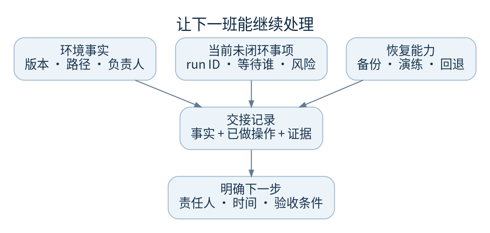

# 日常维护与交接

每次交班应让下一位工程师知道现在运行的是什么、有哪些任务不能丢、发生异常时从哪一份证据继续。



## 现场信息表

在企业内部受控位置填写，不把秘密值放进此手册或普通工单。

| 项目 | 本机实测值 |
| --- | --- |
| 服务负责人和备援负责人 | 待填写 |
| 服务名与运行 OS 用户 | 待核对 |
| 当前部署提交 SHA 与发布时间 | 待核对 |
| checkout 与前端产物路径 | 待核对 |
| 控制数据与工作区根 | 待核对 |
| 公共 origin 与反向代理负责人 | 待核对 |
| 外部 EnvironmentFile 路径 | 仅路径，不填写值 |
| 秘密恢复负责人及受控位置 | 不填写真实凭据 |
| 最近成功备份和隔离恢复记录 | 待核对 |
| 企业 RPO、RTO 和维护窗口 | 由业务负责人确定 |
| 正在等待人工的 run ID 与下一步 | 待填写 |

## 每次值班开始

1. 看当前异常与等待状态，不把已修复的历史失败重复当故障
2. 核对既有服务、执行器唯一性、磁盘和最近错误趋势
3. 对照上一班记录确认任务进展、预算/授权阻塞和外部回执
4. 确认最近备份可验证，恢复目标与当前业务要求一致
5. 只在发现异常或变更时执行进一步诊断，不无故消耗真实模型额度

## 发布前必须能回答

- 我们部署的精确版本是什么，是否还有未提交修改
- 哪些测试通过，哪些因环境或账号未测
- 哪份恢复点包含数据库、文件成果和完整 Git 现场
- 旧运行会如何恢复，是否存在不明外部写入
- 谁能批准切换、回滚和恢复后的数据取舍

## 值班记录模板

```text
时间与时区：
服务与提交：
现象和影响：
project ID / run ID / revision：
最后成功事件：
已核对的事实：
已执行操作和结果：
外部动作回执：
当前阻塞：
下一步、责任人、时间：
备份与恢复记录位置：
未验证事项：
```

尽量记录可验证事实，例如“检查 welcome 退出码 1”，而非“Agent 好像不聪明”。避免把模型的自述当修复证明。

## 升级处理边界

值班人员可依现有授权执行只读检查和既定可逆处置。源码/Git 身份冲突交工程负责人；秘密泄露交安全负责人；外部写入不明交该动作的责任人；数据恢复和回退数据损失由业务与技术负责人共同确认。不要让系统状态栏替人作风险决定。
