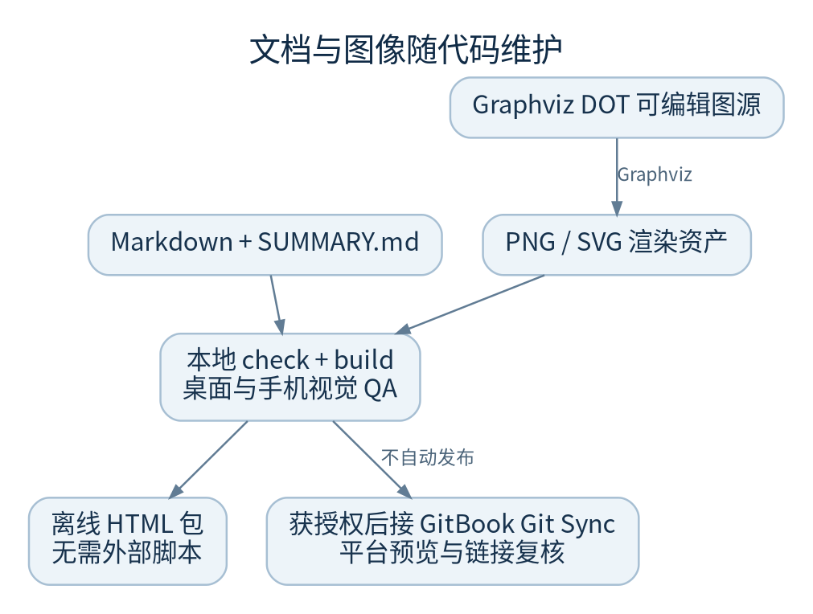

# 维护这本手册

文档与代码一起评审。只要状态、配置、路径或命令改变，就更新相关章节、图源和验证记录。



## 文件结构

- `README.md`：入口与快速查找
- `SUMMARY.md`：章节导航，每页仅出现一次
- 根目录 `.gitbook.yaml`：内容根为 `docs/handbook/`，入口为 README、导航为 SUMMARY
- `diagrams/*.dot`：Graphviz 可编辑图源
- `assets/*.png`：GitBook 正文使用的静态图；同名 SVG 可放大或二次编辑
- `source-map.json`：核心代码落点，供校验脚本验证存在性
- `tools/handbook.py`：无第三方依赖的本地校验和静态预览构建
- `tools/sqlite_snapshot.py`：局部数据库快照辅助脚本，不是完整备份产品

## 官方 GitBook 配置核对

按 GitBook 当前[内容配置文档](https://gitbook.com/docs/docs-as-code/git-sync/content-configuration)，`.gitbook.yaml` 控制一个空间的内容根与入口，`SUMMARY.md` 控制导航。新平台也支持站点级 `gitbook-docs.yaml`；本书没有已存在站点或空间 ID，因此不猜测它们，不创建站点映射。

接入时由文档负责人选择正确仓库、分支和 Project directory。若把空间直接映射到 `docs/handbook`，应在该映射目录使用 `root: ./` 的空间配置，而不是再次叠加 `docs/handbook`。不要随意更改已有站点空间的稳定 key。

GitBook 官方提供 [Mermaid 等集成的说明](https://gitbook.com/docs/guides/docs-workflow-optimization/quick-tips-to-improve-your-technical-writing-workflow-in-gitbook)。本书选择相对 PNG 图片与可编辑 DOT/SVG，避免依赖目标空间安装某个图表集成。这种纯图片引用的可移植性与自定义块不同，见 GitBook 官方[迁移核对说明](https://www.gitbook.com/blog/before-migrating-off-gitbook)。图为说明图，不伪装成产品截图；不保证任意 Markdown 渲染器都有相同集成功能。

当前交付没有连接 GitBook 账户、创建空间或发布内容。后续接入需要单独授权并确认受众和仓库权限。

## 编辑与预览

```sh
# 修改 Markdown 或 diagrams/*.dot 后
python3 docs/handbook/tools/handbook.py diagrams
python3 docs/handbook/tools/handbook.py check
python3 docs/handbook/tools/handbook.py build
# 单文件手机阅读版，图像全部嵌入
python3 docs/handbook/tools/handbook.py single --output reading.html
python3 -m http.server 8768 --bind 127.0.0.1 --directory docs/handbook/_preview
```

只有重绘图需要 Graphviz `dot` 与可用中文字体。仓库已经保存 PNG/SVG；日常阅读、链接检查和预览构建仅需 Python 3.12。静态预览支持本书使用的 Markdown 子集，不执行任意 HTML 或脚本。

预览默认输出 `_preview/`，在本书内部的 `.gitignore` 排除。图中文字、替代文本、图注和正文应相互一致。更复杂的图拆成多张，不把字体缩到手机无法阅读。

## 合并前检查

1. 命令是否来自当前 `--help`、脚本或 CI，而不是历史博客
2. 代码路径与 symbol 是否存在，正文是否忠实解释其约束
3. 所有相对链接、图片、SUMMARY 页面是否可达
4. 新图是否同时更新 DOT、PNG、SVG
5. 桌面与 390 像素手机宽度是否可读，表格是否有独立横向滚动
6. 实施状态、测试通过数、环境限制、未验证能力是否仍准确
7. 是否混入真实 token、密码、主机密钥或用户敏感项目内容
8. GitBook 导入后另看桌面/手机预览与导航，不能只看本地 HTML

## 本书的可访问性选择

正文使用简体中文、清楚的标题层次、描述性链接和每图替代文本。图内信息也在正文解释；不要求靠颜色识别状态。离线版有键盘跳转正文、当前页导航、手机折叠目录和无远程资源的阅读方式。

官方来源核对日期：2026 年 9 月 30 日。在线 GitBook 行为可能变化，接入或调整配置前重新核对官方文档。
