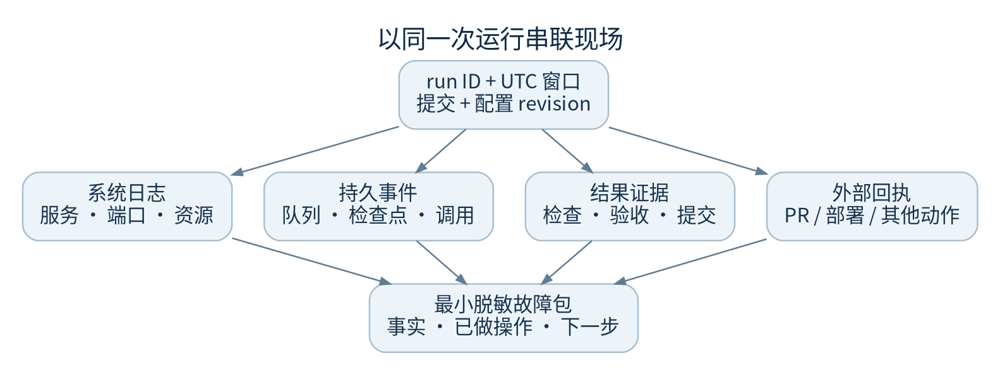

# 日志与现场取证

先锁定同一次运行和同一时间窗口，再联系系统日志、模型事件、检查结果及交付回执。各自单独看很容易把上次失败当作当前故障。



## 一份可用的故障记录

至少保存：发生时间及其时区、页面/任务入口、project ID、run ID、计划 revision、状态、错误类别、最近事件 ID、代码提交、运行配置 revision、最后一次成功步骤、是否已有外部写入。

事件时间使用 UTC ISO 格式；监控“今天”窗口可能使用配置时区。跨时区排查时先统一成 UTC，不把今天的窗口误认成最近 24 小时。

## 三个观察层

- 系统层：服务是否 active、端口和静态资源是否可达、磁盘和进程是否异常
- 编排层：持久队列、run 状态、`execution.checkpoint`、`run.resumed`、模型调用与用量事件
- 结果层：每项检查退出码和输出、独立验收、提交 SHA、成果 SHA-256、远端发布回执

本仓库没有可直接拿来声称“生产 SLO 已达标”的标准 Prometheus 健康体系。页面返回 200 仅证明 Web 路径可达；API 未登录返回 401 是认证边界正常，不能冒充全链路健康检查。

## 本地主机只读命令

```sh
systemctl is-active factoryweb.service
systemctl show factoryweb.service -p MainPID -p User -p WorkingDirectory
journalctl -u factoryweb.service --since "30 minutes ago" --no-pager -n 200
```

只在获授权主机上执行。日志可能含项目内容、路径或第三方错误文本；即使产品会脱敏，转交前仍要检查。不要上传全部 journal、环境变量、数据库或 SDK 原始 transcript 来代替有界证据。

应用层优先通过登录后的运行详情查看/下载记录。`/api/v2/runs/<id>/export` 是 Markdown 工程记录，其他证据导出与成果下载是不同入口。使用浏览器会话读取，不在工单放 cookie 或 CSRF token。

## 长任务的观察节奏

对安静但仍在执行的任务，查看最新结构化工具事件、持久检查点、子进程活动证据和实际阶段时限。不要只凭“几分钟没文字”中断。若需要人工判断，保留最后事件 ID；后续新事件可区分确实有进展与重复状态推送。

## 磁盘告警的处置

记录哪个文件系统逼近容量、最大目录类别和增长时间，不采集文件内容。重点盘点事件归档、成果、导入资料、项目 worktree 和依赖缓存。不要在运行中删除任务目录或用 SQL 清事件。先确定保留策略、引用关系和完整备份，再授权清理。

代码：`store.py::append/export_events`、`autonomy_routes.py`、`provider_timing.py`、`provider_activity.py`、`run_routes.py::export`、`deploy/factory-control.service`。
