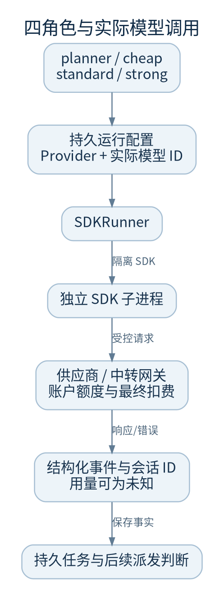

# 模型适配与网关

把网络、SDK、模型配置和产品阶段分开排查，能避免对着一个“模型错误”反复重启整套服务。



## 四个检查层次

1. 安装：Python 包是否存在，配套运行时是否存在
2. 能力与认证提示：版本接口是否兼容，当前服务用户是否有配置线索
3. 真实连接：指定角色和模型的显式只读探针是否通过
4. 任务执行：实际项目的工具、文件、检查和独立验收是否通过

`factory-runtime doctor` 不发起付费模型调用，使用控制库的临时快照进行诊断，不修改真实数据库。它看到的是当前 shell 用户与环境，可能与 systemd 服务完全不同。

```sh
.venv/bin/factory-runtime doctor --json   --db "$FACTORY_CONTROL_DATA/control.db"   --workspace "$FACTORY_WORKSPACE_ROOT"   --static-dir "$PWD/frontend/dist"
```

运行配置页面的显式探针会调用供应商，可能产生费用；只在已有授权下执行。当前 DSH 没有已验证的只读探针，返回 unsupported；不能把它改成假通过。

## 模型 ID 与持久配置

四角色并不对应固定模型品牌或统一型号。Provider 支持 `claude / codex / dsh`，模型 ID 由实际供应商账户支持。README 中的工作分工名称不是有效模型 ID 的证明。

SDK 由新子进程加载，模型错误、超时或子进程崩溃不应直接拖垮 API 进程。会话 ID 及时保存以便接续，重复相同 session ID 不算工作进展。长命令安静运行不等于卡死，不能自创短静默阈值杀掉正常任务。

## 错误分类

| 类别 | 常见证据 | 首选动作 |
| --- | --- | --- |
| `rate_limit` | 明确 429 | 核对网关限流与自动重试事件 |
| `upstream_unavailable` | 502、503、504、529 | 看网关状态和已有有限重试 |
| `network / timeout` | 连接类异常、超时标记 | 核对服务环境代理、DNS、出口、阶段时限 |
| `provider_error` | 非临时供应商或配置错误 | 查模型 ID、认证与权限，不盲目无限重试 |
| `cancelled` | 明确取消事件 | 核对操作者意图，不自动恢复为新付费调用 |

模型传输恢复和项目检查失败属于两条不同路径。测试失败通常需要修代码或测试环境，不能套上“网络重试”标签。

## 费用与执行边界

账户余额、账户级 Token 额度和最终扣费由中转站/供应商管理。当前项目有有限单次运行预算时，平台在后续付费调用前检查记录费用与未对账占用；达到上限后停止新调用。`budget_usd = None` 表示仅监测。不要把未知费用记作零。

Claude 原生调用预算也受用量结算时点约束，其他供应商和并行在途调用不具备同样的原子停止保证。不得承诺全局绝不越线。提高预算需要管理员明确操作，保存设置不等于自动重启所有暂停任务。

## 凭据与代理

凭据由安全的外部配置或 SDK 支持的认证方式提供，不写入仓库和手册。不要打印整个环境或复制 SDK 登录文件到工单。代理需在真实服务环境可见，桌面系统代理存在并不保证子进程继承。

代码：`providers.py::ProviderRequest/SDKRunner/failure_metadata`、`sdk_worker.py`、`runtime.py::inspect_runtime/profile_blockers`、`runtime_routes.py::probe`、`runtime_cli.py::_make_settings`、`run_billing.py`。
