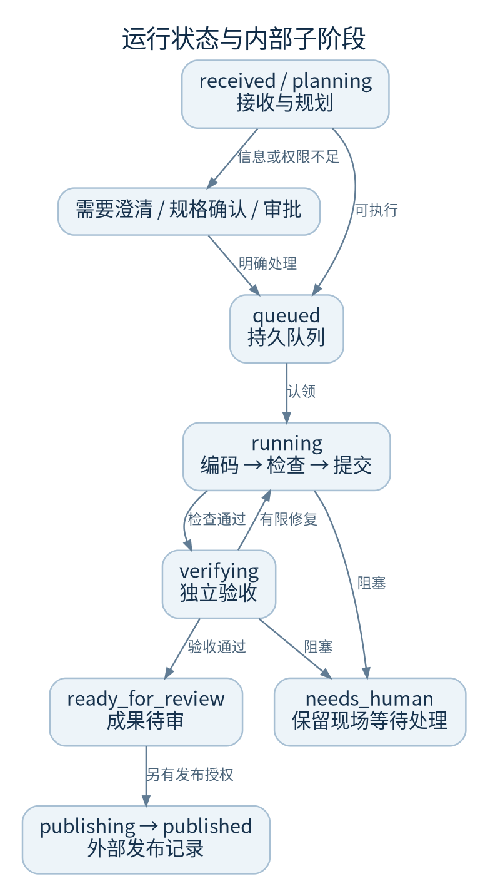
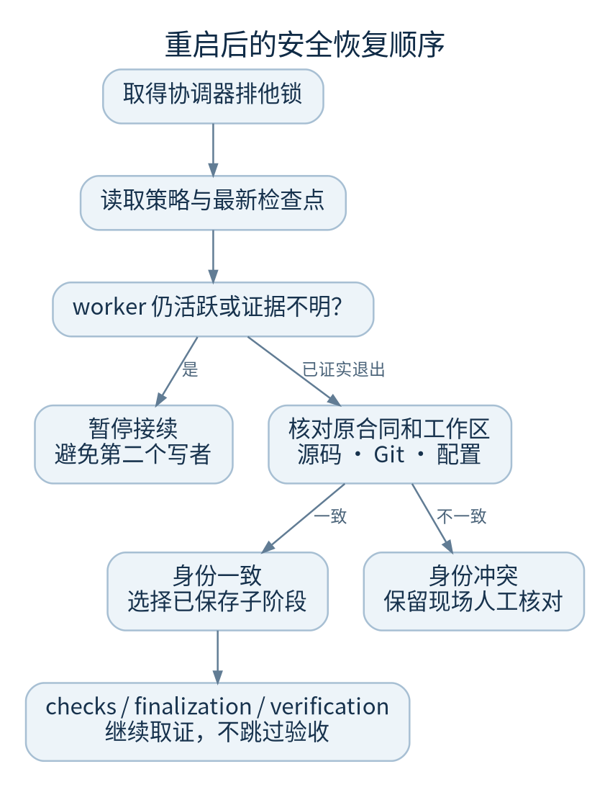
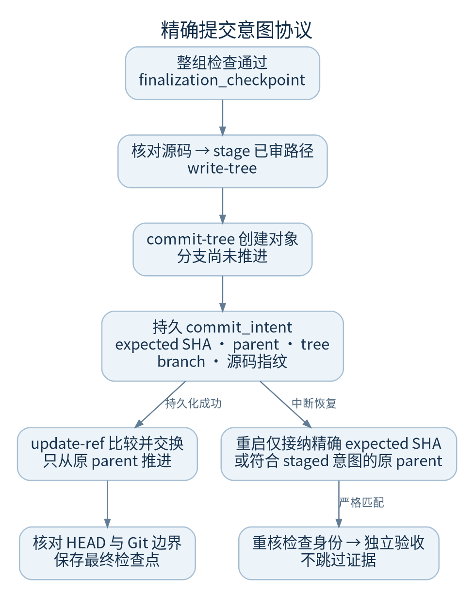

# 任务状态与恢复

先辨认中断发生在哪一步。平台能恢复已保存且身份一致的本地现场，但不会把未知外部写入当作“再执行一次就行”。

## 状态不是进程存活证明

| 状态或阶段 | 含义 | 维护动作 |
| --- | --- | --- |
| `received / planning / queued` | 已接收、规划中或等待执行 | 看队列、策略和最近事件 |
| `requirement_analysis` | 需求分析中 | 重启中断后需接续分析，费用未知不记零 |
| `needs_clarification` | 等待需求补充 | 回答实际问题，不反复重试 |
| `awaiting_spec_confirmation / awaiting_approval` | 等确认或授权 | 由有权限的责任人决定 |
| `running` | 执行、修复或平台检查中 | 看子阶段和检查点，而非只看标签 |
| `verifying` | 独立验收中 | 区分验收不通过与验收连接失败 |
| `ready_for_review` | 本地交付待审 | 检查成果和验证记录 |
| `publishing / published` | 外部发布处理中或已记发布结果 | 发布不等于合并或生产部署 |
| `needs_human` | 保留现场，需处理阻塞 | 先读 reason、错误类别和证据 |

具体状态以该运行返回值为准；这些不是可供运维人员手工写入的数据库开关。

## 重启后的判断顺序

1. 服务必须先取得控制库协调器锁
2. 保存中的运行会核对恢复策略；并非所有任务都开启 `resume_on_restart`
3. 持续编码运行读取最新持久 `execution.checkpoint`
4. 检查原 worker 活动锁和进程组；证据未知时保守阻止两个写者
5. 校验工作区、Git 边界、原需求与授权、检查配置和模型条件
6. 选择 `checks / finalization / verification` 等已证实可继续的阶段；其余路径按执行恢复规则处理

`execution.checkpoint` 是追加事件中的恢复事实。供应商 session ID 可支持会话接续，但不能替代检查点、Git 状态和原合同。

## 检查阶段恢复已实现

编码结束、第一项可信检查开始前保存 `checks_checkpoint`，每项完成并通过源码守卫后更新进度。服务退出后，检查阶段恢复不重新调用编码模型。

已通过的检查只能在源码、命令、工具、脱敏执行环境及需求身份一致时复用。失败、超时、取消、缺失或过期的证据不能当成通过；变化的检查重新执行。`checks_checkpoint` 不等于 `finalization_checkpoint`，更不等于已交付。

检查不是通用 exactly-once：命令结束与结果持久化之间仍可能退出，恢复时会重跑。所以检查必须可安全重复，不应包含部署、扣款、发消息或生产数据迁移。

## 精确提交意图恢复已实现

当前本地增量 `89563d5` 在整组检查通过后，只暂存已核验路径、取得 tree，再创建尚未挂到分支的确定提交对象。平台保存 `commit_intent`，绑定 expected SHA、单一 parent、tree、完整 branch ref、路径、原签名与暂存后签名；持久化成功且未取消后，才用 `update-ref` 比较并交换推进专用分支。

重启接纳的是精确 expected SHA，不是“内容看起来相同”的另一个提交。原始提交对象的 parent/tree、非 HEAD Git 元数据、源码干净状态、意图与整组检查点都必须匹配。意图已存但 CAS 前退出时，仅精确匹配的 staged 状态可以进入恢复。随后仍重核检查身份，再做独立验收。

取消只能回退本次自己的预期提交或原 parent，且符号分支仍须相同；发现其他写入者时拒绝覆盖。新需求必须回到编码路径，不能被本地验收恢复吞掉。

仍有明确边界：`git add` 完成但意图尚未持久化的硬崩溃可能安全停止，因为新增文件在旧签名中的表示已变。HEAD 未推进、源码保留，需要核对现场。不要宣称所有提交崩溃窗口都已自动恢复。当前测试与未验证范围见[验证记录](verification-record.md)。

## 恢复现场时不要做

- 不删除 `.worker.lock` 或 `provider-activity` 记录来强迫启动
- 不对任务 worktree 做 `git reset --hard`、`git clean -fd` 或强制改分支
- 不把“确认没进程”简化为浏览器断线或 PID 不存在
- 不自动重发 `publishing` 阶段的外部动作，先核对远端回执
- 不将新需求当空白继续；补充需求可能改变原验收合同

代码：`recovery.py::recover/_continuous_resume_stage`、`continuous.py::execute_continuous`、`provider_activity.py`、`effective_contract.py`。继续看[故障树](troubleshooting.md)。
