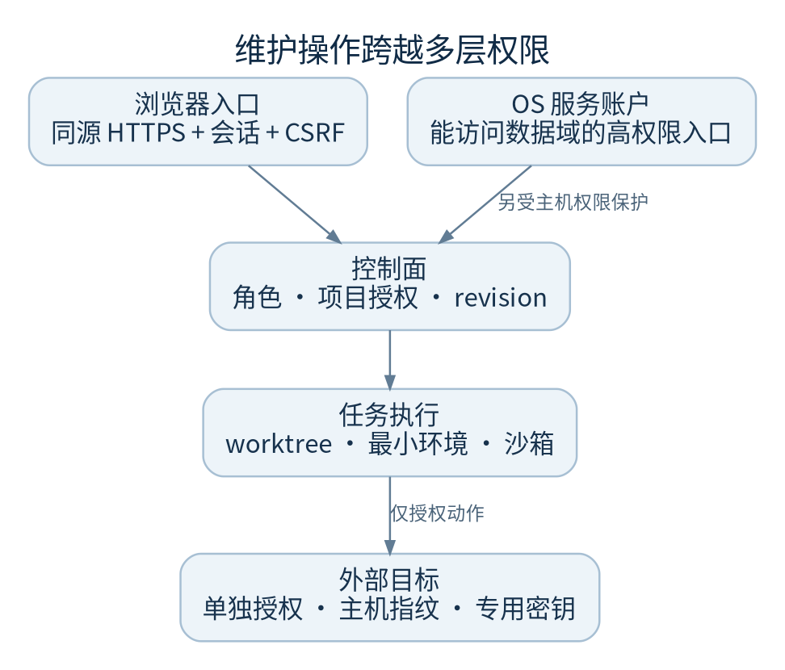

# 安全边界与权限

维护人员拥有主机权限时，能越过很多应用层保护。规程必须让高权限操作可追溯，并把秘密、生产目标和普通任务现场隔开。

## 应用入口

正式 CLI 只监听回环地址，公网以同源 HTTPS 反向代理接入。Cookie、CSRF 和 Origin 校验是应用认证边界；额外的代理 Basic Auth 不能替代它们。

账户密码采用带盐 PBKDF2，服务端保存可撤销会话。用户禁用、角色改变或密码更改会影响会话。不要通过数据库改角色、放松密码限制或跳过 CSRF 排查登录问题。

成员的项目可读、可执行范围由应用授权检查。组织管理视图权限不等于项目执行权限。当前系统面向可信团队，应对多租户、合规审计、数据驻留、SSO 等企业要求单独验证，不能仅因已有登录就承诺全部满足。

## 本地 CLI 是高权限运维入口

维护 CLI 使用本地 OS 用户身份，不采用 Web 会话的逐项目 ACL。能以服务账户运行 CLI 的人通常能触达该数据域，因此服务账户、主机登录、文件权限和命令审计都要独立管理。

## 执行边界

- SDK 子进程隔离故障，任务 worktree 隔离工程修改；两者都不是对任意恶意代码的完整安全证明
- 可信检查使用过滤后的环境；这减少凭据继承，但不等于整个文件系统不可读
- 能力包等路径要求平台沙箱；沙箱不可用时保持 fail-closed，不退化为裸执行
- 部署目标使用管理员登记、专用密钥及主机指纹校验；`ssh-keyscan` 发现的键不能自行当可信指纹
- 发布、合并、部署和回滚是不同动作，分别核对授权与结果

## 秘密与备份

`FACTORY_DEPLOY_KEY_DIR` 必须是独立绝对路径，不能与数据目录、工作区根或项目重叠，也不能使用符号链接。代码要求目录归服务用户、0700，私钥文件 0600。不要为了图省事放入仓库或 `control` 数据目录。

日志脱敏、归档过滤和不显示密码不能代替访问控制。配置目录、数据库、备份、模型上下文、项目资料都可能含敏感业务内容。向供应商支持或外部同事发证据前应做人工审查。

## 禁止作为应急捷径

关闭 TLS/来源校验、取消沙箱、共享管理员密码、复制真实密钥进示例、删除审计记录、强行放开工作区范围、把审批等待状态改为可执行。这些操作改变安全边界，应进入单独审查流程。

代码：`app.py::boundary`、`auth.py`、`auth_routes.py`、`governance.py`、`maintenance_cli.py::LocalOperatorIdentity`、`deploy_targets.py::key_dir/key_path`、`remote_targets.py`。

## 本地文件与审计值

新建认证、控制及旧审计数据库使用 0600，新建必要目录使用 0700；新主机服务模板还设置 `UMask=0077`。既有目录和文件权限不会被代码擅自修改。升级时由获授权维护人员检查主数据库、`-wal`/`-shm`/`-journal` 及备份的所有者和访问权限；只收紧主文件不能证明边车文件也安全。

结构化审计会按敏感键遮蔽密码、API key、访问 token、私钥等值，包括常见带前缀和 camelCase 字段；保留 token 用量计数和会话引用。脱敏降低误记录风险，不能取代最小权限，也不能保证任意自由文本秘密都会被识别。
