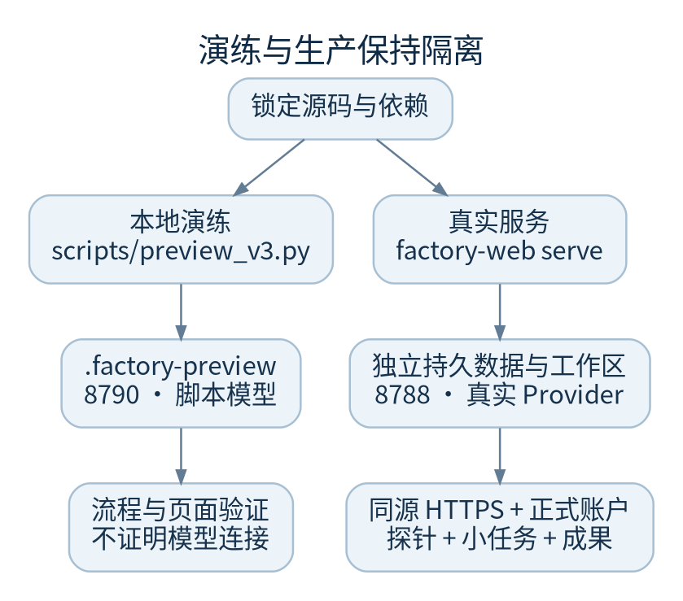

# 启动与环境分离

演练先验证流程和页面，生产再验证真实运行用户、数据、模型与权限。二者不能共用数据库、工作区或公开密码。



## 依赖基线

- Python 3.12 或更高，实际 CI 使用 3.12
- `uv`、Git；前端 CI 使用 Node 22 与 npm
- 真实 SDK 依赖由 `--all-extras` 安装
- Linux 中需要沙箱的能力必须验证 bubblewrap 真正可用；仅安装软件包不够
- 容器检查或浏览器运行时另需 Docker 等依赖，按项目实际功能检查

不要把“安装成功”“能导入 SDK”“已登录提示”“真实只读调用通过”合并为一个绿灯。

## 本地隔离演练

在新建或已确认的开发副本中执行：

```sh
uv sync --frozen --all-extras
npm --prefix frontend ci --no-audit --no-fund
npm --prefix frontend run build
.venv/bin/python scripts/preview_v3.py
```

访问 `http://127.0.0.1:8790`，公开演练账户为 `preview / factory-preview-only`。脚本只监听回环地址，使用 `.factory-preview/`，模型回复由脚本提供，Git 与检查经过真实控制链，不调用真实模型、GitHub 发布或云服务。此账户绝不能复制到生产。

首次启动建立示例仓库和需求。后续启动复用演练数据，不保证每次都重放完全相同的页面。要验收某状态，先记录实际演练运行 ID，不应把静态截图当成功回执。

## 真实服务的最小启动顺序

以下路径仅是新主机示意。既有部署必须沿用实际路径。

```sh
export FACTORY_CONTROL_DATA="$HOME/webuddy-data"
export FACTORY_WORKSPACE_ROOT="$HOME/webuddy-projects"
export FACTORY_PUBLIC_ORIGIN="http://127.0.0.1:8788"
mkdir -p "$FACTORY_CONTROL_DATA" "$FACTORY_WORKSPACE_ROOT"
.venv/bin/factory-web create-user operator
.venv/bin/factory-web serve --port 8788
```

`create-user` 在终端交互输入和确认密码，密码至少 12 字符；不要通过命令行参数、环境输出、截图或工单传递密码。账户初始为管理员。生产凭据由获授权的人员通过安全渠道配置。

`FACTORY_PUBLIC_ORIGIN` 必须为无路径的源地址。公网必须使用 HTTPS；正式服务 CLI 不提供 `--host`，由反向代理连接回环端口。不要将示例 HTTP 配置直接当作公网生产方案。

## 热更新开发

`frontend/vite.config.ts` 默认端口 5173，把 `/api` 转发至后端 8788。要通过开发页面登录，后端 `FACTORY_PUBLIC_ORIGIN` 应与浏览器地址完全一致，例如 `http://127.0.0.1:5173`，否则写请求可能因 Origin 不符被拒绝。

```sh
# 后端终端，先设置独立开发数据目录和工作区
export FACTORY_PUBLIC_ORIGIN="http://127.0.0.1:5173"
.venv/bin/factory-web serve --port 8788

# 另一个终端
npm --prefix frontend run dev -- --host 127.0.0.1
```

不混用 `localhost` 与 `127.0.0.1`；若 Vite 提示端口被占用并换了端口，先停下核对配置，不靠放松来源校验解决。

## 既有 Linux 服务

```sh
systemctl show factoryweb.service -p FragmentPath -p User -p WorkingDirectory -p EnvironmentFiles
systemctl is-active factoryweb.service
```

这两条只读命令不打印环境值。仓库 `deploy/factory-control.service` 是新主机示例；既有服务不应替换成这个名字。不要 `source` 外部 EnvironmentFile，也不要把 `systemctl show -p Environment` 或完整 unit 内容粘贴到支持请求。

## 启动验收

1. 页面返回正常 HTML 和静态资源；无前端产物时首页会返回 503 并提示构建
2. 应用登录可用，未登录 API 仍要求认证
3. 运行配置中工具、模型 ID、诊断结果与该服务的运行用户一致
4. 一个有明确验收的小需求完成检查、独立验收和成果下载
5. 若要求真实模型，必须记录真实探针或任务回执；演练不能代替

代码：`app.py::_build_app/main`、`scripts/preview_v3.py`、`frontend/vite.config.ts`、`pyproject.toml`、`.github/workflows/ci.yml`。
