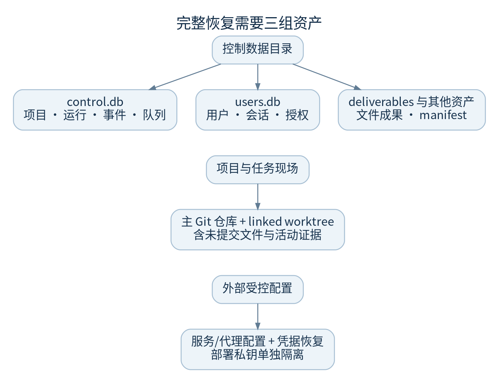
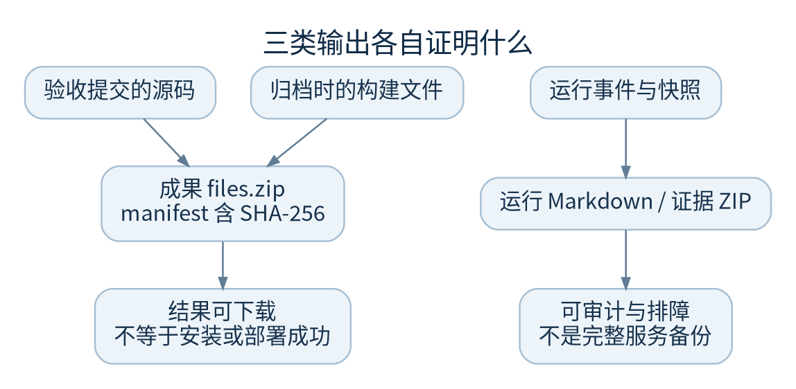

# 数据与存储地图

恢复能力来自数据库、完整 Git 现场和外部配置的组合。只拿到源码仓库或某次成果 ZIP，无法还原用户、权限、任务队列和在途工作。

## 必须盘点的资产

| 位置 | 包含内容 | 能否仅靠源码重建 |
| --- | --- | --- |
| `FACTORY_CONTROL_DATA/control.db` | 项目、运行、事件、队列、配置、知识和其他扩展表 | 不能 |
| `FACTORY_CONTROL_DATA/users.db` | 用户、会话、团队项目授权和用量账本 | 不能 |
| 控制数据下 `deliverables/` | `files.zip` 与 `manifest.json` | 可能依赖已消失的工作区，须备份 |
| 受管项目仓库及任务 worktree | Git 对象、分支、未提交工作、临时执行现场 | 未提交内容不能从远端还原 |
| 工作区根的 `.imports/` 等实际目录 | 导入证据及关联数据 | 按现场盘点，不忽略隐藏目录 |
| 外部 EnvironmentFile 与 SDK 认证配置 | 启动环境与凭据 | 在受控秘密系统中单独保存 |
| `FACTORY_DEPLOY_KEY_DIR` | 目标专用私钥 | 与数据、工作区严格隔离，单独受控备份 |
| 服务 unit 与反向代理配置 | 运行用户、路径、监听与 HTTPS | 需保存配置版本及恢复方法 |

这不是完整目录白名单。新功能可能增加资产，应盘点实际目录和源代码落点；不能只备份表中几个文件后承诺完整灾难恢复。

## SQLite 的边界

控制库启用 WAL。运行中直接复制 `control.db` 可能漏掉尚在 WAL 的事务。数据库备份使用 SQLite backup API；跨 `control.db`、`users.db`、文件成果和 Git 的一致性则需要停止所有写者或有经过验证的一致快照机制。

`events`、事件归档和多个审计表由触发器阻止更新或删除。不要用删事件来缩库、修状态或隐藏错误。仓库未提供通用数据保留与清理政策；需要清理时先确定法律/业务保留要求、引用关系和备份恢复流程。

## Git worktree 不能只复制工作目录

持续任务目录由项目仓库旁的 `.factory-<run>-...` 容器创建；其中的 `.git` 常是指向主仓库元数据的文件，而不是独立对象库。备份时要保存主仓库的 `.git`、linked worktree 的管理目录、任务目录及活动证据。

迁移到不同绝对路径可能使数据库引用、Git 链接和工作区守卫失效。优先在隔离主机保留原路径进行恢复验证，不把 `git worktree repair` 或手改数据库视为通用迁移方案。

## 成果和运行导出

成果归档路径是 `deliverables/<run-id>/<commit>/`。源码来自记录的验收提交，构建文件取归档时快照。默认扫描 `dist/ release/ out/`，也可由预先提交的 `.factory-delivery.json` 明确列出文件。

上限为 5000 个文件、单文件 256 MiB、合计 512 MiB。归档过滤 `.git`、秘密文件、符号链接和常见依赖目录；这层过滤不是完整的企业 DLP，交付前仍须审查内容。

运行 Markdown/ZIP 导出主要用于审计和排障，成果 ZIP 用于下载结果；它们都不能恢复整个服务。静态 HTML 预览采用受限沙箱，不等于完整应用端到端验证，安装包下载也不代表已签名或安装验收。

代码：`store.py::Store/export_events`、`auth.py::AuthStore`、`governance.py::connect`、`deliverables.py::snapshot/safe_path`、`continuous.py`、`project_import.py`、`deploy_targets.py::key_dir`。
