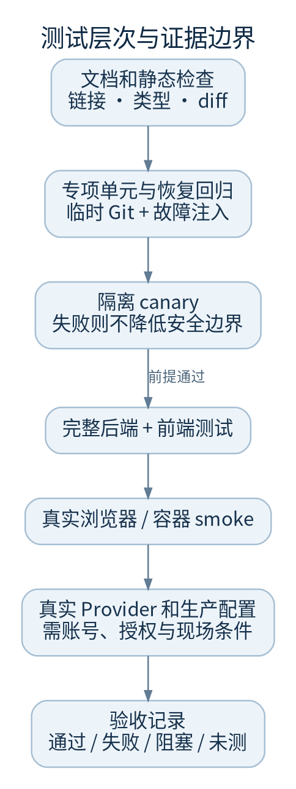

# 测试与 CI

每种测试证明不同的事情。发布记录应写清运行了什么、在哪个环境、对应哪个提交以及哪些项目仍未验证。



## 与现有 CI 一致的关键命令

```sh
# 后端环境
uv sync --frozen --all-extras
.venv/bin/python .github/scripts/isolation_canary.py
.venv/bin/python -m pytest -m 'not smoke'

# 前端
npm --prefix frontend ci --no-audit --no-fund
(cd frontend && npx tsc --noEmit)
npm --prefix frontend run build
npm --prefix frontend test

git diff --check
```

完整 CI 另有基础安装门：先无 extras 安装并运行 `tests/test_base_install.py`，再安装 extras。已经装全 extras 后运行导入测试，不能代替真正的最小依赖验证。

Linux CI 使用 Ubuntu 22.04、bubblewrap 可用性探针和产品自己的隔离 canary。浏览器 smoke 使用专门 Docker 镜像，CI 包含 privileged 容器配置；这是 CI 环境需求，不是让维护人员在任意主机自行扩大权限的指令。

## 持续恢复专项回归

```sh
.venv/bin/python -m pytest -q   tests/test_continuous_check_recovery.py   tests/test_check_environment_identity.py   tests/test_continuous_execution.py   tests/test_continuous_service.py   tests/test_continuous_migration.py   tests/test_evidence_reuse_scope.py   tests/test_verification_evidence.py   tests/test_command_evidence.py   tests/test_checkenv.py
```

这些测试使用临时 Git 仓库、真实本地检查和模拟协调进程退出，证明恢复边界。模型替身通过并不证明真实 SDK 网络或生产权限正常。

## 文档也需要验收

```sh
python3 docs/handbook/tools/handbook.py check
python3 docs/handbook/tools/handbook.py build
python3 -m unittest discover -s docs/handbook/tools -p 'test_*.py'
```

检查文档链接、目录、图源/图像配对、代码来源路径和命令入口。更改图后运行 `handbook.py diagrams`（需 Graphviz 和中文字体），再检查 SVG/PNG 渲染。发布到 GitBook 后还需要平台桌面/手机预览，本地 HTML 不替代其导入验收。

## 结果如何表述

- 通过：写明命令、提交、环境、通过数和必要警告
- 失败：保留首个有因果意义的错误，不只写“CI 红了”
- 环境阻塞：例如当前云环境 bubblewrap 的 NETLINK_ROUTE 权限失败，不算产品测试通过，也不自动算产品功能缺陷
- 未运行：真实模型、生产负载、外部部署应单独列出

本轮核对记录见[验证记录](verification-record.md)。代码：`.github/workflows/ci.yml`、`.github/scripts/isolation_canary.py`、`frontend/package.json`、`runtime/project-browser/Dockerfile.smoke`。
