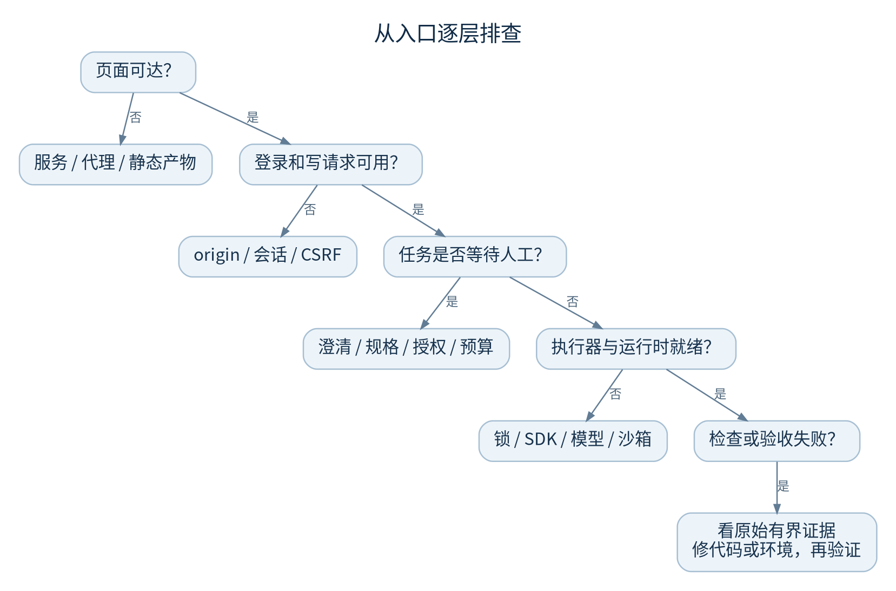
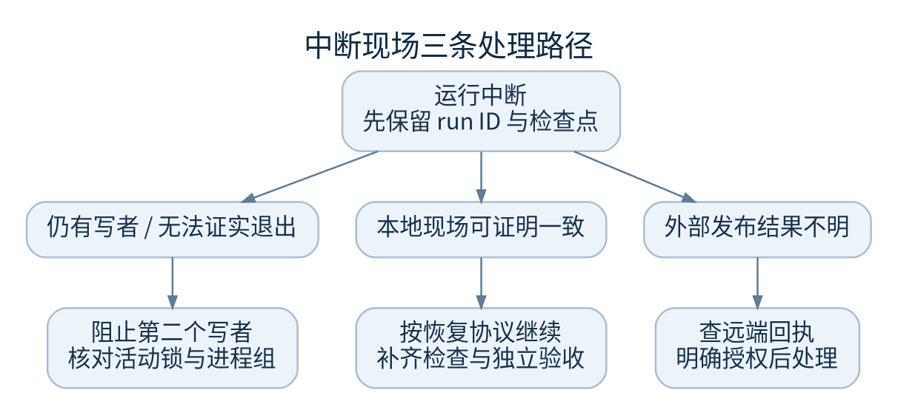

# 故障树与处理步骤

先定位失败层，再做最小的可逆修复。涉及数据库、Git 现场、秘密和外部发布时，保留证据优先于快速重试。

## 页面或登录异常

| 现象 | 先看什么 | 处理方式 |
| --- | --- | --- |
| 首页 503，提示前端未构建 | 实际 static 路径和 `index.html` | 重装锁定前端依赖并构建，成功后再激活 |
| 502 或无法连接 | 既有 unit、回环 8788、代理目标 | 确认原服务与端口，不新增第二套服务 |
| 403 请求来源不匹配 | 浏览器 origin 与 `FACTORY_PUBLIC_ORIGIN` | 修正同源配置，不关闭来源检查 |
| 403 会话验证失败 | 会话与 CSRF、旧页面缓存 | 重新登录/刷新，保留安全校验 |
| 401 | 登录、会话过期、用户 active 状态 | 使用正常账户流程，禁止直接改数据库 |
| 409 设置已更新 | 配置或项目 revision | 刷新比较变更，重新提交明确修改 |

## 有任务但不动

1. 在运行详情确认状态，排除等澄清、等规格确认或等审批
2. 核对目标数据域是否真的有持锁执行器；CLI 入队不会自动启动模型
3. 查原服务是否因为另一个协调器持锁而拒绝启动
4. 查运行配置中的模型、工具与实际服务用户环境
5. 查看权限、预算、风险和恢复策略的具体阻塞理由

不要把设置数据库状态为 `queued` 当作入队修复，它缺少合法状态转移、代次和审计语义。

## 服务崩溃后的任务

- 仍有 worker 或进程组证据不明：阻止第二个写者，交由维护负责人核对；不要删活动记录
- 检查点完整且身份一致：按正常恢复路径继续，观察新的检查/验收事件
- 源码、HEAD、Git 元数据或原合同变化：保留两个版本与事件，交工程负责人处理
- 发布中断：先到远端核对是否已经推送或创建 PR；不要直接重放
- 需求分析中断：按系统提示接续分析，不能将未知费用当零

## 模型与检查异常

SDK 缺失用 `uv sync --frozen --all-extras` 修复受控虚拟环境。代理、认证和模型 ID 按[模型排查](providers.md)逐层确认。显式探针需要授权且可能收费。

bubblewrap 已安装但 canary 失败，属于环境隔离前提不满足。记录精确错误，保持 fail-closed；不要关沙箱、不改测试预期、不用特权模式绕过主机限制来宣称生产可用。

容器测试失败先看本地 Docker、基础镜像和预装依赖。无网络构建缺依赖并不会自动退回宿主机 Python。

## 成果或发布失败

- 归档提示 worktree 不可用：查原现场是否保留，不能伪造验收提交
- 归档提示验收后代码变化：重新核验与验收，不绕过 SHA/dirty 检查
- 文件超限：通过项目交付清单精确选文件，不能把缺文件说成完整交付
- PR 发布失败：区分凭据、仓库访问、PR 条件和网络；本地验证仍可能有效
- 用户看到静态 HTML：它只证明静态预览，不代表后端或交互应用已启动

## 升级给工程负责人的最小包

提交哈希、run ID、配置 revision、最后 20–50 条相关已脱敏事件、失败检查的有界输出、预期与实际、已执行的操作及结果。秘密、完整用户库、原始模型上下文和私钥不得加入普通工单。

代码：`app.py::boundary`、`runtime_routes.py`、`autonomy.py`、`recovery.py`、`deliverables.py`、`harness/sandbox_linux.py`。
