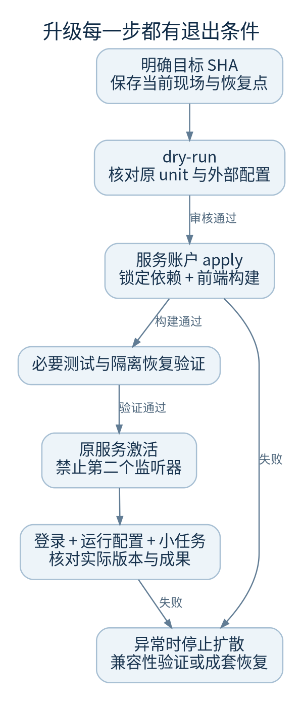

# 升级与回滚

升级的输入应是一个已审核的精确提交，输出应是可核验的服务版本与真实验收结果。`git pull` 成功、进程 active 或模型 SDK 可导入都不能独自证明升级成功。



## 变更前

- 确认工单授权、维护窗口、精确目标 SHA 与当前 SHA
- 查看工作树状态，保存并尊重未提交修改；不要 reset、stash 或覆盖用户工作
- 盘点在途任务和外部动作，规划停写与恢复方式
- 完成[备份和隔离恢复验证](backup-restore.md)
- 保留旧代码、依赖锁文件、前端构建与外部配置；明确谁决定回退

```sh
git status --short
git rev-parse HEAD
systemctl show factoryweb.service -p FragmentPath -p User -p WorkingDirectory -p EnvironmentFiles
```

## 使用既有更新脚本

`deploy/install-control.sh` 维护现有安装，不创建 unit、不改 EnvironmentFile、不替换 Caddy，也不自动重启。以下变量都必须来自现场盘点：

```sh
bash deploy/install-control.sh   --checkout "$CHECKOUT" --user "$SERVICE_USER"   --env-file "$ENV_FILE" --data-dir "$DATA_DIR"   --unit-file "$UNIT_FILE" --dry-run
```

确认 dry-run 后，获授权的服务账户才使用同一组参数加 `--apply`。不要以 root 构建。脚本会同步全部 extras、安装锁定前端依赖、构建前端并运行本地 doctor；不替代完整 CI，也不替代服务实际环境中的探针。

脚本当前使用 Vite 构建，单独的 TypeScript 与前端测试仍应在发布验证中运行，见[CI 清单](testing-ci.md)。不要因为脚本没有运行某测试就宣称该测试通过。

## 激活与验收

只有依赖、构建和必要验证都通过，才在原部署授权内重启已存在的服务。既有 `factoryweb.service` 不应旁边再启动 `factory-control.service`。

1. 核对实际安装 SHA 和期望完全一致
2. 核对原服务 active、页面/静态资源、登录及来源校验
3. 读取运行配置，检查模型和角色没有被不完整环境覆盖
4. 对需要的 Provider 做有授权的只读探针，记录每个结果
5. 验证一个小任务和成果读取；确认旧运行历史仍在
6. 观察恢复任务、错误与磁盘，记录外部动作是否已发生

任一步失败，先停止继续激活或新派发，保留证据；不要在半安装依赖或缺前端产物时强行重启。

## 回滚矩阵

| 情况 | 可采用的方向 | 必须证明 |
| --- | --- | --- |
| 新代码尚未启动写库 | 恢复旧代码与匹配构建/依赖 | 外部配置未被误改 |
| 新代码已启动并迁移数据 | 在隔离副本验证旧版兼容，或恢复成套恢复点 | 旧代码能读同一数据库，不能靠猜 |
| 新版已产生用户数据 | 评估回退丢失窗口并获批准 | 恢复点之后数据如何处理 |
| 外部发布已经发生 | 对账并单独执行获授权的补救 | 数据库回滚不会撤销 PR、部署或消息 |

仓库使用增量建表和部分 ALTER TABLE，没有通用自动降级工具。不要把 checkout 旧提交等同于整个系统已回滚。

代码：`deploy/install-control.sh`、`deploy/README.md`、`runtime_cli.py`、各 Store 构造器中的 schema 初始化。
