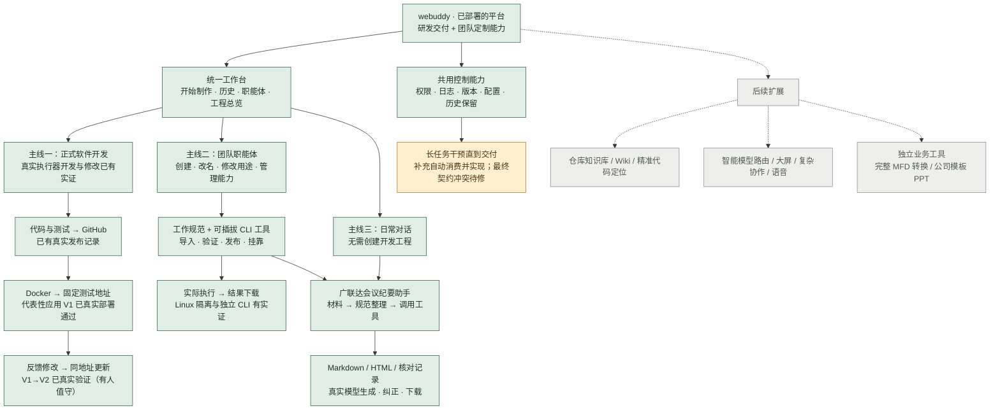

# webuddy 成果地图 · 2026-09-20

按现有验收记录整理；本次新增三条交付链路的真实服务器验收，没有重复执行全部平台检查。最近部署验收代码 f0599bc；里程碑 webuddy-v1-agent-management-2026-09-20；平台入口 https://harness.cloudwaveai.cn。

原始 Mermaid 保留在 [思路全景图](webuddy-design-map-original.md)。原图绿色表示共识确定；本图绿色表示对应范围有实际验证，两种颜色语义不能混用。不同节点的验证发生于不同版本，不代表全部在当前提交上重新验收。

绿：已实现且有对应实际验证。黄：已有实现或局部验证，完整交付仍待验收。灰：后续设计或独立业务需求。

## 相较原图，已经落地的成果

| 原设计 | 当前成果 | 边界 |
|---|---|---|
| 统一用户工作区 | 统一外框、对话、历史、工程与设置 | 不把全部页面细节视为已经无缺陷 |
| 能力与职能体 | 能力管理收进当前职能体；可改名；底层能力仍可复用 | 元信息写入在隔离环境验证，生产核对读取与数据保留 |
| 团队定制小工具 | 工作规范与 CLI 版本挂靠、受控执行、结果下载 | 代表性工具通过，不保证任意新包自动可用 |
| 日常问答 | 正式站会议助手真实生成文件、按反馈修改 | 一次人工纠正后结论改善；内容仍需业务复核 |
| Coding 到交付 | 开发、测试、GitHub 有实证 | Docker首次部署与V1→V2同址更新已通过（有人值守）；长任务补充与验收条件同步仍有缺陷 |
| 项目知识 | 独立知识系统已有设计 | Skill 导入不等于 Wiki 或代码索引已建成 |

当前可直接体验 [会议助手](https://harness.cloudwaveai.cn/agents/f2756d877ee84ce5aedba4a4c66c377a/chat?cid=new)。聊天材料入口目前支持 UTF-8 txt/md/csv，单文件不超过 40 KB；不宣称已经支持任意 Word/PPT/PDF。该限制不同于职能包 ZIP 上传限制。

平台与示例应用均已实际部署。新增实证来自同版本隔离验收实例，非生产数据库中的用户任务；固定仓库和部署脚本由管理员预配置，不表示任意新项目零配置部署。完整 MFD 保真转换、公司模板 PPT、安装包目标系统验收未作为本轮成果。取消不等于可恢复暂停。

## 证据入口

- [最新职能体管理上线验收](../acceptance/agent-management-ux-2026-09-20/README.md)
- [正式站会议助手与真实模型使用](../acceptance/meeting-production-2026-09-20/README.md)
- [三项真实交付链路新验收](README.md)
- [Docker 早期交付记录](../acceptance/webuddy-docker-delivery/README.md)
- [原始六区域设计与 RC1 验收账本](../releases/2026-09-19-v1-rc1/README.md)

本图不计算总完成百分比：三条主线不等权，Coding 是产品主线，工具和聊天场景成功不能抵消长任务干预整链尚未收口。

本轮三项：**首次部署通过、同址更新通过、长任务干预部分通过**。运行中补充已自动实现，但旧验收条件没有同步认可新需求；最终应用经独立发布任务上线，存在人工预算和验收恢复，不称无人闭环。代表应用[在线体验](https://harness.cloudwaveai.cn/delivery-demo/counter/)。版本与回滚锚点见新验收报告。

其他相对链接指原设计工作区；本目录README与证据为本次可独立阅读的验收包。
