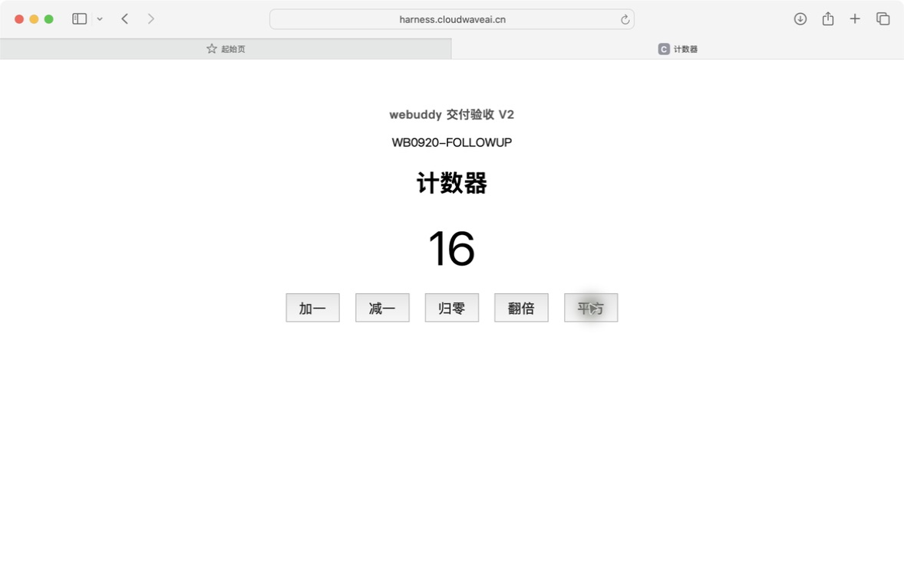

# 三条交付链路现场验收 · 2026-09-20

状态：测试已完成；两项交付验收通过，一项长任务干预整链仍未通过。不是一次无人自动成功。

| 项目 | 结论 | 实测范围 |
|---|---|---|
| Docker首次部署到固定地址 | 通过（有人值守） | 独立验收、GitHub发布、部署/健康/状态回执、公网HTTP与Safari操作 |
| 同项目修改后更新同一地址 | 通过（有人值守） | V1→V2，同URL；旧镜像保留；新增翻倍/平方正确；版本SHA一致 |
| 运行中补充自动落实直到交付 | 部分通过，整链未通过 | pending→system/auto→applied及真实代码/页面通过；旧验收契约冲突导致终态失败，人工改走独立发布 |

[直接体验第二版](https://harness.cloudwaveai.cn/delivery-demo/counter/) · [缺陷与范围](FINDINGS.md) · [Claude补修单（未发送）](CLAUDE-NEXT.md)

这是生产代码f0599bc的隔离实例验收，使用独立数据库。生产平台本身没有升级；示例应用真实更新。管理员预先配置固定仓库与受控部署脚本，不代表任意新项目零配置部署。

- 用户已授权部署到现有服务器并完成测试，不等待域名资料。
- 验收代码：当前线上 f0599bc；使用独立服务 127.0.0.1:18926、独立数据库和测试项目，真实 Claude SDK/模型。
- 服务目录：/home/ubuntu/releases/acceptance-closure-20260920，凭据留在服务器受控目录，不入本资料。
- 应用：原 Counter 网页代码 75b89f3 为历史基线，新一轮实际开发、独立验收、GitHub 发布、受控 Docker 部署。
- 测试地址：https://harness.cloudwaveai.cn/delivery-demo/counter/ 。平台首页及 API 保持原服务。
- 当前服务器承载独立 128 MB / 0.5 CPU 容器。第二台服务器虽已确认可用，本轮先复用已注册动作，减少新的接线。

## 三项判据

1. 首次交付：真实开发验收通过；平台发布 GitHub；固定提交构建容器；平台 deploy / health / status 回执通过；公网地址核心操作正确，版本与提交一致。
2. 同址更新：同项目继续修改，保留 V1；生成新提交及新镜像；同一地址出现新增功能且原功能可用；回执关联前一镜像。
3. 干预：运行时提交补充；持久化 pending；可恢复安全节点由 system/auto 接续；补充实际体现在最终代码和业务行为；保留真实失败/预算边界，不以 applied 字段单独判通过。

第三项按当前实现只证明可恢复节点自动消费，不宣称成功完成的任务必定自动开启下一轮、任意节点实时打断或取消等于暂停。若使用可控检查失败构造安全节点，将明确记为故障注入场景，不冒称自然发生或完全无人业务交付。

## 留证与范围

本轮不重复后端全量。新应用的必要检查由平台执行，Codex另核验公网业务、GitHub SHA、部署镜像与干预事件。平台问题交给 Claude 编码，不伪造通过状态、不追认旧截图哈希。按每次运行 12 美元上限执行，不自动无限加预算。

## 首轮现场问题（保留）

V1 运行 5b4370b3b88a4b8c8eccfdec2d035535：开发完成、27 项应用测试及浏览器行为通过，生成提交 f1d02c24a1f9ce3e5709174cbc0ed85deb5a3f06。独立验收在剩余 208 秒耗尽前未返回结构化回执，平台正确阻止发布；不能用验收模型文字声称通过代替终态。

通过平台 continue 恢复时选中 verification 阶段，未重做编码。第一次恢复被预算保护挡住：已有 $4.5827 记录，未对账调用保守预留 $7.4173，达到 $12 上限。保留未对账费用，一次性把本隔离项目上限改为 $20 并继续验收；没有清零成本、修改通过状态或无限续费。后续新任务仍按 $12 上限。

后续验收模型搭建的临时代理漏转根路径 favicon，制造 404；自动补修重测确认应用自身为 204，但验收再度重复测试并耗尽预算。原调用已知费用/未对账预留分别保留，停止旧运行，未继续提高上限。

一次纠正补充提交时，运行已进入 needs_human，所以回执为 applied=true / queued=false，属于人工在待处理节点接续，**不能作为 ACTIVE 排队后自动消费证据**；随后被预算保护挡住。该次不算第三项通过。

新部署验收 2296fedca9c74043a8baec9c7f9fce1c 使用已有候选 db196e44b4882854ed7fc8eb90c2834dbcc6b87f，单独检查部署合同，不重复 UI 开发。候选先上传私有仓库审核分支 acceptance/closure-v1-review-20260920，只是保存源码，不表示旧开发任务通过或已发布应用。新任务仍必须通过平台独立验收才能调用受控部署动作。旧任务经显式 cancel 收口，原失败与费用报告保留。

## 首次 Docker 交付：已通过

独立部署验收、平台 deploy/health_check/service_status 三个远程回执通过；随后由平台 GitHub publish API 发布部署任务。应用部署源版本 db196e44b4882854ed7fc8eb90c2834dbcc6b87f，镜像和 /version 一致；部署任务自己的提交可能仅含过程记录差异，已用 git diff 核对 app.py/counter.py/Dockerfile 无变化。

从本机通过公网 HTTPS 验证页面、health、version、increment/decrement/reset 和非法 action 400，见 public-V1.json。公网 V1 页面经 Safari 实际操作：0→1、1→0、非零→归零，截图 01/02。

浏览器留证过程：Codex 内置浏览器接口两次超时；直接读取 Codex 原生窗口被工具限制，因此改用允许控制的独立 Safari，未绕过限制。截图来自真实公网站点。首个 Python 公网探针有导入作用域错误，修正探针后重新执行通过，不是应用缺陷。

## 第二轮干预测试的观察脚本修正

平台自动推进到 running 时，观察脚本重复 approve 返回409并退出，第一遍没有发出补充；可控检查因无补充而失败，不能判自动接续失败或成功。修正观察器对这种状态竞争的处理，人工继续一次作为测试准备，在实际 running 状态下提交 square 与 WB0920-FOLLOWUP，收到 queued=true / applied=false 的真实回执。从本次排队到自动消费期间没有人工继续，等待真实 system/auto 接续与产物证据。准备阶段那次人工继续单独记录，不冒称全程无人。

## 第二轮自动消费已发生，最终验收预算干预如实保留

运行 364266fb3b6f43d3a4b39007307b5d02 的事件 1143 为 followup.pending；1218 为 actor=system/auto 的 run.auto_resumed；1219 为同一 pending_id 的 followup.applied。真实模型随后实现平方与 WB0920-FOLLOWUP，34 项应用测试通过。此段无人按继续，属于可控失败形成的安全节点自动接续。

最终独立验收再次耗尽 12 美元额度，保留状态后仅一次提高到 20 美元，人工 continue 只恢复 verification。该动作发生在自动消费和补充实现之后，留证 v2-budget-renewal.json。因此即使最终上线通过，也不能称本次从需求到交付完全无人干预。首轮和第二轮均暴露重复验收造成的成本问题，应后续交 Claude 优化，不在本轮绕开判据。

## 第二轮最终验收失败：记录保留，不改写成通过

预算恢复后，平台收到模型“pass”文字，但正式逐项账本为28 pass、1 fail、1 unverified。旧非目标requirement:16拒绝后来授权的square，requirement:11缺少传给验收器的历史中断事实。真实模型已做34测试及HTTP/浏览器，但系统终态正确未放行。详细证据见v2-coverage-stop-proof.json，原因与后续范围见FINDINGS.md、CLAUDE-NEXT.md。

V2开发运行停止为cancelled，保留原失败及费用。源码389b0b07abfa74419dfb9ffa7f40dabe5c79b0de保存到私有GitHub审核分支；独立release任务d100f909d0a0424388a89ef4e419069b明确验收double+square并沿用同一部署目标，正在执行。新的发布通过不追认旧运行通过，也不证明第三项全程自动交付。

Claude补修资料已写好，但本轮未实际发送：原生客户端正在用户的另一项文档任务，工具报告用户切换状态；没有在错误会话输入，也没有声称已派发。

## V2独立发布：第一次验收输出格式失败

release任务d100f909d0a0424388a89ef4e419069b执行检查完成，源码产物608d39b6665aa2b254e15784e9c57a40ff8b7c52（应用部署候选389b0b0）。独立验收实际34测试/HTTP检查均通过，但最终消息JSON不合法，operation_results出现缺少冒号的结构，平台返回invalid_response并阻止部署。这是现场模型输出协议失败，不是Docker或服务器权限缺失。

保留release-v2-first-result.json、release-v2-invalid-response.json与原日志；在同一12美元预算内仅人工continue一次，resume_stage=verification（release-v2-retry-once.json），不重做编码、不修改平台判据。不承诺这次恢复必定成功。

## 最终结果与版本锚点

独立release V2第二次verification返回有效结构化通过；平台随后deploy/health_check/service_status全部pass，再通过GitHub publish发布。不是把旧失败改成pass。34项应用测试已由执行器与独立验收器实跑，本轮没有重跑平台后端全量。

| 对象 | 标识 |
|---|---|
| 平台生产代码（未变） | f0599bc |
| 隔离验收项目 | 4892b00257e14426bb652e1a479a9bcb |
| V1部署源码与旧镜像标签 | db196e44b4882854ed7fc8eb90c2834dbcc6b87f |
| V1正式发布任务提交 | dfe7b3af36861c8c8cb1229cea9cf2a15f8feb25 |
| V2部署源码与当前镜像标签 | 389b0b07abfa74419dfb9ffa7f40dabe5c79b0de |
| V2正式发布任务提交 | 608d39b6665aa2b254e15784e9c57a40ff8b7c52 |
| V2正式发布任务 | d100f909d0a0424388a89ef4e419069b |
| 应用源码仓库 | auntunt/webuddy-acceptance-counter-b0407128（私有） |

部署候选与发布任务提交只允许过程文件差异；已对app.py/counter.py/Dockerfile做git diff零差异核验。真实当前容器/镜像/previous_image/源码归档sha256见deployment-v2-proof.json，GitHub发布与三个远程动作见release-v2-result.json。旧镜像作为回滚锚点保留，本轮未实际切回旧版，不宣称回滚演练完成。

公网public-V2.json验证health/version、加减归零、非法action400、翻倍与平方的零/正/负输入。Safari同一地址实际点击0→1→2→翻倍4→平方16→归零0，截图03-public-v2-square.png；首次交付截图01/02。示例界面仅用于验收功能，不是新的产品UI设计稿。

## 成本、人工动作及清理

四次运行已知费用合计37.5733美元，来自平台记录，**不是供应商最终账单**，存在未对账预留边界。首次开发和V2开发各发生一次预算12→20人工调整；V2测试准备有一次人工continue；pending消费之后最终验收有一次预算continue；独立release V2有一次invalid_response后的verification-only人工continue，预算保持12。旧失败均保留，不将重跑结果覆盖原记录。

本次一个小应用仍产生较高验证成本，这是明确的产品效率问题，尤其契约冲突和JSON格式错误不应反复触发完整功能验证。后续只做有边界的补修，不追加大套件或无上限付费重试。

所有四次运行已收口（两次cancelled保留失败、两次published）。临时18926服务已停止；正式factory-web f0599bc/8788仍active，V2 Docker容器继续运行，见cleanup-proof.json。首次清理脚本对进程名称预期过窄，在发信号前安全拒绝；确认factory-web实际命令及端口18926后才停止，未触碰8788。

证据：platform-final-proof.json（四运行）、followup-final-proof.json（自动消费true/整链false与原验收失败）、v2-coverage-stop-proof.json（验收契约问题）、release-v2-first-result.json（格式失败）、release-v2-retry-once.json（一次恢复）。凭据/登录数据/私钥没有入库。补修单已准备但未向Claude当前其他任务发送。
