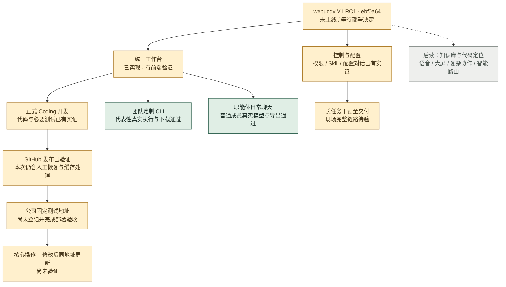

# webuddy V1 RC1：里程碑与原设计对照

记录日期：2026-09-19。阶段名称：**研发工作台与团队能力贯通，等待公司固定地址交付验收**。

## 当前完成到哪里

**三条使用主线中，两条已有代表性闭环，Coding 主线已到 GitHub，尚未走完固定测试地址交付。**

这个 2/3 是“已跑通代表性场景的主线数”，不是 67% 的工作量或全平台完成率。三条路径不等权，Coding 是产品主线；不能用两个轻量场景抵消部署缺口。V1 当前处于收口候选阶段，尚未完整验收。

原 Mermaid 的绿色是“共识已确定”，不是“代码已验收”。本文件按已实现、真实场景验证、待现场验收、后置重新标注，不把原图全部节点计入百分比。

| 主线 | 已有实证 | 尚未覆盖 |
|---|---|---|
| 正式 Coding 开发 | 成熟执行器修改代码、必要测试、旧任务恢复、GitHub 真发布 | 固定公司测试地址、地址上的核心操作、修改后同地址更新；现有发布实测含一次人工缓存处理 |
| 团队定制 CLI | 示例包版本发布、挂靠、Linux bwrap 实际调用、结果下载、平台外独立运行 | 所有团队工具的通用适用性；最新生产 UI 全程体验；MFD 完整保真、公司 PPT 是独立业务需求 |
| 职能体日常聊天 | member 真创建/发送，真实模型回答与导出下载，无 Coding 工程；正常终态、重启保留、越权拦截 | 旧消息 pending 不自动清理；当前文本附件范围之外的 PDF/Word/PPT 不能泛称已支持 |

## 对照原 Mermaid 六个区域

| 原区域 | 当前状态 | 具体边界 |
|---|---|---|
| 产品定位 | 已落实到实现方向 | Coding 主线；复用成熟执行器；人可查看记录和干预，不自行开发 Agent 底座 |
| 用户与工作形态 | 主体已实现，局部真实验证 | 统一壳、开发、工具和角色聊天均存在；最新整套桌面/手机生产界面仍需上线前核验 |
| 执行与控制 | 主体已实现，部分现场链路待验 | 权限、受控挂载、终态、幂等与恢复有证据；长任务新要求自动消费至交付不能据局部测试宣布完成；pause 独立语义后置 |
| 项目知识 | 设计保留，未实现独立知识系统 | 私有 GitHub Skill 导入已实测，但不等于 Wiki、ContextPack、代码定位索引或 knowledge diff 已建成 |
| 能力与职能体 | 代表性场景已贯通 | 工具版本、绑定、下载与日常使用；会话 Skill 正文真实用于报价；管理员配置对话真实改值且表单同源读取 |
| 软件交付 | 开发到 GitHub 已实证，部署缺最后一段 | 固定地址与同址更新未验收；安装包目标 OS 未选；知识版本关联依赖后续知识系统 |

绿：代表性实测通过；黄：已有实现或局部证据，尚有完整场景待验；灰：后续设计。不同证据覆盖的提交与环境见下表，不暗示所有链路在 ebf0a64 上重跑过。

## V1 十项验收逐项账本

本表为覆盖情况，不以绿格比例冒充产品完成率。

| 编号 | 约定 | 当前覆盖 | 收口动作 |
|---|---|---|---|
| V1-01 | 单一入口、刷新恢复 | 统一壳与持久化已实现；聊天真实重启恢复通过 | 完整新建开发任务在最新 UI 的刷新连续体验 |
| V1-02 | 成熟 Coding 执行器 | 真实模型与代码/命令/测试已有证据 | 不据此扩为所有备用执行器均可用 |
| V1-03 | SaaS 真实交付 | 代码、验证、GitHub 发布有证据 | 固定地址部署与核心业务操作，仍是主阻塞 |
| V1-04 | 同任务修改与同址更新 | 修改/版本保留机制存在，旧现场能恢复 | 新一轮 GitHub 同步与同址更新现场 |
| V1-05 | 人的干预 | 持久化、状态和消费守卫已实现并有定向验证 | 真实长任务补充要求直至完成；保留实际取消终态 |
| V1-06 | SaaS / CLI / 安装包分支 | 类型与展示实现，CLI 实际独立执行 | SaaS 随 V1-03 验收；安装包选目标 OS 后再验证 |
| V1-07 | 团队工具 | 发布/绑定/隔离/下载及平台外运行实证 | 完整成员界面流程、换输入与卸载后新调用的联合演示尚未作为本次整套现场验收 |
| V1-08 | 日常角色使用 | member 真实模型、导出、刷新/重启、完成态通过 | 当前新会话代表性闭环成立；不覆盖所有文件与定制业务 |
| V1-09 | 可观测与恢复 | 日志、恢复、失败保留与 GitHub 重试有证据 | 部署失败后恢复及外部结果不明的整段 UI 体验 |
| V1-10 | 统一界面 | 统一壳及桌面/移动端既有报告、前端回归 | 最新候选完整页面视觉巡检尚未替代为线上验收 |

## 本里程碑证据

| 提交 / 环境 | Codex 独立证据 |
|---|---|
| f5b238c / Linux | 32 项定向回归，2 项真实工具隔离与下载运行；管理员真实模型改配置、私有 GitHub Skill 导入、规则正文报价/导出、重启保留 |
| f5b238c / 旧测试现场 | 人工 continue 后完成 Counter 业务检查，正常平台发布 GitHub，远端 SHA 对齐；缓存保留处理一次，不能称全无人交付 |
| ebf0a64 / macOS | 后端相关 23 passed，前端 AgentChatPage 10 passed |
| ebf0a64 / Linux | 同一定向 23 passed；真实 member 创建/回答/导出/下载/终态与重启通过；跨用户、配置入口、maintain 均 403 |
| 4c56632 / 生产只读观察 | factory-web.service active；运行目录 /home/ubuntu/releases/factory/4c56632；受版本管理文件无差异 |

本轮整理没有再跑无关全量，没有改功能，没有重启或部署生产。

## 两个不可混淆的版本标记

| 用途 | Git annotated tag | 精确代码提交 |
|---|---|---|
| 当前生产回退锚点 | webuddy-prod-baseline-2026-09-19 | 4c56632d4cc18918f9c5c0396b6a05ca816b5547 |
| 新候选里程碑 | webuddy-v1-rc1-2026-09-19 | ebf0a64394051d92d2696e6cbc03220874648769 |

RC1 表示候选，不是正式 V1 全部验收通过。标签不移动、不覆盖；后续修代码应创建 RC2。文档单独提交时不改变以上代码标签。

## 回滚边界与下次上线动作

这轮完成的是代码版本锚定与生产目录核对。**Git 标签不是数据库或配置备份**；尚未执行上线前完整备份，也未演练从 RC1 回退生产。不能把“可定位旧代码”说成“一键无损回滚”。

用户下一轮决定上线后：

1. 再核对活动任务与生产身份，保留现有运行目录、依赖和前端构建。
2. 按现有 RUNBOOK，在合适停止窗口用 SQLite backup API 保存控制库与用户库，并备份产物/工具文件、配置与服务定义；凭据仅在服务器受控位置保存，不入 Git。
3. 在独立 release 目录构建 RC1，记录前端构建与依赖；切换现有服务后检查健康、登录、历史、成员聊天和工具入口。
4. 若失败，优先切回原 release、服务定义与环境，保留新产生数据并核对兼容性。若确需恢复旧数据，先保留失败现场；备份后新增的业务记录可能丢失，不能自动抹掉。

本次没有选择公司示范项目测试 URL，也没有把 harness.cloudwaveai.cn 当成生成应用的部署地址。平台升级与“平台产出的应用交付”是两件事：RC1 上线不自动意味着 V1-03 / V1-04 通过。

## 原设计与现场报告

- 原图快照：original-design-map.md（保留原“共识已确定”的颜色定义）。
- 详细流程：original-system-and-flows.md。
- V1 验收约定：original-v1-scope.md。
- evidence/server-f5b238c.md、evidence/chat-ebf0a64.md：独立现场报告。
- evidence/chat-live.json：最新真实成员链路脱敏结果。
