# webuddy 思路全景图：历史原文

于 2026-09-19 从本会话历史找回。以下完整保留当时回答，不代表当前实施状态。图中“职能体”定义和“下一轮”指向已有后续修订，现行决策见[产品共识](../webuddy-product-system-consensus.md)。

---

下面这张图把目前的产品思路分成四种状态：**已经确定、已完成详细设计、正在实现或待验收、明确后置或仍待讨论**。

```mermaid
flowchart TB
    ROOT["webuddy<br/>成熟 Coding Harness 之上的研发交付平台"]

    ROOT --> P
    ROOT --> U
    ROOT --> E
    ROOT --> K
    ROOT --> D
    ROOT --> F

    subgraph P["一 产品定位"]
        P1["Coding 是产品主线"]
        P2["不重新开发 Agent 底座"]
        P3["复用 Codex 和 Claude Code"]
        P4["人可查看日志并持续干预"]
        P5["可靠交付和能力积累是核心价值"]
    end

    subgraph U["二 用户与工作形态"]
        U1["Chatbox 是统一工作入口"]
        U2["单人发起和负责<br/>其他人体验反馈"]
        U3["正式软件开发"]
        U4["团队定制职能工具"]
        U5["普通职能体问答"]
        U6["SaaS 安装包 CLI 三类交付"]
    end

    subgraph E["三 执行与控制"]
        E1["任务 会话 执行 干预相互分离"]
        E2["模型负责理解和建议"]
        E3["系统负责状态 权限 幂等 验证"]
        E4["运行中补充要求需要真实回执"]
        E5["模型接口与执行器接口分开适配"]
        E6["具体模型路由策略"]
        E7["跨执行器恢复和自动切换"]
    end

    subgraph K["四 项目知识"]
        K1["两类来源<br/>webuddy 产出或外部 Git 仓库"]
        K2["仓库初始化与 Wiki 构建"]
        K3["稳定知识快照加 worktree overlay"]
        K4["按需生成 ContextPack"]
        K5["代码修改同步 knowledge diff"]
        K6["Zoekt Ctags Tree-sitter SCIP 候选栈"]
        K7["8 个历史任务试点"]
        K8["是否增加 pgvector 语义召回"]
    end

    subgraph D["五 能力与职能体"]
        D1["职能体是用户入口"]
        D2["职能包是可版本化能力资产"]
        D3["CLI 可独立运行并可插拔接入"]
        D4["组长或管理员挂靠团队定制能力"]
        D5["MFD 和会议材料生成是示例"]
        D6["职能包生命周期设计"]
        D7["能力交易 市场和收费"]
    end

    subgraph F["六 软件交付"]
        F1["需求到开发到测试"]
        F2["GitHub 提交与同步"]
        F3["公司固定测试地址"]
        F4["同一任务继续修改和再次部署"]
        F5["代码 产物 部署和知识版本关联"]
        F6["安装包目标平台与验收"]
        F7["蓝绿发布 正式生产和回滚"]
        F8["飞书记录及客户沟通"]
    end

    P --> P1 & P2 & P3 & P4 & P5
    U --> U1 & U2 & U3 & U4 & U5 & U6
    E --> E1 & E2 & E3 & E4 & E5 & E6 & E7
    K --> K1 & K2 & K3 & K4 & K5 & K6 & K7 & K8
    D --> D1 & D2 & D3 & D4 & D5 & D6 & D7
    F --> F1 & F2 & F3 & F4 & F5 & F6 & F7 & F8

    NEXT["下一轮最值得讨论<br/>项目和交付版本模型"]
    F5 --> NEXT
    K5 --> NEXT
    E1 --> NEXT

    NEXT --> N1["项目"]
    NEXT --> N2["任务与多次执行"]
    NEXT --> N3["代码 commit"]
    NEXT --> N4["软件产物"]
    NEXT --> N5["部署版本"]
    NEXT --> N6["知识快照"]
    NEXT --> N7["验收记录"]

    classDef confirmed fill:#dcecdf,stroke:#326451,color:#20302a;
    classDef designed fill:#dbe8f1,stroke:#456a81,color:#20302a;
    classDef active fill:#f8e8bf,stroke:#9a6d18,color:#3c2d12;
    classDef deferred fill:#ececea,stroke:#8a8f8c,color:#4d5552;
    classDef next fill:#eadff2,stroke:#76558d,color:#2f2436;

    class P1,P2,P3,P4,P5,U1,U2,U3,U4,U5,U6,E1,E2,E3,E5,K1,D1,D2,D3,D4,D5,F1,F2,F3,F4 confirmed;
    class E4,K2,K3,K4,K5,K6,D6,F5 designed;
    class E6,K7,F6 active;
    class E7,K8,D7,F7,F8 deferred;
    class NEXT,N1,N2,N3,N4,N5,N6,N7 next;
```



颜色含义：

- 绿色：产品共识已经确定。
- 蓝色：已经完成比较具体的系统设计。
- 黄色：已有实现或方案，但还需要试点、补齐或验收。
- 灰色：明确后置，当前不应抢占主线。
- 紫色：建议下一轮集中讨论。

我认为下一部分应该讨论 **“项目和交付版本模型”**。它现在是整套设计的连接点：

```text
一个项目
  → 多个需求任务
  → 每个任务可有多次执行
  → 形成代码 commit
  → 形成 SaaS、安装包或 CLI 产物
  → 形成部署或交付版本
  → 同步形成知识快照
  → 由验收记录确认具体版本
```

这部分明确后，代码、部署、知识、历史作品、继续修改和验收才能真正使用同一套事实，而不是各页面分别维护状态。

