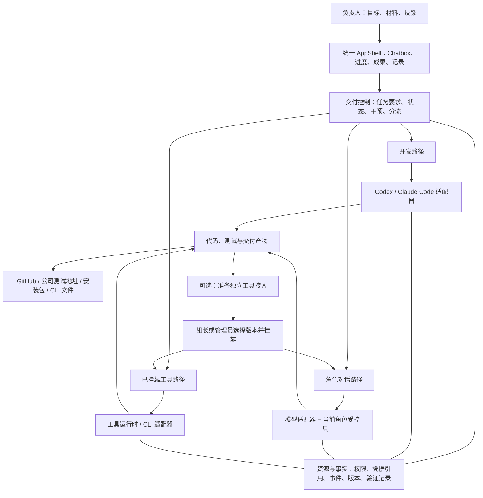
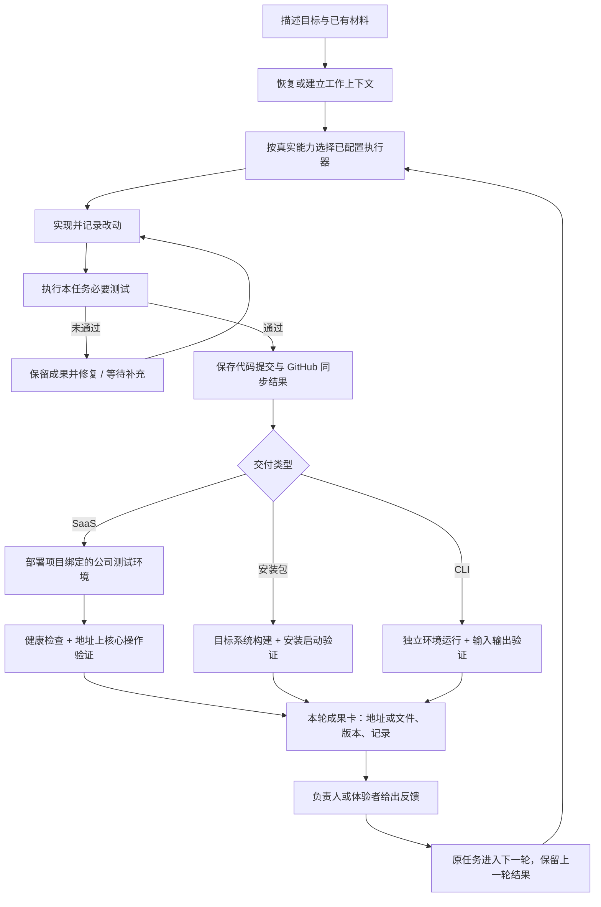
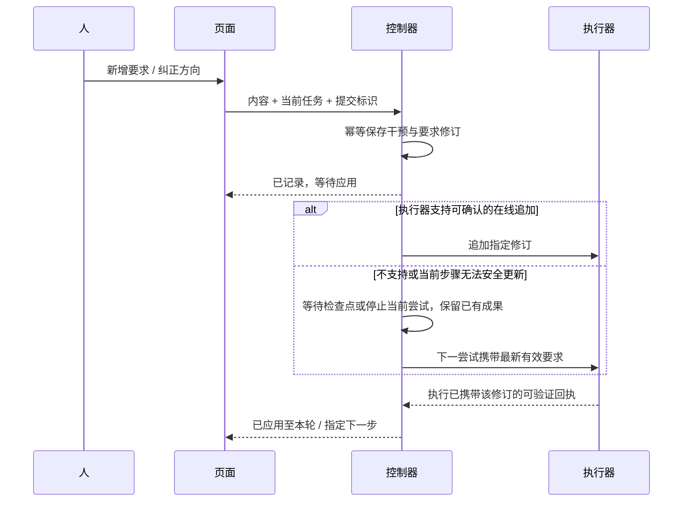
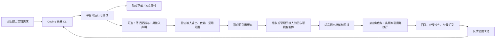

# 系统设计与流程

2026-09-18：遵循[类型与流程对齐说明](../capability-terminology-alignment.md)。Skill 加载与独立工具执行分别处理；现有代码对象可复用，不要求按产品名称迁移表结构。

这是基于现有实现的目标设计。下列名称表达逻辑关系，不要求按每个框新建服务、表或框架。优先使用现有 run、conversation、event、maintenance job、pack version 与 artifact。

## 1. 总体关系

控制器管理任务事实，执行器完成代码工作，模型辅助理解与摘要，CLI 完成具体工具工作。普通工作模型不冒充完整 Coding 执行器；模型兼容接口与执行器能力分别验证。

## 2. 对象关联与最小记录

| 对象 | 必须能回答的问题 | 优先落点 |
|---|---|---|
| 项目 | 长期产品是什么、仓库和目标环境是什么 | 现有 project、仓库与部署目标绑定 |
| 任务 | 这次要交付什么、当前有效要求是什么 | 现有 run 或普通工具任务；用关联而非强行合表 |
| 对话 | 用户说了什么、哪条话触发了什么动作 | conversation/message 与 run 事件 |
| 执行尝试 | 谁在执行、状态如何、恢复到哪里 | SDKRunner、job、provider session 和已有事件 |
| 干预 | 哪条要求在哪一步已生效 | 持久操作标识、要求修订号、消费执行引用和回执 |
| 产物/交付 | 产生了什么、可否下载/访问、对应哪轮代码 | artifact、commit、验证引用、部署回执 |
| 角色与挂靠 | 谁能使用哪一版本能力 | agent version、pack binding、任务快照 |

产品中的“同一任务”可以关联多轮现有 run。首版先提供稳定的任务关联和连续界面，不要求改造全部数据库 ID。每轮验证必须指向对应代码或产物；不能把前一版通过记录显示成本轮通过。

## 3. 软件交付流程

测试地址默认固定，当前部署版本另存于部署记录，不通过增加版本域名来解决。GitHub 同步失败不删除本地成果；部署失败不宣称交付完成。重试从失败步骤继续，外部执行回执不明时先核对，不能盲目重复动作。沿用既有必要部署和恢复机制，不新增复杂审批或回滚中心。

## 4. 干预的最小实现

“已应用”指要求进入了执行上下文，仍不代表实现已经通过验收。具体内容满足程度由后续改动与测试验证。单纯消息发送成功、接口 200 或模型说“收到”都不足以表示产品已满足要求。

建议在现有 follow-up 上增量维护 `received / pending / applied / superseded / rejected`，以及对应要求修订与执行引用；名称可以适配已有实现，但语义不能合并成一个 success。先后冲突的明确要求以后来的有效要求为准，保留旧记录，不静默删除。

- 询问进度只读，不改变工作目标。
- 补充要求持久保存，首版允许下一检查点生效，无需先实现低延迟中途注入。
- “暂不部署”对尚未开始的部署设置控制约束；部署派发前再次读取。正在执行或已经执行时报告实际状态，不宣称撤销。
- 停止分为请求取消和执行已结束；调用取消 API 后必须收回实际终态。
- 网络重试、刷新和服务重启不丢待应用要求，也不重复消费。恢复后无法确认状态时明确待核对。

## 5. CLI 的开发、封装与团队使用

独立交付与团队挂靠是可同时进行的两件事，不是互斥产品模式。普通成员不必理解包管理。新版本不能静默替换在途任务所用版本；已有结果关联原版本，卸载不删除历史。

沿用 `webuddy.capability-pack/v1` 的最小接入内容：入口和运行时、输入/输出 schema、依赖、权限、时限、适用范围和验证样例。现有 stdin/stdout JSON 只是平台适配协议；第三方 CLI 可以通过薄包装转换普通参数和结果文件，不强迫工具重写为新 agent SDK。

保留源代码与独立运行说明、样例输入、依赖安装说明、退出码及错误语义。业务材料、公司私有文件和任务临时结果默认不作为可分发代码包的一部分。

**模型型 CLI 的边界：**小工具可以拥有内部推理与调用循环，但当前受控包运行时并未因此自动支持网络和模型凭据。首版插件接入先验证确定性 CLI。模型型工具的独立运行可以自带用户配置；挂载后需要单独实现按声明授权的模型代理，支持超时、用量与取消回传，之前明确标“当前运行时不支持”。不将凭据注入模型可见提示词，不因为 CLI 需要联网就解禁全部网络。

## 6. 轻量路由与可观测

路由先用当前角色和已挂靠工具；明确开发走默认 Coding 执行器；日常问题走工作模型；判断不清才问一个必要问题。未知文件格式提示当前能力边界，可让用户继续表达需求，不因后缀自动触发开发。服务端保留分流原因和人工纠正，不建设独立路由平台。

统一用户可见记录至少包括任务/会话关联、执行引用、时间、事件类型、阶段、状态、产物引用和脱敏摘要。详细命令与工具结果按权限可看；隐藏推理不属于日志。进度由服务事件计算，不用计时器模拟百分比。

首版监控复用工程总览、运行记录与设置：进行中、等待处理、失败、最新活动和环境可用性已足够。运行无活动或工具异常先由确定规则发现，再按需调用模型解释。大屏后续读同一数据源。
