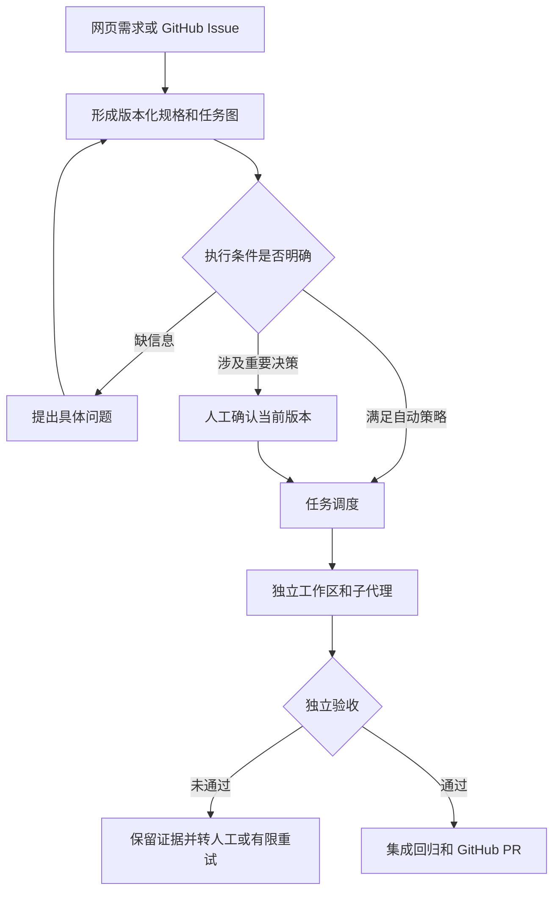

# webuddy重写规划：软件工程 Harness

日期：2026-09-07。基线：`e545d0b`。本文件描述目标架构与实施顺序；实际完成范围以 `STATUS.md` 为准。

## 1. 产品目标与边界

让工程师把重复性的需求整理、代码定位、任务派发、回归检查、记录整理和提交交给系统，自己集中处理产品歧义、架构取舍和最终业务验收。

一次输入应该产出四样东西：可确认的需求、能执行的任务图、能追溯的工程记录、可审查的 GitHub PR。完成标准是需求得到验证，不能用“生成了多少代码”“测试数量多”“模型说完成”代替。

首个使用场景是单个工程师或可信小团队管理多个已有 Git 仓库。基本账号用于防止匿名访问，同一实例内的账号共享工程工作区；真正租户隔离作为下一阶段，不能把基本登录包装成多租户安全。

系统的核心是软件工程控制层。Claude、Codex、DSH 提供实际执行能力，控制层持有需求版本、执行授权、任务状态、验收结果和交付记录。商业情报等业务系统应当成为工厂生产的独立项目，不进入核心 API。

## 2. 同类项目与取舍

| 参考 | 采用的机制 | 在本项目里的位置 | 取舍 |
| --- | --- | --- | --- |
| [OpenHands](https://github.com/OpenHands/OpenHands)、[事件系统](https://docs.openhands.dev/sdk/arch/events) | 控制界面、执行服务与结构化事件分层 | 控制面与 SDK 适配层之间 | 学边界，不引入整套平台作为必需依赖 |
| [GitHub Spec Kit](https://github.com/github/spec-kit) | Specify → Plan → Tasks → Implement | 需求入口与版本化计划 | 保留结构化规格和验收协议；不强迫用户操作大量命令 |
| [mini-SWE-agent](https://github.com/SWE-agent/mini-swe-agent) | 小型执行器与线性执行轨迹 | 简单任务的便宜执行通道，可后续增加 | 优先把任务拆清楚，再考虑扩充 Agent 框架 |
| [Vibe Kanban](https://github.com/BloopAI/vibe-kanban) | 每个任务独立 worktree、分支与变更审查 | 并行任务隔离、交付页 | 借鉴工作区交互，不绑定外部托管服务 |
| [Sweep](https://github.com/sweepai/sweep) | Issue 到代码变更的历史实践 | Issue 分流、PR 反馈循环 | 当前项目方向已有变化，只作工作流参考 |
| [Eclipse69420/ShowMe](https://github.com/Eclipse69420/ShowMe)、[dean0x/showme](https://github.com/dean0x/showme) | 视觉反馈、文件和 diff 展示 | 需求确认、结果反馈 | 同名项目含义不同；先实现用户描述的视觉交互，不假定某个库就是所指项目 |

不复制这些项目代码。使用其设计思想，保持现有 Python + React 栈，避免重写同时再承担语言和框架迁移。

## 3. 用户完整流程

1. 登录，选择已有工程仓库和模型配置。
2. 输入需求，或接收已登记仓库的 GitHub Issue。
3. 系统阅读工程上下文，生成目标、范围、验收标准与待澄清问题。
4. 页面显示任务依赖图；选择节点可查看具体改动范围与检查方法。
5. 用户在同一页面补充说明。每次修改产生新计划版本，旧版本确认失效。
6. 系统根据确定性规则分流：可自动执行、需要澄清、需要人工确认。
7. 调度器按依赖分配任务；低风险小任务优先便宜模型，必要时升级。
8. 子代理在独立工作区实现，检查器独立执行预先配置的测试。
9. 合并到本次运行的集成分支，再跑最终回归。
10. 保存问答、事件、代码差异和验证结果，推送 GitHub 分支并创建 PR。
11. 后续迭代接入 CI、PR review comments 和人工验收反馈。当前实现不自动合并主分支。

## 4. 架构

| 层 | 职责 | 不承担什么 |
| --- | --- | --- |
| Web 控制面 | 登录、项目、需求、图形确认、待办、日志、交付 | 不持有浏览器端模型/GitHub 密钥 |
| 工程编排 | 需求版本、任务依赖、模型路由、预算、人工决策、验收策略 | 不依赖任何 SDK 原生对象 |
| Provider 适配 | 启动/取消、工作目录、会话、模型、事件归一化、能力说明 | 不自行决定 GitHub 发布或升级权限 |
| 执行与证据 | 工作区、进程边界、文件范围、检查、持久化事件、提交 | 不把 Agent 自证完成当作验收 |

初期使用 FastAPI + SQLite WAL + React，单个控制面进程。保留原引擎作为可比较基线，新增 `factory/control`；认证网关提供新的 API 和经过登录保护的历史查看入口。后续多个调度节点再迁移 PostgreSQL 和带租约的持久任务队列。

## 5. Claude、Codex、DSH 兼容

兼容的是三套 coding-agent 运行时，不只是三个文本生成 API。统一输入 `ProviderRequest`，统一输出 `ProviderResult` 与版本化事件；原生会话 id 保留供查询和后续续跑，前端不读取供应商内部文件。

| 运行时 | 官方入口 | 接入策略 |
| --- | --- | --- |
| Claude Agent SDK | [Python SDK](https://code.claude.com/docs/en/agent-sdk/python) | 可选依赖；结构化消息、工具事件、用量；工作区工具权限显式配置 |
| Codex SDK | [官方 SDK 文档](https://learn.chatgpt.com/docs/codex-sdk) | 优先 Python SDK，指定 cwd、sandbox、approval policy；可另加 TypeScript bridge |
| DeepSeek Harness | [Python SDK](https://github.com/deepseek-ai/deepseek-harness/blob/master/python/sdk/README.md) | 独立 DSH_HOME 与运行时配置，JSON-RPC 生命周期映射；不冒充其未具备的只读保证 |

SDK 包、账号是否能用、模型名是否可用和一次真实任务是否通过认证是四件事。页面先显示安装情况；上线验收要逐一完成真实调用、超时、取消、权限拒绝和使用量测试。这里的 Luna 是本次开发分工使用的子代理；部署配置不假设每家平台存在同名模型。

不同供应商的 token/美元口径并不相同。美元不可获得时显示未知；配置经验证的价格表后才能估算，并保留缓存读写差异。每次任务有时间和次数上限，美元预算只能按已有计费证据停止后续派发，不能宣称它是供应商侧硬限额。

## 6. 模型与子代理策略

| 角色/档位 | 工作 | 进入条件 | 退出条件 |
| --- | --- | --- | --- |
| 需求/架构规划 | 明确目标、识别歧义、读取仓库、拆任务 | 自然语言或 Issue 进入 | 输出可校验计划；未决问题必须保留 |
| Cheap | 小范围格式、简单修复、明确文档和重复实现 | 范围窄、低风险、有检查 | 独立检查通过 |
| Standard | 常规接口、局部业务逻辑、普通修复 | 需求已明确、有可控依赖 | 独立检查通过 |
| Strong | 跨模块方案、困难排障、复杂重构 | 明确值得额外成本 | 方案/实现可审查 |
| Human | 产品歧义、认证支付、迁移、生产变更等 | 缺少裁判或影响不可自动承担 | 对具体版本作明确决定 |

调度层控制模型，不能让执行 Agent 随意扩大预算、切换强模型或创建无限子代理。初期任务图上限 20，默认并发 2；相互依赖或修改范围重叠的任务串行。每个子任务记录父运行 id、任务 id、执行轮次、模型和选择原因。

重试分为两类：实现未通过验收可以有限修复；凭据失效、SDK 不兼容、权限拒绝属于环境/权限问题，直接停止并说明。不能靠换更贵模型重试相同环境错误。

## 7. 日志与“一问一答”

底层保存追加写事件：真实用户输入、需求版本、规划摘要、人工决定、子代理启动、可公开助手文本、工具请求/结果、用量、检查、Git 提交和 PR。

上层用同一组事件形成三种视图：

- **对话记录**：实际输入与实际回复，不编造用户提问，不伪造思考过程。
- **工程进度**：现在卡在哪里、谁在执行、哪个检查失败、需要人决定什么。
- **审计证据**：具体 event id、命令和退出码、改动文件、版本与提交。

所有视图都引用相同 event id。秘密字段、凭据和模型私有推理不会进入问答；原始可记录事件也在落库前脱敏。截断的工具输出必须明确说明；后续把大文件/完整输出保存到受控 artifact 存储。

## 8. GitHub Issue 分流

Webhook 验签遵循 [GitHub 官方签名文档](https://docs.github.com/en/webhooks/using-webhooks/validating-webhook-deliveries)。只处理登记仓库中的 Issue 事件，按投递和内容版本去重。

**自动处理的必要条件**：项目显式开启自动 Issue、维护者添加工厂标签、问题范围明确、没有未决问题、有独立验收命令、风险规则允许。验收命令来自可信项目配置，绝不把 Issue 中的一段 shell 直接变成服务器命令。

**必须介入的情况**：无法确认预期行为；没有复现条件；涉及登录/支付/权限/数据迁移/生产部署；需要跨服务产品取舍；验收只能依赖“看起来不错”；现有检查不能辨别是否解决问题。

需要人工时输出具体缺失信息，例如“同一用户重复提交时，应保留第一条还是覆盖？”而非笼统的“请完善需求”。第一阶段问题留在控制台；自动评论回 GitHub 和 review 循环进入下一阶段，避免在没有去重和状态确认时重复留言。

交付默认是推送本次验证通过的分支和创建 PR。自动合并单独制定后续策略，必须绑定 required checks、确切 commit SHA 与仓库保护规则。

## 9. 执行隔离与可靠性

worktree 解决并行文件干扰，OS 用户/容器解决执行副作用，两者不能混为一谈。控制台登录也不等于执行沙箱。

阶段一用于可信工程师操作的专用机器。公网只开放 HTTPS 登录网关，后端绑定环回地址；执行机不应包含生产凭据。Provider 子进程剥离 GitHub/Webhook 凭据，但同一 OS 用户不构成强秘密隔离，所以正式远程多用户服务必须拆 worker 服务与凭据域。

每次运行使用新工作区；崩溃后保留，不能自动删除未合并代码。重启时将未完成运行标为待核对，避免重复付费或重复发布。后续引入租约、心跳、fencing token 和 outbox，把安全停止升级为安全恢复。

验收证据必须绑定被提交的内容。执行前固定基线；拒绝越界文件、篡改测试配置、移动 HEAD 等；验证后检查内容是否变化；合并子任务后重跑集成检查。发布失败独立于代码验收失败，可以核对远端后重试发布。

## 10. 实施阶段与验收

| 阶段 | 交付 | 通过条件 |
| --- | --- | --- |
| P0：规格和边界 | 本规划、接口契约、来源调研、迁移清单 | 每项诉求都有模块与验收，待办与完成明确区分 |
| P1：可运行纵向闭环 | 登录、项目、需求规划、任务图、三家适配、事件、执行、Issue 入口、PR 发布 | 离线替身 Agent 在真实 Git 仓库完成全链路；未登录/伪签名/过期确认/失败检查均被拒绝 |
| P2：真实运行认证 | 三家已配置账号实际跑通、隔离 worker、持久队列恢复、完整输出 artifacts、账户恢复 | 真实模型各完成一项修复；重启/取消/凭据过期有证据；没有双重发布 |
| P3：工程质量循环 | 独立语义审查、CI/PR feedback、可编辑需求可视化、预览、自动模型成本反馈 | 对真实历史 Issue 的回放对比，人工介入率/有效交付成本有可信分母 |
| P4：团队化 | GitHub App 短期令牌、项目 ACL、远程沙箱、备份恢复与观测 | 不同用户/项目的访问和执行隔离经过验证 |

不按“生成代码量”估算进度。每阶段使用可运行行为作为完成条件，真实供应商验证、服务器部署与 GitHub App 安装依赖运行环境配置，不能用本地 mock 通过代替。

## 11. 本次开发分工

主代理负责需求、方案、统一接口、持久化、GitHub 交付、集成审查和最终提交。Luna 负责边界明确的登录模块、SDK 消息映射、计划校验规则、控制台组件和执行流水线子任务。主代理复查安全边界与跨模块问题，发现缺陷后把具体修复再交给 Luna。

这是同一套工厂方法的实际应用：贵的模型承担不确定性，便宜模型承担已经明确的实现，最终通过独立验证决定能否交付。

## 12. 旧系统迁移

- 旧 `audit.db` 只读接入历史界面，新 `control.db` 和 `users.db` 分开；不在此次提交中改写历史数据。
- 原 `factory run/loop` CLI 保持可用；新 `factory-web` 为认证入口。公网反代必须指向新入口，旧服务不得额外对公网开放。
- `/` 是全新工程工作台；`/projects`、`/runs/:id`、`/settings/runtime` 提供项目、任务和运行配置。原 CLI 与历史数据库保留，旧界面已退出主导航。
- 商业情报 PR 独立处理，不把它未经验证的业务代码带进本次重写。
- 分支与 PR 先承载重写，发布切换前备份数据库和运行配置。确认新链路后再收敛旧路由与重复代码。
