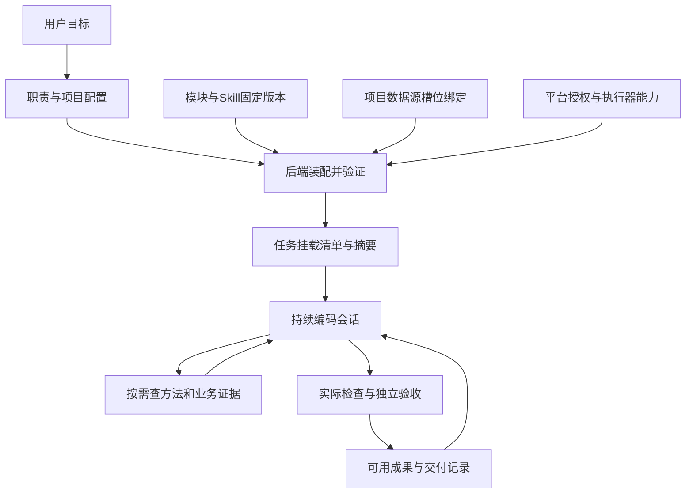

# Webuddy：从配置组合到可执行挂载

日期：2026-09-12。基线：d2b0f8f。本报告来自本地实现审查；不是生产环境新一轮全量审计，也不把模板通过测试等同于真实业务能力。

## 1. 核心定位

Webuddy 的产品目标是：团队用自然语言委托工作，平台为执行器准备合适的方法、资料、工具和工作现场，让它持续产出可验证、可接续的成果。

约束是运行时的一部分，不是产品全部。有效能力由四类东西共同形成：知道怎么做的方法、可以查询的业务事实、真正能调用的工具、可以证明完成的验收条件。仅增加提示词只能改变“模型被要求做什么”，不能增加“模型实际能做什么”。

保留六环看板。它适合帮助人理解目标、进展、验收与交付；六个展示阶段不必对应六次模型交接。普通 coding 使用一个持续负责人，复杂任务才启用既有 DAG。前端选择的最终对象应是一次可解释的运行配置；后端必须能说明它实际装配出了什么。

## 2. 当前基础与真实断点

| 层次 | 基线已有实现 | 断点与结论 |
| --- | --- | --- |
| 职能体 | AgentStore：职责说明、分阶段模型、验收、交付、Skill IDs；不可变版本 | 已经能表达工作配方；不必另造一套数字员工对象。但 tool_scope 只能为空，不能把字段存在误解为支持自定义工具权限 |
| 能力模块 | ModuleStore：风格、知识、工作方法、交付规范；固定版本与组合冲突检查 | 基线只有 instructions 注入，不包含真正的数据源依赖与挂载 |
| 能力契约 | CapabilityStore：输入、输出、验收、ready/draft、项目绑定、成果候选 | 与模块有表述重叠，但其输入输出及验收有价值。建议保留为可调用工作契约，逐步统一引用，不直接删表迁移 |
| 项目档案 | KnowledgeStore 中的 knowledge agent 与 entries；来源、版本、适用提交 | “项目档案”与“职能体”应该在文案和代码边界上分清。项目档案描述项目，不应扮演第二位负责人 |
| 资料检索 | assemble_context：词项匹配、最多六条知识、每条最多一千字符、总量约一万二千字符 | 对代码定位有用；无法代替持续查询垂直知识库。未选中的资料在基线执行时没有继续检索入口 |
| Skill ZIP | 包检查、不可变资产、维护草稿、skill_ids | 保存和应用 skill_ids 不等于运行时读取文件。基线执行端没有据此加载 ZIP 的 SKILL.md 和 references |
| Prompt 装配 | service 在规划、编码、验收处分别拼装 | 职能体说明在 context.vertical_agent 和独立 AGENT INSTRUCTIONS 中重复；还会绕过 assemble_context 原先的限额计算。验收/交付字段没有一致到达编码端 |
| 工具执行 | Claude 文件工具、隔离终端、浏览器、只读研究助手；明确权限回调与 hook | 是值得保留的底座。平台注册的 project MCP 是实际工具；外部私人 MCP 被禁用，并不等于已有通用连接器挂载 |
| 多执行器 | Claude/Codex/DSH 独立适配、SDK 子进程、有界通信 | 工具能力不对称。应当有明确的支持矩阵，不能仅因三个 provider 都能返回文本就宣布挂载一致 |
| 持续状态 | 工作树、会话、反馈接续、预算恢复、版本记录、独立验收和交付 | 保留。更换方法或资料时还需要判断旧模型会话是否适合复用，不能只核对模型名 |
| 团队 | 登录、CSRF、管理员写操作、项目执行授权 | 当前不少旧 GET 接口仍采用可信团队共享阅读；不是严格的多租户隔离。新资料接口应显式按项目授权，正式对外团队化前需另做整站读取权限审查 |
| 预算 | 运行预算和已记录成本；另有团队额度数据结构 | 当前 _runner_for 返回原 runner，GovernedRunner 也主要转发。不能把额度表存在当作所有入口都已强制执行成员额度；中转计费与平台授权仍需分清 |

上述不是否定已产出：版本、恢复、沙箱、归档、看板继续使用。要重整的是这些组件之间的契约。

## 3. 对象边界

| 对象 | 应回答的问题 | 不应承担 |
| --- | --- | --- |
| 职能体／工作配方 | 我负责哪类工作，默认使用什么方法，交付什么 | 私藏业务库凭据；复制平台工具实现 |
| 模块／Skill | 何时采用什么方法，有哪些参考与验收经验 | 自己提升权限；把外部数据当系统指令 |
| 数据源槽位 | 这个方法需要哪一种资料，例如 format-spec | 写死客户库地址 |
| 项目绑定 | 此项目的 format-spec 具体接哪一份资料 | 修改其他项目的绑定 |
| 连接器 | 怎样从 CLI、MCP、API 等获取数据或执行受权操作 | 决定业务验收是否通过 |
| 挂载清单 | 本任务实际使用的版本、资料、工具及限制是什么 | 展示“安装成功”却没有可调用入口 |
| 验收契约 | 用什么真实观察证明完成 | 让执行模型仅凭总结自证 |

### 运行路径

## 4. 本轮已经落地的第一条完整链路

### 4.1 数据源与项目槽位

新增 SourceStore：项目拥有的数据集合、不可变内容版本、导入来源、内容摘要、启停状态、配置人和操作记录。只有管理员在控制面导入的资料才进入集合；上传动作不自动让它被所有任务使用。

模块支持两类依赖：

- source_slots：可复用的逻辑槽位，例如 format-spec。推荐共享模块使用它。
- source_refs：直接固定某个项目数据源 id/revision，适合项目专用模块。

项目把槽位绑定到资料版本。选择模块时核对归属和可用性；任务开始时固定已解析的绑定；组合引用同一资料的不同版本会明确报错。不同项目可以把同一个槽位绑定到不同库，模块方法不用复制。

### 4.2 CLI 与 MCP 接入

新增 factory-sources 管理入口：

- import-json：文件或标准输入导入统一文档结构，现有知识库 CLI 可以通过管道输出它。
- import-mcp：管理员指定已安装的 MCP stdio 服务和明确的资源 URI，通过 resources/read 读取文本。
- bind：把版本绑定到项目逻辑槽位。
- list、enable、disable：检查和启停。

MCP 导入只读取指定资源，不采用服务器推荐的工具权限，不自动调用 tools/call，不允许模型选择命令或环境变量。服务 stderr 不写进平台返回值，错误不输出原始 SDK 异常；第三方服务是管理员安装的受信任程序，并非在 coding 沙箱内执行。

这是“定期获取资料并固定版本”的接入方式；还不是每轮向远程业务库实时查询。该区别必须保留：工艺规范、格式说明、运维手册适合快照；库存、订单、实时状态需要后续实时查询适配器。

### 4.3 真正的模型可调用挂载

compile_mounts 将模块依赖、适用的项目知识摘要、职能体选中的 Skill 文本装成一次任务清单。完整正文由受控通道交给 SDK worker，不拼成大段模型提示。

Claude 实際获得 mcp__references__search 和 mcp__references__read。搜索返回紧凑结果；读取按页返回正文、来源、版本和摘要。工具实现只访问本次清单中的文档，不接收数据库路径、文件路径或可执行命令。

选中的 Skill ZIP 中 SKILL.md 和 Markdown/text 参考资料可按需读取；包内脚本和二进制不执行。程序方法标记为 scoped_procedure，业务资料标记为 reference_data。前者只能在用户范围与平台权限内提供方法，后者不能变成指令。

本轮没有把旧项目知识库全部换成新库。已有基线适用性检索仍提供少量项目摘要；新增垂直集合补上可完整分页读取的资料。代码知识的提交适用性规则继续保留。

### 4.4 接续、撤销与可观察性

- 普通恢复使用原挂载清单，更新资料库不会悄悄改变在途任务的依据。
- 反馈产生新任务并改变挂载摘要时，清除旧反馈会话引用，保留代码并发送完整新上下文。
- 停用集合会阻止后续 provider dispatch；已经进入 SDK 的调用保有本次快照，需要取消任务才能立刻停止使用。不能宣称支持即时清除模型已见资料。
- 记录 mounts.frozen、mounts.dispatched、source.read 和 source.read_failed。读取日志包含文档标识与页偏移，不复制整个资料正文。
- 新增按项目授权的 sources 和 run mounts 查询接口。挂载接口返回版本与文档数量，不回传整份资料。

### 4.5 Prompt 衔接修正

职能体正文不再同时放进项目证据与 AGENT INSTRUCTIONS。统一的 agent_guidance 向规划、编码提供职责、验收与交付格式；验收端也收到交付契约。职能体身份与版本留在任务快照中，项目证据上下文不再重复保存角色说明，避免挤爆资料限额。

### 4.6 当前明确限制

- 挂载清单与资料模型独立于 provider；本轮实际工具适配为 Claude。Codex/DSH 请求外部集合或 Skill 挂载时明确报不支持，不假装已经挂载。
- MCP 导入支持 stdio 文本 resources；HTTP/SSE、OAuth、动态 tools/call、数据库写入与自动重同步尚未接入。
- 单集合最多 100 文档、单文档 40,000 字符、集合及任务清单各最多约 200 KB。超出时明确要求拆分；这不是大规模检索引擎。
- 现有知识摘要仍只覆盖 assemble_context 选中的项目条目，不等于全量代码知识库。
- 新接口按项目授权，旧接口仍需系统性权限梳理。
- 凭据仅在管理员导入进程使用，不证明任意第三方 MCP 程序本身安全，也不是一人一凭据的完整托管系统。

## 5. 下一步顺序

### 第一优先：统一执行配方与能力支持矩阵

把当前 manifest 扩展为执行器公开的能力协商：文件、终端、浏览器、资料查询、外部写入分别列出支持与权限。缺少必需能力应在任何付费模型调用前发现，并指出究竟缺驱动、授权还是资料绑定。避免后续只用 provider 名字判断能力。

将职能体依赖的模块从内置包构建时复制改为版本引用；保留迁移兼容和已有冻结任务。CapabilityStore 的输入、输出、验收作为工作契约保留，其方法正文逐步引用共享模块。

### 第二优先：实时数据源网关

统一受控请求：source_id、operation、typed arguments、project/actor identity。模型不能提供命令、任意 URL 或原始数据库语句。连接器负责协议转换；网关负责身份、资源范围、超时、限流、取消、输出大小、来源与审计。

优先实现 search/read，按需增加一个明确业务操作；不要把一个 MCP 服务器的全部 tools 自动加入会话。CLI 适配器用固定 argv 和结构化 stdin，逐条声明操作；将 MCP 工具名映射为经过管理员确认的业务操作。上游工具的 readOnlyHint 只是提示，不能替代权限判断。

### 第三优先：真实团队与知识治理

审查全部读取入口、运行详情、ZIP、Skill 与项目档案；区分可信共享工作区和多租户模式。成员停用/项目撤权在 dispatch 与实时网关每次调用都检查。凭据绑定到成员或服务身份，配置范围与来源分开；冻结内容版本不冻结仍然有效的授权。

为资料增加业务有效期、主题标签、源版本、最后同步时间与证据失效策略。只有真实查询量和召回失败需要时再引入向量索引；先用现有词项搜索、精确 ID 与分页读取验证闭环。

## 6. 用什么任务验收

选一个真实垂直任务，例如“依据客户格式规范，将设备导出的 CSV 转成目标格式”。同一个方法模块在两个项目分别接不同规范，验收以下行为：

1. 模型查到当前项目的规范，引用具体版本，不把另一项目的规则混入。
2. 缺少关键资料时指出缺失，不编造协议。
3. 资料更新后，原运行仍按旧版完成，新运行使用新绑定。
4. 失败修复保留代码，既有方法与资料不重复全文加载。
5. 正常、边界、错误输入和独立保留样例都通过，CLI 真正可安装使用。
6. 同事只处理业务差异；平台自己处理工具装配、运行、恢复与证据记录。

衡量仍以首次可用结果耗时、人工介入次数、真实验收成功率、无效调用量为主。测试数量与模块数量是辅助指标，不能代替这四项。
