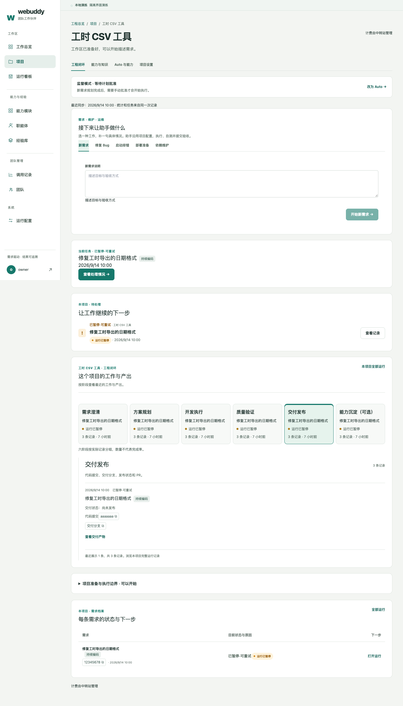
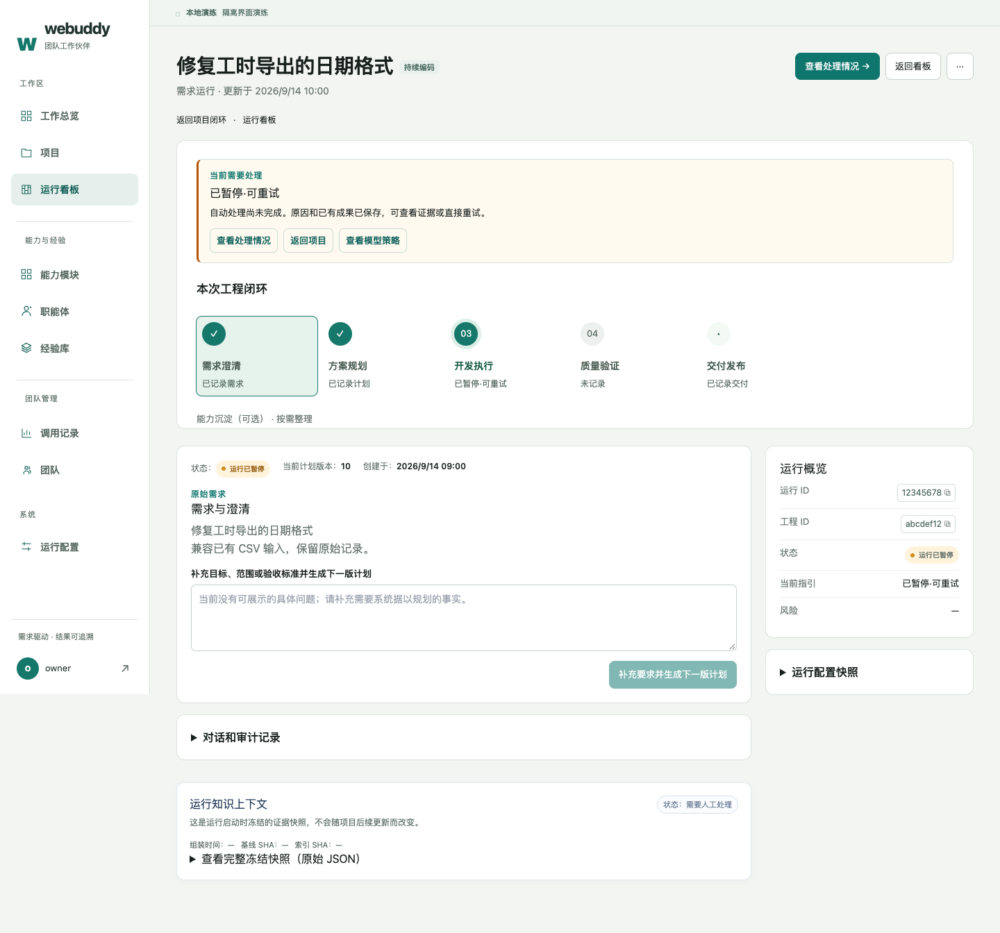
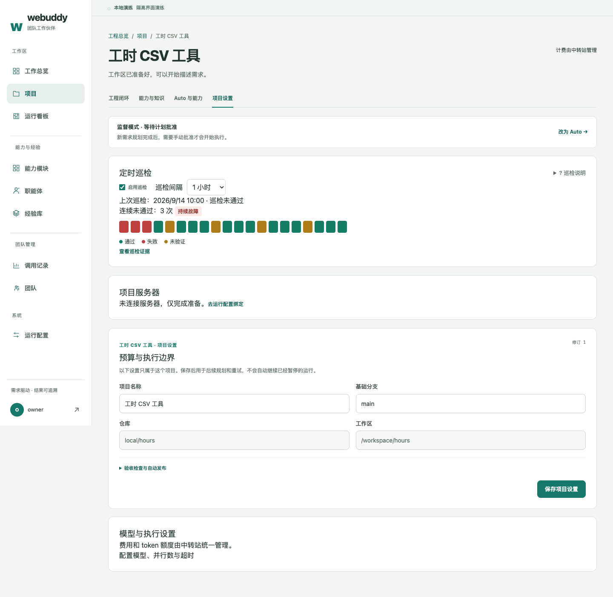

# 工作台 UI 改版 · 2026-09-14

依据 `uiux-improvement-plan.md`，在 8584b6f 上完成前端增量。六阶段仍是记录分组，阶段定义、数据源、路由、请求字段、幂等键和 API 契约保持不变。没有修改后端。

## P0：结构与信息层级

- 项目页与总览共用 `StageStrip`：六个等宽阶段，每段显示最近标题（14 字）、相对时间、带文字的状态点，记录数量降为次要文字。项目页支持方向键与 Home/End 切换，详情在下方全宽展开。
- 删除无消费者的 `EngineeringLoop` 和环形图样式。环形箭头会暗示强制循环与完成率，与实际记录分组不符；共享阶段条能直接扫读最近工作，且只保留一句数量说明。
- `runTitle` 优先使用用户请求首行（40 字），再用有效计划标题，最后用运行短号；执行模式名单独显示为徽标。运行、工程编号显示 8 位并可复制完整值，提交 SHA 显示 7 位，交付分支只展示徽标并可复制。
- 列表使用短 `label`、状态和时间；完整 `summary` 只出现在运行详情的统一引导卡，旅程导航不再重复它。

## P1：页面结构

- 运行顶部保留一个由当前状态决定的主入口、返回看板和更多菜单。补充要求、导出、废弃、取消收纳在菜单；取消需二次确认，默认聚焦“保留运行”，Escape 关闭后焦点回到触发按钮。
- 旅程节点直接承担工作视图 Tab；删除另一套导航。可选能力沉淀保留为独立的草稿入口，不伪装成必经执行阶段。
- 策略、模型配置和已搭配能力合并到“运行配置快照”折叠卡，解释“冻结＝提交时定格”。
- 巡检与项目服务器移到“项目设置”。成员可只读查看，写操作仍仅对管理员开放。主流程为需求表单、当前任务、待处理、阶段与记录。
- 巡检最近 20 次用纯 CSS 色条展示，每格有中文结论、时间、耗时与证据链接；连续失败 ≥3 显示“持续故障”。边界说明和远程探测开关收进帮助说明。空运维事实不渲染占位卡。
- 未绑定服务器时只显示状态及管理员配置入口／成员说明；已绑定时展示目标和最近健康检查。健康状态只从项目已加载的 `remote_results` 读取，缺少证据显示“未验证”，不额外探测、不新增接口。
- 有项目的总览使用轻量入口，无项目保留大卡。计费说明后置，不充当统计量；最近成果补充请求标题、时间、状态及发布情况。

## P2：本轮完成范围

- 运行配置、运行详情和阶段／总览加载采用共用骨架组件；未触达页面的加载样式留待后续统一。
- 经验库无能力时改为一个可操作空态；调用明细全部缺失时只显示一个“供应商未返回明细”，未知缓存统计可通过悬浮或键盘聚焦查看说明。
- 清理本轮涉及页面的普通链接箭头，主 CTA 保留；未触达页面的链接不作机械批量替换。
- 检查侧栏可访问名称、阶段及工作类型 Tab 键盘操作、状态文字与确认框焦点管理。修复扫描发现的低对比度文字和运行表空表头。
- 文案原则记录在 `presentation.tsx`：避免一屏重复整句引导；边界说明折叠或后置；内部术语附白话解释。

## 验收

- `npm run build` 通过。
- Vitest：20 个文件、157 项通过。覆盖阶段条、标题回退、完整值复制、短长引导分级、巡检趋势、设置迁移、请求字段及幂等键保留、成员只读、动作确认与焦点、总览两种入口、加载及空态。
- Chrome/Puppeteer，1440 × 1000 桌面：总览、项目阶段、项目设置、运行列表、运行详情、经验库空态、调用记录、运行配置共 8 个页面／状态。没有脚本错误、没有横向溢出；验证阶段与旅程键盘切换、取消确认／Escape 恢复焦点、运行配置加载骨架。没有发出写请求。
- axe-core WCAG 2 A/AA、2.1 A/AA 与 best-practice：8 项均为 **0 violations**。`incomplete` 保留在[机器报告](design/uiux-2026-09-14/axe-report.json)中，主要为浏览器无法自动判断的颜色和 ARIA 项，不能将其当成自动通过。此报告是隔离接口样本的前端基线，不是生产数据全覆盖或完整无障碍认证。

复跑浏览器基线（需要 Chrome；axe 为独立验收工具，不进入产品依赖）：

```sh
npm --prefix frontend run dev -- --host 127.0.0.1 --port 5175
# 在另一个终端：
npm --prefix runtime/project-browser ci
npm --prefix /tmp/webuddy-uiux-tools install axe-core --no-audit --no-fund
node frontend/scripts/uiux-browser-smoke.cjs
```

脚本默认使用 macOS Chrome。可通过 `BROWSER_EXECUTABLE`、`UIUX_ORIGIN`、`UIUX_TOOLS`、`UIUX_OUTPUT` 指定浏览器、地址、工具和输出目录。所有 API 在浏览器中由样本拦截，不需登录或生产凭据。

## 当前截图

以下是本轮实际 Chrome 截图，数据为隔离演练样本。







## 边界

不做深色主题、移动端重新适配、国际化、图表库或后端数据结构变更。历史设计稿和旧截图继续作为历史资料，当前布局以本页截图为准。
