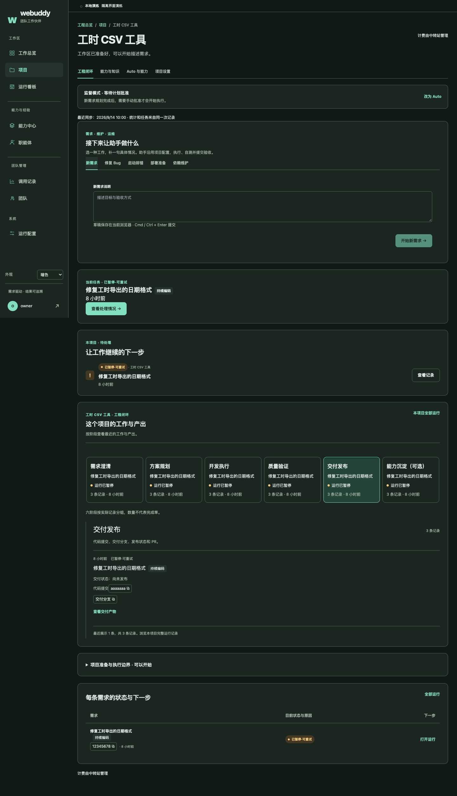
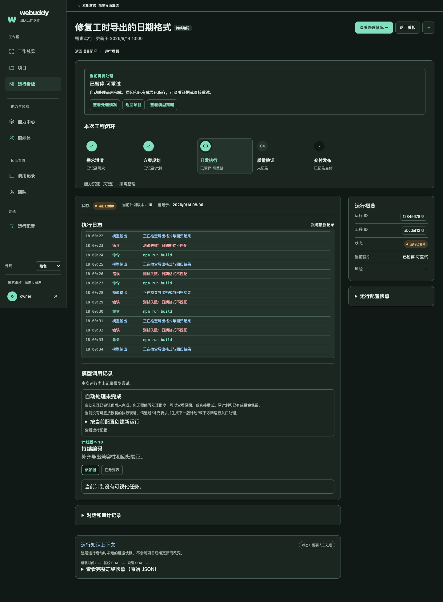
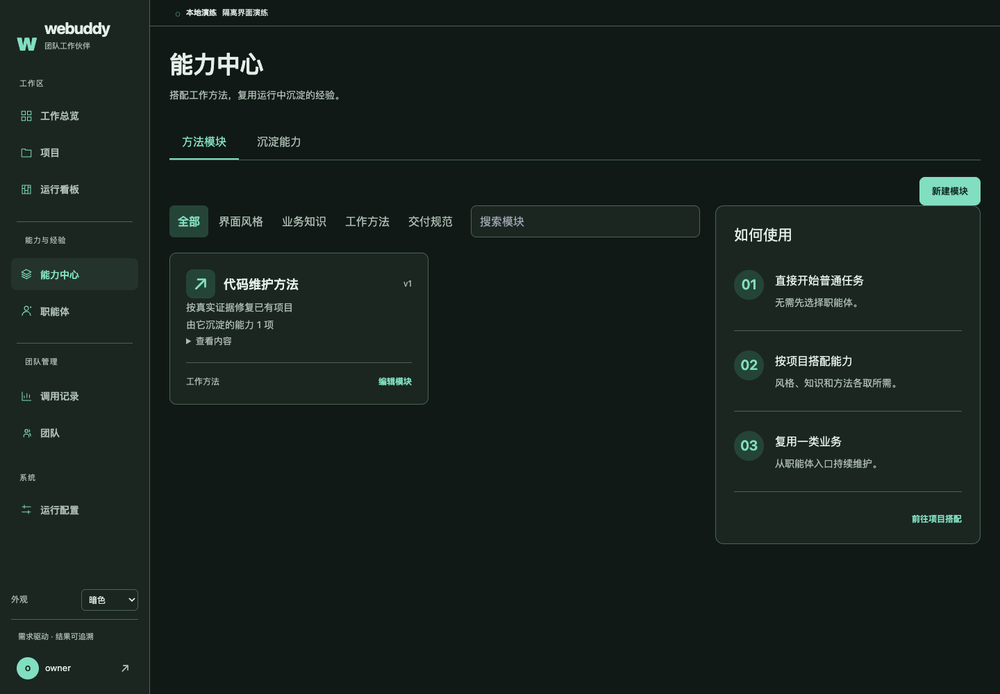

# UI 第二轮：布局、主题与执行体验

本轮仅修改前端与设计文档。后端 API、权限、预算、幂等语义与项目六阶段映射保持不变。新增能力中心页面和旧入口的前端重定向。

## 使用变化

- 全站内容宽度由 `--layout-content-max: 1240px` 统一控制。运行页在窗口宽度 ≥1200px 时主列与摘要栏并排，项目阶段条和记录表占满内容宽度；窄容器中的阶段条横向滚动并吸附到阶段起点。
- 页面保留一个主标题区；卡片标题降低视觉权重，次级卡片眉题隐藏，普通链接去掉箭头，主操作保留方向提示。
- 待处理和需求记录使用一个状态徽标，短语与色调由同一份运行指引生成。列表中一天以内显示相对小时、更早显示日期，时间悬停可查看绝对时间；运行详情继续展示绝对时间。
- 需求草稿按项目保存到当前浏览器，包含需求正文、工作类型和结构化字段；提交失败保留，成功后清除。Cmd/Ctrl+Enter 提交，输入法组合期间不触发；达到 45000 字时显示距 50000 上限的剩余字数。部署勾选属于当次明确授权，不从草稿恢复。浏览器禁用存储时仍可正常填写和提交。
- 侧栏底部可选择跟随系统、亮色、暗色；选择保存在当前浏览器。默认跟随系统，系统为亮色时显示默认亮色。语义颜色集中于 `frontend/src/workbench/theme.css`，原样式与图形引用这些变量。
- 执行区展示带行级时间戳的等宽日志，命令、模型输出、错误分别着色并带文字分类。自动滚到最新；上滚暂停并显示“跳到最新 ↓”。沿用现有 3.5 秒事件轮询，不是模型 token 流式接口，不增加后端调用契约。事件仍保留原审计入口。
- “能力模块”和“经验库”合并为“能力中心”，页内有方法模块、沉淀能力两个 Tab。`/modules`、`/capabilities` 保留前端重定向，并保留原查询参数与锚点。
- 模块显示关联能力数量；能力提供来源运行和来源模块链接。关联通过现有 `source_run_id` 与运行的 `module_snapshot` 计算，同一来源运行内模块去重。它表示来源运行曾挂载该模块，不声称该模块独立产出全部能力；仅统计接口可见记录，来源不可见或请求失败时明确提示，不生成虚构来源。

## 验收记录

- `npm --prefix frontend run build`：通过（包含 `tsc -b`）。
- `npm --prefix frontend test`：21 个文件、170 项测试通过。
- 新增测试覆盖：单状态徽标、相对时间与绝对时间提示、按项目恢复草稿和成功清除、快捷提交与输入法保护、字数提示、导航真实可访问名称、主题存储、日志吸底/暂停/恢复、能力中心重定向与来源去重。
- 本机 Chrome 使用隔离 API 样例，亮暗各 10 个页面／状态执行 axe；均无自动检测到的违规、脚本异常或页面横向溢出。没有提交真实任务或修改服务器数据。
- 浏览器额外断言：1024px 窗口中的阶段条滚动与 scroll-snap、1800px 窗口中内容上限 1240px、运行主副列并排、日志暂停和跳回最新、阶段键盘切换、确认框 Esc 与焦点恢复。
- [亮色 axe 报告](design/uiux-2026-09-14-round2/axe-light.json)；[暗色 axe 报告](design/uiux-2026-09-14-round2/axe-dark.json)。报告保留 `incomplete`，包括滚动区外文本等无法自动判定的对比度项目；零违规不等同于完整人工无障碍认证。
- [语义颜色对比度记录](design/uiux-2026-09-14-round2/token-contrast.json)：正文、次要文字、日志分类和各状态前景/背景组合均超过普通文字 AA 的 4.5:1；本次检查最低 5.47:1。

复现浏览器检查：启动前端后，分别设置 `UIUX_THEME=light` / `dark` 和 `UIUX_OUTPUT`，运行 `node frontend/scripts/uiux-browser-smoke.cjs`。脚本使用 runtime/project-browser 已有 puppeteer-core；axe-core 安装位置可通过 `UIUX_TOOLS` 指定（本次 `/tmp/webuddy-uiux-tools`），浏览器通过 `BROWSER_EXECUTABLE` 指定，站点通过 `UIUX_ORIGIN` 指定（本次 `http://127.0.0.1:5175`）。

## 深色截图

以下为隔离样例页面，不代表生产任务已经执行或部署。

### 项目页

### 运行页

### 能力中心

