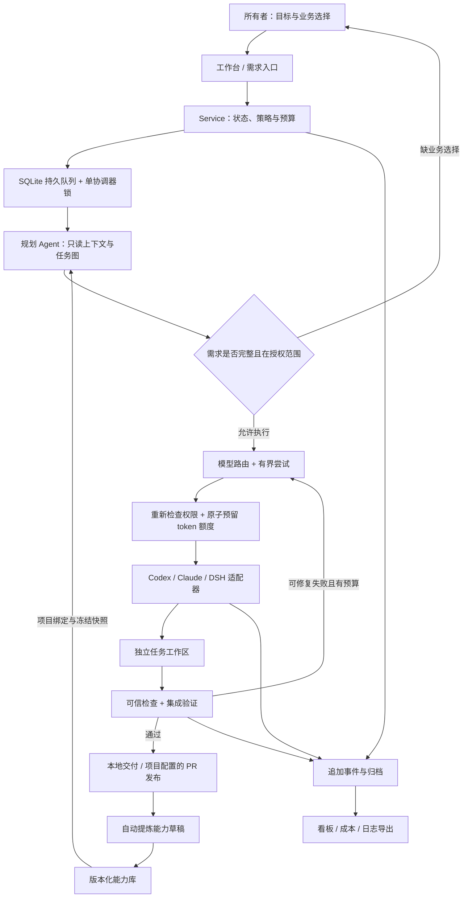

# 无人工厂 v3：自主交付与能力生产

## 产品目标

为单所有者及可信工程团队提供持续工作的软件工厂。用户提交明确需求，或通过需求澄清得到明确目标；系统在事先配置的项目范围和预算内自主规划、分工、验证与交付。人的主界面是运行现场、交付证据、能力资产和费用记录。常规执行不依赖逐步人工批准，缺失业务意图和超出授权的工作集中呈现为异常。

## 基线与演进

本工作副本来自 upstream `auntunt/unmanned-factory` 的 `rewrite/engineering-harness-v2`，源提交 `b2425121528f2e0ed1431dcc3111b7769a6d261d`。使用 GitHub 源码归档导入并记录本地基线，未修改旧目录中的用户未提交内容。保持 Python/FastAPI/SQLite 与 React/TypeScript/Vite；沿用已有 SDK 适配、代码范围验证、独立工作区和项目知识。

## 核心边界

1. **工厂控制层**：项目与需求、持久状态、并发与恢复、授权策略、预算、版本和事件。
2. **执行层**：已有 Codex / Claude / DSH 适配器执行有界工作；模型 ID 来自实际配置，不猜测账号可用型号。
3. **能力层**：版本化 Agent 能力定义、适用场景、SOP、输入输出、验收规则；项目绑定具体版本，执行冻结快照。
4. **知识层**：项目事实和客户配置独立保存；成功执行提供候选能力材料，验证后才成为可复用能力。
5. **人机界面**：运行总览、任务看板、项目、工作能力、模型与成本、团队与额度、运行详情与日志导出。所有计数来自实际状态，演示数据明确标记。
6. **团队治理**：管理员和成员、执行项目分配、调用归属、按成员/项目/工作区计量与审计。所有已登录成员共享可读记录；项目分配限制执行，不提供多租户数据隔离。

## 稳定对象

- Project：仓库、可信检查、运行策略和领域档案。
- Run：一个用户目标，保留需求对话、计划、知识/配置快照和产物。
- Task：有依赖、修改范围及验收条件的工作单元。
- Attempt：某任务一次模型执行，保留模型选择、失败和成本；重试不改写旧记录。
- Capability：独立版本的职责、SOP、输入输出与验证说明，可绑定项目和从交付提炼。
- Event：追加写事实记录，贯通界面、导出、成本计算与复盘。
- TokenCall：一次 SDK 任务的派发预留、完整结算或待核对记录，关联成员、项目和运行。

| 模块 | 稳定职责 | 当前实现 |
| --- | --- | --- |
| 入口 | 身份、请求来源、API | `app.py`，既有 auth 与 v2 路由，新增 v3 路由 |
| 团队 | 角色、项目权限、额度预留与结算、审计 | `auth.py`、`governance.py`、`team_routes.py` |
| 协调 | 状态迁移、恢复、派发与交付 | `service.py`、`autonomy.py` |
| 规划 | 从上下文得到可验证任务图 | `planning.py`、`context.py` |
| 执行 | 角色选择、工作区、重试、集成验证 | `model_routing.py`、`execution.py` |
| 运行时 | SDK 隔离、取消与结果协议 | `providers.py`、`sdk_worker.py`、`runtime.py` |
| 资产 | 版本、绑定、调用、草稿和导出 | `capabilities.py`、`capability_routes.py` |
| 证据 | 持久状态、事件与完整归档 | `store.py`、`autonomy_routes.py` |
| 产品界面 | 状态与证据的可操作视图 | `frontend/src/workbench/` |

项目事实、历史确认与代码索引继续由既有 knowledge/codegraph 模块管理。能力提供可复用行为，项目知识提供本项目事实，两者在上下文组装处汇合。

## 自主策略

项目运行模式为 `supervised` 或 `autonomous`，旧项目迁移保留原模式；用户新建时默认自主。自主模式在需求没有未解问题、检查和范围完整、风险处于配置范围时直接执行。策略冻结到每个 Run；运行中修改策略只影响后续任务。授权、预算和验收由程序执行，不由模型修改。

## 模型与成本

沿用 planner/cheap/standard/strong 四个可配置角色。小任务优先经济角色，跨模块任务使用常规角色，高复杂度/高风险任务使用强角色。验证失败允许有限次数修复与升级，升级保留原因和全部成本。配置模型 ID 与角色分离，Luna/Terra/Astra 可以作为用户所配角色的显示名称，但不假定底层服务接受这些型号。

记录已报告费用、费用未知次数、各次尝试和规划费用；未知费用不视为零。总预算覆盖规划和失败尝试。美元费用无法事先硬封顶时，明确其为派发约束，并结合任务数、并发、时长与重试次数限制。冻结策略和模型配置使运行可以追溯。

团队 token 账本在每次 SDK 任务前原子预留，同时检查成员、项目和工作区的月额度。完整结果按总输入加总输出结算，缓存输入按供应商字段规范化；异常结束的部分流式用量不冒充完整结算。未知记录跨月保留，并阻止有上限范围的新派发，人工核对须留依据。SDK 内部多轮使用可能超出预留，因此这不是供应商实时硬限额。执行身份来自服务器配置，尚不按成员切换个人订阅。具体运行口径见 [小组运营说明](TEAM-OPERATIONS.md)。

任务图中的下游工作区基于已集成的上游提交，重叠文件范围串行处理。任务失败按策略修复/升级；最终集成检查失败时，最多增加一次受原声明文件范围约束的修复，并重跑全部可信检查，不能以单任务成功替代集成成功。

## 恢复与副作用

持久状态先于派发。重复启动同一运行不得并发重复执行；重启后自动恢复未开始的工作和可重做的只读规划。已经执行的写入必须核对现场和检查点；已发布的外部操作不能盲目重放。重试保留旧运行和工作区，关联后继运行/尝试。取消立即阻止后续派发，历史不删除。

## 知识与日志

决策过程指可核验的目标、依据摘要、选型、工具事件、验证和结果，不能将内部推理过程伪造为日志。结构化事件和用户可读报告来自同一组记录。导出绑定运行、配置和能力版本，包含所有已记录事件并保留分页完整性；凭据脱敏。候选知识与已经验证的项目事实明确区分。

## 验收

- 已配置项目：提交明确需求后按项目策略自主执行，模糊需求进入澄清，回答后继续。
- 经济模型验证失败后升级，成功/失败调用均计入费用，预算耗尽停止新派发。
- 服务重启不会丢失待执行目标，不重复执行同一活动任务。
- 能力可创建、版本化、绑定和调用，调用固定版本，交付可提炼候选能力。
- 页面显示真实运行、选择原因、异常、交付和费用未知状态；支持桌面及移动端。
- 导出覆盖全部已记录事件，自动化验证覆盖认证、版本冲突、重试和恢复边界。
- 真实云资源/第三方账号执行需在用户的实际环境配置后验证，不以模拟执行冒充上线结果。
