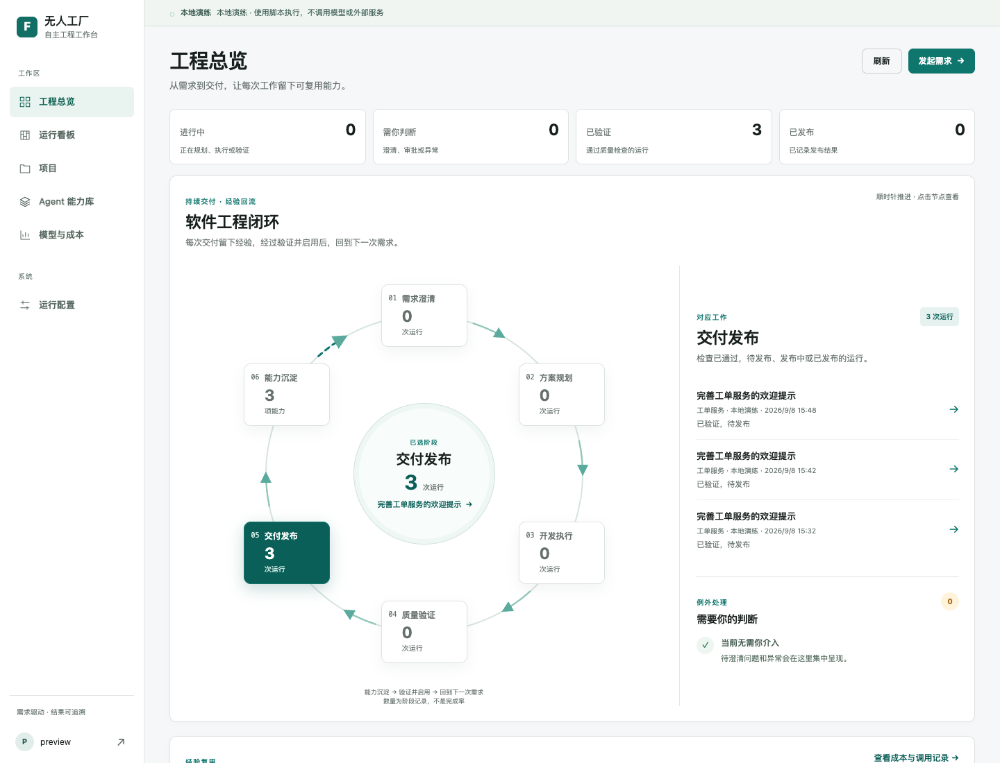

# 页面与用户流程

## 交互原则

面向工厂所有者：打开后先看到正在发生的工作和需要决定的事，再按需查看代码、模型与证据。工作台采用浅灰背景、白色轻量侧栏、白色内容区域和克制的青绿色状态。总览以六阶段闭合圆环为视觉中心，汇总数字和日志降低层级。成功、运行、异常分别编码，颜色之外保留文字；移动端折叠导航与内容列。

页面上的状态、次数、金额均从后端读取。没有数据时引导建立项目或提交需求，不生成装饰性统计。独立演练环境始终显示标识。

[手机工作台截图](screenshots/overview-mobile.png) · [运行详情的交付路径](screenshots/run-journey-desktop.png)

| 页面 | 用户要完成的事 | 主要内容与动作 |
| --- | --- | --- |
| 工程总览 | 知道工作推进到哪里，哪里受阻，留下什么 | 可切换的六阶段闭环、对应阶段记录、当前待处理、能力沉淀与复用、重要动态 |
| 运行看板 | 找到一个目标及其状态 | 搜索、状态筛选、打开详情 |
| 项目 | 定义一次工作环境 | 仓库、检查、预算、知识档案、自主策略、能力版本绑定 |
| Agent 能力库 | 管理可复用交付能力 | 创建、编辑、版本历史、绑定调用、导出 Agent 包 |
| 模型与成本 | 看清谁在执行、费用去了哪里 | 按模型角色汇总调用、已知费用与未知调用，跳转运行配置 |
| 运行详情 | 理解一次执行并处理异常 | 本次交付路径、优先呈现的业务问题、计划与任务图、模型尝试、修复证据、对话、事件、检查、重试和导出 |
| 运行配置 | 调整全局执行资源 | 规划/经济/常规/强模型、供应商、时长、并发、任务数、未知费用策略 |

## 工程总览的信息层级

1. **运营摘要**：进行中、需你判断、已验证、已发布。验证完成和发布完成分别统计。
2. **工程闭环**：需求澄清 → 方案规划 → 开发执行 → 质量验证 → 交付发布 → 能力沉淀。六个节点按顺时针围成圆环，能力沉淀通过明确的回流箭头连接需求澄清。点击任一阶段，环中心显示选中阶段和快捷入口，旁边同步显示对应运行或能力，并可进入详情。默认选择有记录的阶段；手动选择后刷新保留选择。
3. **当前工作与例外**：阶段记录与待处理并列呈现，详情页保留证据，待澄清问题在任务记录前呈现。
4. **经验复用与动态**：展示交付来源、可调用能力、实际引用已有能力的运行，以及关键阶段变化。完整日志在运行详情和导出中查看。

阶段数字是**当前归属数量**，不是累计通过率或项目完成百分比。前五阶段按运行状态归属，失败和暂停另入待处理；主动取消保留在运行历史。第六阶段统计有交付来源的能力，含草稿，明确标注状态；内置模板不计为交付沉淀。“复用”以运行中冻结的能力来源为证，不表示该次交付已经成功。

总览每 15 秒在可见页面读取最新记录，更新时保留原内容；失败时显示上次数据和错误提示。桌面呈现圆环与旁边的工作记录，手机也保留完整圆环并将记录放在其下方。六个节点按 1—6 的顺序支持键盘操作，回流虚线表示经验经过验证并启用后用于新需求。界面不采用装饰性的完成率或虚构的运行数据。

## 明确需求

登记项目 → 配置可信检查与模型 → 开启项目自主策略 → 提交需求 → 系统生成任务与验收 → 自动派发与验证 → 本地产物就绪 → 按项目发布策略交付。

普通执行不增加逐步审批。新项目的权限和检查需要一次配置；缺少配置的任务显示具体阻塞原因。仅在需求不清、超过预设范围、预算或执行异常时进入待处理。

## 模糊需求

规划 Agent 先读项目上下文。仍无法确定的业务选择以少量具体问题呈现，例如“报修提示面向管理员还是报修用户”。回答保存在同一目标的对话里，生成新的计划版本后继续；旧计划不能再被批准。

## 自动修复

任务的经济模型尝试未通过检查 → 记录失败及费用 → 按项目尝试上限和升级策略选择下一角色 → 在新工作区修复 → 重新运行可信检查。用户看到每次尝试的原因与结果，成功修复不再出现在当前异常列表。

## 能力复用

交付自动归档为能力草稿 → 完善适用范围、SOP 与验收 → 保存可调用版本 → 绑定项目 → 提交本次输入 → 工厂按固定能力版本执行。更新版本后，旧项目保持原绑定；升级是一次明确操作。

草稿和来源证据可以导出。版本化能力包属于可迁移定义，运行时、账户、工作区、服务器和目标系统仍由接收环境提供。

## 介入和追溯

异常页提供原因、已有工作区与日志。取消保留记录，重试创建可追溯后继；已发布操作不会被盲目重放。用户可导出 JSON、Markdown 或 ZIP，检查全部已记录事件及当时冻结配置。展开的技术证据服务于排障，主界面以结果和下一步为中心。
