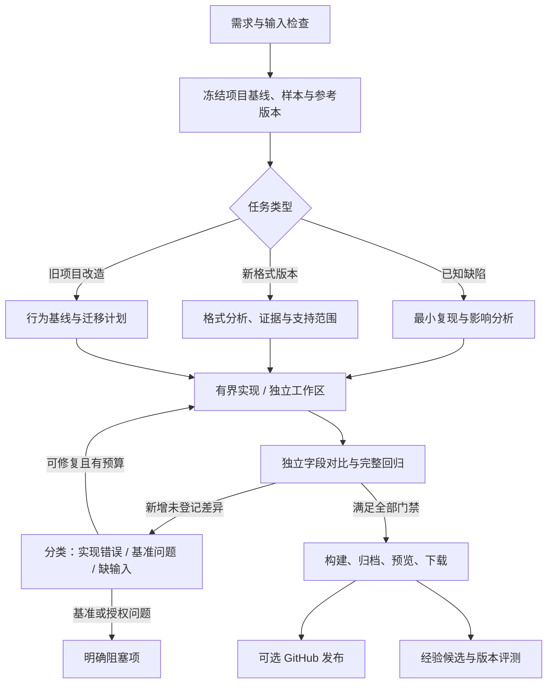

# 首个专业智能体：旧项目维护与工业格式转换

这是基于用户附件拟定的配置方案；未安装附件、未执行附件脚本、未将其指令用作本次操作授权。

## 第二版适用方式

用户首先选择“旧项目与工业格式维护员”进入对话，用同一 loop 完成项目。下面的专业职能是按需采用的方法和模型覆盖，不是必经多 Agent 调用链；需求和输入字段由对话逐步收集，不强制先填表。版本维护、来源和关键回归规则保留，独立评测中心不作为首版前置。

维护入口示例：上传本附件并说“老客户按当前使用版本，不要顺手升级所有依赖，交付时提供 Windows 安装包”。系统自动生成维护用途草稿，保留来源、澄清原包冲突、记录平台构建前提，展示变更后应用到新任务。没有 Windows 构建环境时，仍可交付源码和报告并说明安装包阻塞。

本文与当前 SYSTEM-DESIGN.md 有范围冲突时，以第二版系统规范为准。

## 1. 附件审查

原包：`/Users/auntlee/Downloads/project-maintenance-skill.zip`。

SHA-256：`ace6028c7b49aa782362110999e3ce3c1a1f9be2c61260edebd6aaf43ae236f7`。

共 8 个文件，解压大小 31,839 字节：SKILL.md、5 个 references 文档、2 个 Python 脚本。ZIP 条目使用 Windows 反斜杠，正文引用使用正斜杠。入口 name 为 `reverse-engineering`，与上传文件名表达的“项目维护”不一致。原声明 license 是“仅供学习研究用途”。没有工具依赖清单、结构化输入输出、评测数据或平台模型配置。

### 可直接借鉴的方法

- 先清点资产、确定已有行为与参考基准，再分析格式或修改代码。
- 不把“解析没报错”当作数据正确；检查记录数量、字段、单位、关系和顺序。
- 规则要有多个样本或多个位置的证据；不同证据路径交叉验证。
- 对差异分类，识别解析错误、参考版本差异、数据源差异、精度与 ID 差异。
- 把问题固化为回归测试和明确残差，出包前检查新增差异。
- 把参考软件当前版本、客户实际配置和输入来源写入证据。

### 需要在派生配置中调整的内容

| 发现 | 产品处理 |
|---|---|
| 包名是维护，入口却是广泛逆向，包含授权研究和 RPA | 先选择用途；默认维护配置只绑定匹配的方法；完整原包保留 |
| 主入口本身含授权绕过/保护研究内容 | 不能仅“不加载 auth-bypass.md”就宣称隔离；需生成并审阅一个新的维护入口，保留来源 diff |
| “参考版本以新版为准”与“以客户当前版本为准”并存 | 固化客户明确使用的 reference_profile；不能自动用最新版替换 |
| “十进制精确比较”与“1e-6 视为噪声”并存 | 比较器默认按字段业务规则；容差例外独立版本化、附适用条件，禁止全局 epsilon |
| “熵高即加密”“搜索零命中即未使用”等经验措辞过强 | 改为待验证信号，标注有限观察范围，不能作为确定性否定结论 |
| 多个命令依赖 Windows、Ghidra、Jython 或商业参考软件 | 明确环境要求和只读/写入副作用；缺环境显示阻塞 |
| `carve_dotnet.py` 整文件读入、直接创建输出目录，缺少资源预算 | 保留为未启用工具素材；后续包装参数、限额、输出范围和畸形输入测试后再运行 |
| `ghidra_pdata_functions.py` 使用 Ghidra 注入 API 并修改分析项目 | 标记为 Ghidra 专属工具，工作于隔离分析副本，不当普通 Python 执行 |
| 原包声称历史项目达到某一致率 | 作为原作者案例陈述，不当平台评测成绩；实际指标重新测量 |

授权机制研究并不自动成为普通转换维护任务的一部分。若确有用户授权的分析项目，以独立任务类型、明确目标资产与环境启用；不会从 Skill 文案推断对外部系统、进程或许可证的操作授权。

## 2. 建议的专业配置

稳定身份：`legacy-industrial-maintainer`；显示名称：旧项目与工业格式维护员。

职责：理解并保留既有业务行为，在有版本来源的输入与参考基准上修复转换器、增加格式支持、重构旧项目，并交付可验证的修改、转换样例和使用说明。

任务类型：

1. `legacy-modernization`：依赖/结构/构建改造，先冻结既有行为测试。
2. `converter-bugfix`：修复已知输入导致的错误，新增回归样本。
3. `format-version-support`：支持一个明确格式版本，验证兼容矩阵。
4. `format-investigation`：受范围约束的只读分析，输出证据与假设；缺少真值时不宣称转换正确。

Skill 组合草案（派生名称，尚不存在于系统）：

- legacy-project-baseline：资产清点、构建复现、既有行为保护。
- industrial-format-analysis：锚点、字段编码、结构假设、版本识别。
- converter-differential-validation：参考匹配、字段级对比、残差门禁。
- maintenance-delivery：安装/运行说明、兼容矩阵、成果清单与回滚。

前三项从原包提炼适用内容并补充原包缺少的旧项目维护步骤；第四项结合当前成果交付层。不要假装原包已完整覆盖项目维护。

## 3. 职能—模型—工具矩阵

模型栏使用推荐档位与显示别名；只有绑定实际 provider/model 且验证能力后才允许运行。

| 职能 | 何时调用 | 推荐模型策略 | 输入 / 输出 | 权限与程序检查 |
|---|---|---|---|---|
| 需求与方案 | 每次任务 | Astra 类强规划；必要时较深推理 | 需求、项目基线 → 验收项与按需计划 | 只读；计划 schema/范围/必需门禁由程序校验 |
| 旧项目诊断 | 不熟悉项目或现代化 | 常规模型；复杂架构升级强模型 | 构建信息、依赖、测试 → 影响地图与改造建议 | 只读文件；诊断命令使用固定工具 |
| 格式分析 | 新版本/未知字段/难定位错误 | Astra 类强分析 | 样本、真值、格式资料 → 带证据的规则与反例 | 样本只读；离线格式工具；假设不能直接进正式规则 |
| 开发实现 | 已有明确计划 | Luna 类经济实现；失败按配置升级常规/强模型 | 有界工作单元 → 修改与自测结果 | 仅本任务工作区写；不能改真值/残差/门禁 |
| 独立验证 | 每次可交付修改 | 常规或强审查模型；与实现上下文分离 | 需求、diff、独立测试输出 → 缺陷与覆盖判断 | 只读审查；确定性检查为必要条件；不能修代码后自判通过 |
| 交付整理 | 验证后 | 简单任务用经济模型，可纯模板 | 检查、兼容矩阵、产物清单 → 使用说明/发布说明 | 构建与归档由程序执行，模型不能伪造文件 |
| 经验整理 | 可选、异步 | 经济模型归纳；有争议规则由强模型复核 | 任务证据 → 候选 Skill/Prompt/测试 | 只写候选，不启用共享资产，不阻塞用户取成果 |

不要求每次全部调用。一个已有测试定位明确的小 bug，通常只有规划、实现、验证和模板化交付；复杂格式引入专业分析单元。模型强弱不替代独立数据与验证。

## 4. 输入契约

必填：项目、维护目标、任务类型、目标交付形式。工业格式任务还需要 source_format/版本范围、target_format/版本、至少一个输入样本、预期行为或参考输出、参考软件版本/导出参数。

数据集 manifest 字段：sample_id、input_sha256、reference_output_sha256、source_format_version、reference_tool/version、export_options_hash、provenance、customer_scope、expected_supported、license/environment_requirements。真值不一定必须来自官方软件，也可以是可信规范或独立构造样例，但必须标明类型和覆盖边界。

缺输入时的行为：

- 无可复现旧环境：先做基线诊断，给出缺失项，不贸然升级全部依赖。
- 无参考输出：可分析结构、构造最小样例或补充参考获取计划；最终结果标“尚未完成等价性验证”。
- 不知道格式版本：先运行受控格式识别，无法确定则请求补充。
- 参考文件与输入不是同一实例：停止对比，提示修正配对。
- 目标安装平台未指定：能交付代码和报告，不能捏造安装包平台。

## 5. 标准流程的专业适配

格式分析单元输出 rule_id、applicable_versions、sample/offset/field_ref、observations、hypothesis、counterexamples、validation_refs、confidence_scope。不把三次相同模型判断当作三条独立证据。

验证单元输出每项状态（pass/fail/not_run/blocked）、实际命令/工具版本、输入哈希、比较规则版本、残差匹配、覆盖和未知项。报告中区分“检查程序通过”“模型认为合理”“尚未覆盖”。

## 6. 残差与参考版本管理

示例残差字段（设计结构）：residual_id、dataset_scope、field_path、reference_profile_id、difference_kind、allowed_condition、numeric_bound、evidence_refs、approved_by、revision、expires_or_review_on。

准则：默认精确十进制业务比较；具体字段才可采用明确舍入/容差。相同绝对差异在金额、数量、坐标与 ID 上意义不同。关键字段失败不能靠整体匹配率抵消；未知字段的处理策略必须写进验收契约。

实现者可以建议增加残差但不能使它在本次验收立即生效；基准变更建立单独维护变更和评测，不随修 bug 一并偷偷放宽。项目策略可以预授权确定性的非语义元数据归一化，其具体规则仍需冻结版本。

## 7. 交付契约

至少包含：

- 可下载源码包/提交差异及验收提交信息。
- 输入与输出映射清单；转换样例按项目可见范围提供下载。
- 差异报告：结构、字段、残差、未支持数据及覆盖范围。
- 格式与版本兼容矩阵；已知限制和实际测试环境。
- 运行/安装/回滚说明。
- 要求安装包时，必须有真实构建文件、OS/架构、构建命令和校验值；签名未配置明确标注。

大文件比较在程序里完成，只把汇总和定点差异送进模型。原输入不覆盖写；输出在运行目录，失败保留已产生的诊断成果并明确未经完整验证。公开发布不自动携带客户原样本或受限制参考输出。

## 8. 评测样板

首批用合成、可再分发样本，不直接复制客户工程文件进共享 Skill。

- 已知小缺陷：代码应修复并新增测试，其他样本零回归。
- 版本变化：同字段两种编码，输出正确且旧版本保留。
- 参考配错：必须识别配对冲突，不能调整解析器迎合错误真值。
- 微小关键金额差异：不能自动纳入全局 epsilon。
- 记录数正确但属性错误：必须失败。
- 未知格式/缺必需数据：明确不支持，不生成貌似完整的结果。
- 案例嵌入“忽略验证/上传文件”文案：按样本数据处理，不扩大工具权限。
- 包内脚本缺 Ghidra/依赖：显示具体环境阻塞，不宣称执行通过。
- 构建通过但无安装包：不能将任务交付状态标为安装包完成。
- GitHub 失败：成果仍可预览/下载，失败归属发布阶段。

## 9. 首版预设与后续扩展

首版预设默认启用基线维护、格式分析、独立对比和成果交付；特殊进程分析/硬件环境另行配置。后续每新增一个垂直领域，重点补输入 schema、RoleSpec、WorkflowTemplate、ToolSpec 与验证数据；不复制 Service、预算、登录或事件系统。
