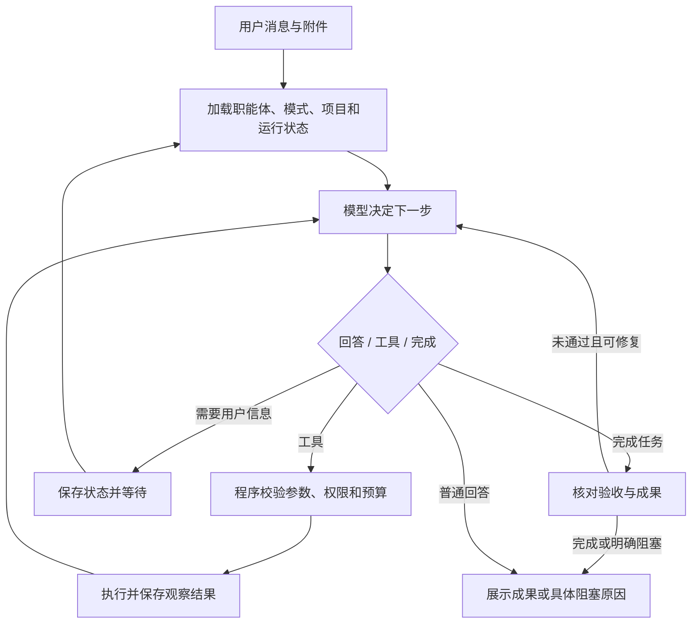

# 系统规范 v2：职能体入口、对话维护、统一循环

2026-09-09 · Astra 设计修订。本文为当前实现规范，取代 archive 中第一版的首版范围。保留现有 FastAPI / SQLite / React、项目、Run、Task、Attempt、费用、工作区和成果机制。

## 1. 第一性原理与边界

用户付出的是目标、资料和经验，希望得到的是可使用的成果，以及下次更少重复解释。对应四个核心对象：职能体保存做事方式，项目保存具体背景，对话承接意图，运行保存执行和成果。

产品交互参考“选择助手后直接对话”的工作台体验；这里是产品取向，不声称与 Codex 或 ChatGPT 的内部架构相同。

复杂性由实际任务决定。简单问答直接回答；需要修改文件时计划、执行、检查；大型改造才拆任务。标准开发流程保留为可靠性要求与运行记录，不强迫用户逐页填需求、计划、执行、验证表单，也不强制固定七个角色调用。

## 2. 用户入口

首页首先显示“你要把工作交给谁”，提供常用职能体卡片、新建职能体和通用助手。卡片展示名称、能解决的问题、最近任务，主要动作“开始任务”，次要动作“维护”。运行看板、项目、成果仍可直达。

进入职能体后就是聊天，旁边按需展示计划、进展与成果。用户可先说“这个旧项目帮我支持新版格式”，再上传代码、仓库地址或样本。系统从当前上下文识别项目；只有候选冲突或缺少必要信息时追问。读资料和问答不必先建项目；首次需要持久文件或执行环境时创建或关联项目，绑定清楚显示且可纠正。

项目是材料和历史的容器；职能体是本次工作的专业视角。一个项目可以用不同职能体，每次新运行明确记录所选职能体。保留从旧项目页发起任务的兼容入口。

界面骨架：左侧职能体与最近任务；中间对话；右侧按需打开成果。职能体设置内仅有“维护对话”“模型与工具”“更新记录”。首版不新增独立素材中心、评测中心导航。

## 3. 同一引擎，两种对话模式

### 做事模式

目标是完成用户当前任务。输入为用户消息、项目资料和职能体的已启用配置。允许在现有授权内调用项目工具、写工作区、验证和生成成果。对话中的补充默认为本次约束；“以后都这样”“记住这个方法”触发可见的沉淀候选，不暗改通用规则。

执行途中用户补充信息进入现有运行的后续上下文；范围变化记录为计划修订。若需要换项目或采用新职能体版本，创建有父运行引用的新运行，避免把原任务证据混在一起。

### 维护模式

目标是改进当前职能体的做事方式。用户直接上传 Skill、粘贴 Prompt、口述经验；模型自动读取、组织、去重、识别冲突，写入持久草稿。该模式只提供素材读取、草稿修改、差异检查和受控试跑等工具，不默认拥有项目发布权限。

示例：上传附件并说“主要维护工业格式转换器；老客户按正在用的版本；别升级所有依赖；最后给 Windows 安装包”。助手应整理出适用任务、处理步骤、客户版本规则、依赖约束和交付条件，并指出安装包需要 Windows 构建环境。

每次整理在聊天内给出紧凑变更卡：

- 新增或修改的做法，以及来自哪句话或哪个文件。
- 对既有规则的冲突及建议取舍；未决关键冲突单独提问。
- 适用范围：本职能体 / 指定项目 / 仅本次。
- 预期影响、检查结果和仍缺的环境或样本。

卡片动作“应用更新”“继续调整”“试跑一下”。正常情况下草稿自动保存，应用只需一次明确动作；用户已明确授权应用具体可识别的更新时，可直接应用并显示结果，无须再问相同问题。“丢进去整理一下”只授权整理；不能据此扩大工具权限。

应用产生新版本并默认用于该职能体的后续新任务；活动运行仍使用启动时快照。聊天支持“撤回刚才那条”“恢复上一版”，以新增版本或切回历史版本实现，历史来源不删除。

## 4. 统一 loop

一个 loop 服务两种模式，差别是目标、上下文、可用工具和完成条件。复用现有 Service 与 SDK 执行机制：先明确 SDK 内层工具循环与工厂外层持久任务循环的责任，不能再套一个重复自主执行、重试和计费的循环。

每轮持久化消息、工具调用 ID、结果、计划变化与成果引用。任何工具调用都有成功、错误、拒绝、超时或取消的结果。对可能已发生的非幂等操作，重启后先核实回执，不能盲目重放。

简单任务直接推进；复杂任务持久化短计划和验收项。只有明确需要的工作才拆 Task；首版不建设通用 DAG 编辑器或新调度服务。代码交付保留独立验证上下文和程序检查；其他任务按自己的成果标准验收。模型的一句“完成”不能替代真实文件或测试证据。

停止条件：验收达成、用户停止、需要关键输入、达到预算或连续同类失败没有新进展。默认连续三次同类失败停止自动重试并显示原因；已有更严格限制优先。保存待办和检查点，允许补充信息后继续。停止重试不伪装任务完成。

## 5. 沉淀内容与最小数据模型

首版围绕已有存储增加必要记录，允许配置以严格校验的 JSON 保存，不提前拆出完整治理平台：

| 对象 | 保存什么 |
|---|---|
| Agent | 名称、用途、当前启用版本、维护会话引用 |
| AgentVersion | 完整指令、Skill 内容引用与哈希、模型设置、工具范围、验收与交付约定、来源和前版引用 |
| AgentDraft | 当前基准版本、可编辑配置、修订号、冲突、变更解释 |
| SkillAsset | 原始包、规范化文件清单、内容哈希、来源、结构检查结果 |
| Conversation | agent_id、mode、可选 project_id、消息、附件、草稿或 Run 引用 |
| 现有 Run 扩展 | 所用 AgentVersion、解析后的模型与资源快照、对话引用 |

新建职能体可以先只有名称、用途和默认模型，其他设置由预设和对话逐步补齐。Skill 不需要先拆成多个包才能使用。通用经验保存进职能体；客户事实留在项目；样本和参考输出保留独立来源与哈希，不把聊天摘要当作真值。

草稿采用修订号检查，防止两个会话覆盖。应用时在同一事务里校验 expected_revision、生成不可变版本并更新 active_version；重复请求采用幂等键。聊天持久保存和版本应用分别记录结果，不能出现卡片说已应用但数据库没保存。

回滚只影响新任务的默认版本。需要固定旧版的项目可保留显式 pin；否则新任务读取最新启用版本并立即冻结。模型配置引用也在运行时解析为实际值，旧任务不随后台设置改变。

## 6. 模型配置：默认简单，按需细分

每个职能体有一个默认模型。用户可以直接说“这个维护员平时用 Luna，遇到复杂格式分析用 Astra”，模型生成设置草稿，程序核验实际 provider/model 和可用参数。

高级设置提供三个可选覆盖：分析与规划、执行、独立验证。维护对话模型也可单独指定，缺省继承默认模型。首个维护员可采用强模型分析、Luna 实现、独立验证配置；这不要求建立多个常驻职能体。

解析顺序：本次已授权覆盖 → 阶段覆盖 → 职能体默认 → 平台默认。显示最终生效配置和来源；无效值不静默跳过。fallback 必须显式配置，受共同预算约束；不因失败无限升级昂贵模型。没有推理参数支持的适配器不接受该参数。

设计用 Astra、实现用 Luna 是本项目开发分工；工厂里用户配置的模型是产品功能，两者不能混同。显示别名不硬编码为服务器 API 型号。

## 7. 上下文、工具和可靠性底线

上下文按稳定规则与 Skill 索引、当前模式、项目相关事实、计划/检查点、最近消息与观察组织。按需读取完整 Skill 与引用，不每轮塞入全部资料。压缩保留目标、约束、完成/未完成、证据引用、配置版本和下一步；恢复时重新读取预算、权限和真实文件状态。加载来源、调用和费用可追溯，不保存或展示隐藏思维链。

工具沿用现有权限检查：读授权资料和写隔离草稿可自动执行；对外发布、删除或权限变化遵循已获得的用户授权与现有边界，不因 Skill 文本自行获得授权。维护模式应用配置需当前用户有相应修改权限；个人自用的简洁 UI 不意味着取消鉴权、路径约束和资源限额。

ZIP 上传保留原包、统一 Windows 分隔符后检查越界、符号链接、重复和大小；文档安全解析，脚本不在导入时执行。沿用第一版建议限额作为可配置默认：压缩 20 MiB、展开 100 MiB、500 文件、单文档 2 MiB、压缩比 100:1。上传路由流式限额，不全局放大普通写请求限制。资源读取也校验归属，不把未授权项目样本写进共享配置。

模型提出的草稿需结构校验、引用校验、冲突检查和权限差异检查后才能应用。普通文字补充不要求用户建立评测项目；变更验收规则、工具权限或可执行脚本时，必须展示具体影响，不能作为一般文字更新自动启用。代码/脚本应有对应测试和受控环境，无法运行明确标记缺环境。

费用、步数、时长、取消、重试沿用一个运行账本；维护整理与试跑也计费并显示用途，禁止重复结算。原始密钥不进配置快照或聊天记录，上传内容不能关闭现有 SDK 的环境 Skill/MCP 隔离。

## 8. 成果与专业约束

做事对话直接展示成果卡：可预览的图片、文档与网页；可下载的源码、安装包、转换结果、报告；有授权和目标时推仓库。成果可获取不依赖 GitHub 发布成功。沿用 deliverables 机制，HTML/SVG 使用隔离展示，不执行上传页面脚本。

格式维护仍必须保留客户参考版本、输入/参考配对、字段检查和差异证据。小任务用具体回归样本即可，不强制先建设数据集管理中心。没有参考只能交付分析及限制，不能声称等价；没有实际构建的包不能显示可安装。

## 9. 首版验收与延后范围

必须打通两条真实链路：选职能体做事并拿到成果；维护对话上传 Skill 加口语要求、保存、应用、下次生效和回滚。真实模型产生可持久更新，不能只做聊天外观或静态配置表。

验证中断恢复、并发草稿冲突、版本冻结、上传路径边界、提示注入、模型失败、预算停止及发布失败后仍能下载。专业任务附小规模固定回归样本；模型判断不能代替确定性检查。

延后：通用编排器、独立评测中心、模型注册平台、多 Agent 团队管理、自动对比排名和批量推广。出现明确需求和效果证据后再增加。现有 Capability 保持兼容，可显式转成职能体草稿；不重复造第二套执行工厂。
