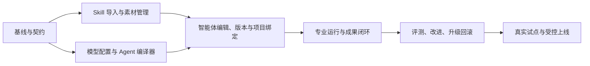

> 历史方案，仅供追溯；已被上级目录的第二版规范取代，不作为实现要求。原相对链接请从上级目录查找。

# Luna 实现计划：垂直智能体工作室

实施前置：阅读本目录全部文档。这里是可执行的阶段计划，不代表用户已批准生产部署，也不代表任何具体模型 ID 已在服务器可用。

## 0. 实施纪律与交接

设计职责由 Astra 完成。实现使用用户指定的 Luna；开始时核实实际可用的 Luna 配置，不把显示别名写死为 SDK ID。若需要修改核心对象、授权语义或流程边界，记录设计偏差和理由；不要通过悄悄减少功能或绕过门禁“完成”任务。

当前工作区已有上一轮成果归档/预览改动，涉及 `factory/control/deliverables.py`、app/service/github、RunPage/Deliverables、样式、测试和运行说明。保留这些改动，建立包含当前工作树的实现基线，不切到一个缺少它们的旧分支。不要删除或提交 `.factory-preview` 里的运行数据、恢复图片、凭据或用户下载文件。

建议交付单位是单个里程碑，每个都有可运行界面、API、测试和边界说明。若使用协作 Agent，把每个任务包限定到明确文件与验收，不能让不同实现者同时改 Service 状态机。实现者不自行推广有权限变化的共享配置。

## 1. 里程碑与依赖

M1/M2 的对象契约先在 M0 固定；它们可独立开发，但本计划不要求多 Agent 并发。首版完成定义为 M0–M5 均通过；只完成导入页面不称为专业智能体平台已完成。Windows 专用执行节点是 M6 后单独扩展，不是首版可用性的虚假承诺。

## M0：基线和兼容契约

**任务 0.1：记录当前真实基础**

- 查看 AGENTS.md、Git 差异、已有迁移、Service/ProviderRequest 和测试入口。
- 运行相关现有测试，记录基线失败；已知旧 `test_control_app.py` 两个审批测试受默认自主策略影响，在未修改版本亦失败。不得把全部失败随意归为已知问题。
- 记录当前已有成果下载能力的行为，作为后续集成验收。

**任务 0.2：固定类型与迁移规则**

新增 `factory/control/agent_contracts.py`：受严格 schema 校验的 SkillManifest、AgentSpec、RoleSpec、RoleModelPolicy、BindingSpec、EffectiveSnapshot、ValidationContract 和 ArtifactContract。API 版本 v4，旧 v2/v3 不变。

为哈希定义 canonical JSON 规范（稳定键序、UTF-8、禁止 NaN、数组顺序有意义、无时间戳/密钥值）。schema_version 与 compiler_version 独立；内容哈希不代替数据库版本号。未知字段拒绝或明确放入 metadata。

**验收**：旧请求不带 Agent 字段仍能运行；新 schema 有错误路径；哈希测试覆盖字段顺序、Unicode、数组变化与非法数值。迁移在真实旧 SQLite 副本上运行可回滚/恢复，不能只验证空库。

## M1：Skill 原包、导入与素材管理

建议模块：`skill_packages.py`、`skill_imports.py`、`skill_routes.py`；持久对象目录位于 control data 下，沿用备份约定。

**任务 1.1：原包存储和流式上传**

- 上传必须已鉴权/校验来源与 CSRF；独立限定路由接收 multipart。
- 改造 `app.py` 请求体限额逻辑，只对规定上传路由采用流式上限；普通写接口仍保持旧限制。
- 先暂存、哈希、登记导入意图，再扫描；中断无可见半成品。

**任务 1.2：确定性扫描**

- 规范化 ZIP 内 Windows 路径再做全套越界、重复、符号链接、大小、压缩比检查。
- 检查入口/YAML/相对引用，保存原包和规范化映射，不执行脚本或下载依赖。
- 按文件记录文本/脚本/其他资源、哈希、大小；不凭模型输出认可安全。

**任务 1.3：素材 UI**

“智能体 → Skill 素材”：上传、文件树、入口、引用和环境问题、版本、来源/派生 diff。可保存有阻塞项的草稿，不能把它显示成可执行。

**必测**：用户附件的 8 文件/反斜杠结构正常解析；多入口、../、C:、UNC、NUL、大小写碰撞、符号链接、压缩炸弹、重复提交、脚本自启动、未知 YAML 标签、缺引用、上传中断、越权读取。

**交付演示**：导入附件并展示未执行两段脚本，保留 name 与包名差异，生成维护用途派生草稿。

## M2：模型注册、职能策略与确定性编译

建议模块：`model_profiles.py`、`agent_compiler.py`、`role_routing.py`；扩展 runtime 路由和 UI。

**任务 2.1：版本化模型配置**

- provider connection 使用受控引用；不将凭据复制到 Agent JSON。
- 保存真实 model_id、适配器支持的参数、模型能力要求、探针状态与时间。
- 现有四档配置提供显式“继承该档”来源，不改变旧设置结构。

**任务 2.2：RoleModelPolicy 和继承解析**

- 稳定职能、首选配置、显式 fallback 列表、故障分类、attempt 限额、角色预算。
- 按 SYSTEM-DESIGN 中的顺序解析，输出每个字段来源。
- 权限交集与预算多重上限独立于模型选择；模型输出无法覆写。

**任务 2.3：Agent 编译器**

输入 Agent 草稿 + 项目绑定 + 当前可用注册表 → blockers/warnings/effective_snapshot/compiled_hash。检查所有依赖版本、引用、角色必需性、循环/节点限制、环境、模型参数与验证门禁。

程序检查无需调用大模型。可选“建议配置”作为有计费标签的只读建议，不改变编译器规则。

**必测**：继承与显式钉住、null/省略、覆盖白名单、未知 role/model option、模型停用、DSH 只读拒绝、缺验收、删除验证节点、fallback 耗尽、配置更新不改变历史快照、不同角色不能误复用 session。

## M3：专业智能体编辑、版本和项目绑定

建议模块：`agents.py`、`agent_routes.py`、`agent_bindings.py`；前端新增 `AgentsPage.tsx`、`AgentDetailPage.tsx` 与细分编辑器。

**任务 3.1：新入口与编辑器**

- 导航增加“智能体”，保留“工作能力”兼容入口。
- 提供预设用途、输入输出、职能列表、Skill 选择、模型矩阵、工具环境、验证与交付配置。
- 每个字段显示实际继承值；高级 JSON 视图可选，普通流程可通过表格完成。

**任务 3.2：版本与启用**

- 草稿 CAS；固化内容版本；评测结果匹配 compiled_hash；启用/停用独立审计。
- 在 M5 评测未完成前只允许隔离试跑，不提供假绿色“生产就绪”。
- 可从既有 Capability 指定 revision 生成草稿，原资产保持不变。

**任务 3.3：项目绑定**

- 一个项目可绑定多个 Agent，最多一个默认；使用权限继承项目分配。
- 用户新任务显式选 Agent/版本或采用已设置默认；普通工程模式保留。
- 切换版本展示影响和差异，不改运行中快照。

**必测**：并发编辑409、停用阻止新任务、旧绑定不跟随最新版、跨项目样本不可误引用、成员不能写共享配置、迁移后旧项目保持旧行为。

## M4：专业职能进入现有执行流程

建议模块：`role_execution.py`、`agent_context.py`、`tool_registry.py`、`environment_profiles.py`。修改 `service.py`、`execution.py`、`providers.py`、`sdk_worker.py`、`governance.py` 时按子任务串行集成。

**任务 4.1：运行快照与预检**

规划前解析全部内容，按本次用户/项目/环境检查；先持久保存再调模型。Run 页面显示 Agent 与版本和角色模型来源。原配置重跑/新配置重跑采用不同明确入口。

**任务 4.2：角色上下文与调度**

- 在 Task/Attempt 上保存 role_id/packet_kind，不复制全局运行状态机。
- analysis/verification 产出结构化证据；code_change 走已有工作区；artifact 走受控归档。
- 独立验证器使用新上下文，只读生产代码/数据；不能修改标准。
- 后端校验模板角色集合与必经门禁；并行/写冲突/重启/取消沿用并扩展现有检查。

**任务 4.3：受控 Skill 资源与工具**

- 快照指定的资源只读挂载，记录每次加载引用；保留 Codex 的环境 Skills/MCP 隔离。
- 注册有限格式探针/比较/构建工具；工具执行有固定输入输出、超时、资源/网络/文件范围。
- ProviderRequest 可选参数向后兼容；适配器真实映射 reasoning 等能力，未验证支持则明确拒绝。
- Windows/Ghidra 缺失返回 environment.blocked，不用普通 Python 尝试启动脚本。

**任务 4.4：预算与结果**

所有角色调用使用同一账本的唯一 call_id 预留与结算；规划/评测/修复也计费。独立工具调用记录执行成本类别，未知美元成本保留未知。取消及撤销阻止新的副作用。

**任务 4.5：专业成果**

复用 deliverables 基础，加入结构化 artifact manifest：kind、target_platform、source_run/role、validation_ref、build provenance、download/preview 能力。不要只靠扩展名声明某文件已是有效安装包。

源码归档沿用当前机制；大型输入/样例采用项目数据存储，不能把客户样本无选择地加入公开发布 ZIP。交付错误和 GitHub 错误仍独立于验证状态。

**必测**：跨职能模型实际被正确调用、错误升级只换模型不换职责、验证器不能写、文件重叠串行、分析任务不误 cherry-pick、篡改检查/样本/残差被阻止、取消/重启幂等、角色费用总和不重复、未知费用、产物可下载、发布失败仍能取成果。

## M5：评测与持续沉淀闭环

建议模块：`agent_evaluations.py`、`evaluation_routes.py`、`improvements.py`、`validation_contracts.py`。

**任务 5.1：数据集和验证契约**

- 输入/参考配对、版本、来源和哈希；测试集与优化样本分离。
- 字段比较/归一化/残差规则独立版本管理，客户参考版本显式固定。
- 测试执行使用冻结只读数据，不从可写工作区加载已被改动的门禁实现。

**任务 5.2：版本评测**

- 候选/基线在相同输入与权限下隔离运行；成本标为 evaluation。
- 报告任务正确性、关键字段、回归、工具合规、成本、时延与成果完整性；not_run 不等于 passed。
- 发布/绑定启用检查精确的评测哈希；样本不足显示证据不足。

**任务 5.3：改进候选与回滚**

- 从运行证据提出方法、Prompt、知识、样本、检查五类候选。
- 接纳操作只修改草稿；评测后可只切换试点项目。
- 记录纳入关系、拒绝理由与过期规则；回滚只切绑定，活动运行不变。

**必测**：评测重试不重复计费/派发、基准修改使旧评测失效、残差扩大不能自动通过、自我总结不能自动 ready、跨项目资料不进共享 Skill、回滚后新任务使用旧版、历史证据仍可读。

## M6：试点上线与环境扩展

先做合成样本端到端演示，再选择一个用户已授权的真实项目与参考数据。真实模型调用需使用有效配置并标注费用，不能把 fake provider 测试等同真实上线。

上线包包含代码、构建、迁移/备份/回滚说明、接口契约、演示步骤与已知限制。生产更新必须先确认真实服务器/服务/提交，保留现有环境和数据，不另起冲突服务。

后续 Windows 执行节点、GUI 参考导出、许可证设备和签名发布分别作为工具环境集成项目。远程执行需 lease、认证、受控对象传输、取消和回执；不通过 SSH 拼接任意模型文本执行。

## 2. 一次性端到端验收脚本（人工操作描述）

1. 导入用户 ZIP；看到 8 个文件、路径修正及脚本依赖说明。
2. 创建维护智能体草稿；保留原包、派生入口和差异。
3. 需求/专业分析选已配置 Astra 类模型，实现选已配置 Luna 类模型，验证选独立常规/强模型。
4. 绑定两个测试项目，分别指定不同参考版本和数据集。
5. 发起一次受控转换器缺陷任务；看到不同角色的真实调用和冻结配置。
6. 检查输出与参考匹配，并可下载源码/样例/报告；如无真实安装包，清楚显示未构建。
7. 人为制造未知差异，验证必须失败且不能由实现者修改残差自救。
8. 新增 Prompt 候选，在评测页与当前版比较；只对试点项目启用。
9. 回滚绑定；验证旧 Run 不变、新 Run 使用已回滚版本。
10. 模拟 GitHub 故障、重启、取消与预算耗尽；成果、费用与状态保持一致。

## 3. Luna 接手任务提示

你负责实现“垂直智能体工作室”，设计以本目录 SYSTEM-DESIGN.md 和 MAINTENANCE-AGENT.md 为准，按 M0–M5 顺序完成。先检查仓库当前差异并保留成果预览/下载改动。第一交付是 M0–M1；完成后报告代码变更、实际测试、界面行为、未完成项与下一阶段。不要自动部署生产，不执行上传 Skill 里的脚本，不硬编码未验证模型型号，不削弱当前 SDK 隔离。若设计与现有实现冲突，先尝试兼容扩展并记录具体证据，再提出最小设计修订。每阶段需要完整可运行功能与验证，不能用静态 UI、mock 成功、TODO 或假数据替代已经承诺的后端能力。
