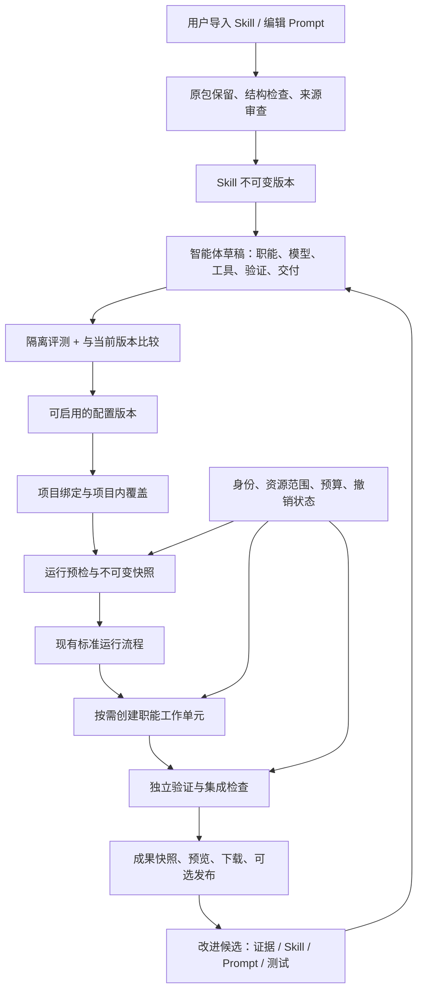

> 历史方案，仅供追溯；已被上级目录的第二版规范取代，不作为实现要求。原相对链接请从上级目录查找。

# 垂直智能体工作室：产品与系统设计

状态：待审阅设计；2026-09-09。基于本地 FastAPI / SQLite / React 工厂代码，未实施本文新增对象。

## 1. 核心需求与成功标准

用户要交给一个专业负责人持续处理某类工作。专业知识要可积累，行为要可预测，模型费用要可控制，成果要拿得到。完成一次任务不代表智能体版本可推广；创建一份配置不代表执行环境已具备能力。

成功标准：

1. 用户导入现有 Skill，能看清系统识别出的用途、文件、依赖、冲突和建议职能。
2. 用户不必编写编排代码，即可为每个职能选择模型、深度、重试/升级条件和工具范围。
3. 同一个专业智能体可绑定多个项目，每个项目保留自己的事实、数据集、参考版本与运行限制。
4. 运行采用现有标准工程流程，展示真实职能进展、检查证据、可下载成果和发布结果。
5. 新经验通过候选版本、评测、差异比较和回滚进入长期能力，不由一次成功自动推广。
6. 历史运行能查到当时实际使用的 Skill、Prompt、模型、工具、基准与例外版本。

产品不以 Agent 数量或调用次数表示能力。主要指标是验收通过率、回归逃逸率、每个成功任务成本、阻塞定位时间、成果可获取率及升级后退化率。

## 2. 现有基础与新增边界

当前 `CapabilityStore` 已有版本、项目绑定、调用和草稿提炼；内容是 instructions、输入/输出说明和 acceptance，尚无多文件 Skill 导入、专业模型矩阵、工具包运行能力及评测发布生命周期。`RuntimeSettings` 严格限定 planner/cheap/standard/strong，`ProviderRequest` 未包含独立职能、reasoning 配置或工具执行契约。

复用 Service / DurableQueue / Run / Task / Attempt / TokenCall / Event、隔离 Git 工作区、可信检查、项目知识及成果归档。新增「智能体配置与解析层」「Skill 素材管理」「评测试跑管理」。第一阶段继续单服务进程、SQLite 持久调度，不引入消息中间件或独立微服务。



### 概念边界

| 对象 | 回答的问题 | 例子 |
|---|---|---|
| SkillPackageVersion | 有什么可复用的方法和资源？ | 格式解析方法 v2、回归验证 v1 |
| AgentDefinition / AgentVersion | 谁负责哪类工作，按什么专业配置做？ | 工业格式转换维护员 v3 |
| RoleSpec | 某个工作单元承担什么职责？ | 需求分析、格式分析、实现、独立验证 |
| ModelProfileVersion | 用哪个已配置模型，具备什么调用能力？ | 团队的经济代码模型配置 v5 |
| WorkflowTemplateVersion | 哪些步骤必经，哪些分支按条件发生？ | converter-maintenance-v1 |
| ProjectAgentBinding | 这个项目使用哪个智能体版本和哪些项目设置？ | 项目 A 使用 v3，参考软件为指定版本 |
| RunSnapshot | 这一次实际解析出来的全部配置是什么？ | 明确模型 ID、Prompt 哈希、Skill 内容哈希 |
| DatasetVersion | 输入样本和参考输出是哪一批？ | 2026-Q3 回归样本集 |
| ValidationContract | 什么事实才算做对？ | 属性对比、未知字段处理、残差约束 |
| ImprovementCandidate | 哪项经验值得变成能力？ | 一个字段解码规则及对应反例 |

现有 Capability 保留为兼容接口与既有资产，不立即改名或批量重写。用户可「从工作能力创建智能体」，生成带 `source_capability_id/revision` 的草稿。旧项目继续旧流程；新项目可选择具体智能体或通用工程模式。

## 3. 产品结构与交互

### 3.1 一级入口：智能体

列表卡片显示名称、适用任务、当前启用版本、绑定项目数、最近评测、最近实际任务状态、模型费用摘要。草稿、就绪、执行环境缺失、停用是独立标签。列表不把“已有配置”统一显示成“可运行”。

详情包含：概览、职责与流程、Skills 与 Prompt、模型分工、工具与环境、验证与成果、版本与评测、运行与改进。普通视图提供预设和表格，高级视图才展示结构化配置。

### 3.2 从 ZIP 到可运行智能体

1. 上传 ZIP 或选择已有 Skill；本地目录导入走明确目录选择，不允许服务器任意路径读取。
2. 展示原包名称、声明名称、哈希、文件树、路径规范化结果、引用检查和脚本清单。
3. 程序做确定性检查；可选让 Astra 类规划模型生成「专业配置建议」，这一步有明确成本且只产草稿。
4. 用户选择用途，例如「维护已有转换器」「支持新格式版本」「旧项目现代化」，系统据此推荐 Skill 组合和必需输入。
5. 确认职责、输入、成果类型与验证条件；缺少数据集或运行环境时仍能保存草稿。
6. 按职能配置模型，显示继承来源、当前生效值、支持的参数和连接验证时间。
7. 选项目和隔离样本试跑；结果按正确性、行为边界、费用、成果完整性展示。
8. 评测满足明确门槛后形成可启用版本；管理员将具体版本绑定到项目。

不会在上传时安装依赖、运行脚本、创建远程资源或采用附件中要求的权限。原包始终保留；调整产生派生版本与可读差异。

### 3.3 从专业智能体发起任务

入口位于智能体详情「让它处理任务」及项目新建需求。输入项目、任务类型、需求、参考版本、样本与交付期望；系统只询问会影响结果的缺失项。已绑定项目自动填入默认值。

提交前提供简明卡片：将使用的智能体/版本、预期流程、关键模型、可用/缺失环境、预算、预期成果。提交后预检失败保留输入，直接链接缺失配置。无需重复确认已经在项目策略中授权的普通维护动作。

任务类型由用户选择或模型建议，后端校验；模型不能自造任意职能、任意模型或任意工具。首版允许有限已注册分支，不做任意可执行流程 DSL。

### 3.4 运行和交付

沿用需求→规划→执行→验证→交付→沉淀。阶段内显示工作单元的专业职责、实际模型和状态；区分排队、环境缺失、等待输入、执行失败、验证失败、发布失败。代码任务仍走工作区集成；只读分析单元交出证据，不生成虚假 Git 提交。

成果页按照用途展示转换样例、差异报告、代码 ZIP、安装包、兼容性说明和运行方式。安装包标注 OS/架构、构建工具版本、校验值及签名状态；未构建不能显示安装按钮。在线预览只是成果的一种展示方式，不能代替完整验证。

### 3.5 持续维护

任务结束生成改进候选：新增 Skill、Prompt 修改、字段规则、回归样本、可信检查或知识更正。候选有来源、范围和反例；管理员选择纳入哪个版本。编辑后提供影响分析：“影响哪些职能、项目、工具范围、模型与评测”。试跑当前版和候选版后展示差异，允许只为一个试点项目切换。

## 4. 配置、版本与生命周期

### 4.1 不可变版本

AgentDefinition 是稳定身份；草稿可编辑并带修订号。发布版本内容不可变，含角色、流程、Skill 版本及内容哈希、Prompt、模型选择规则、验证与交付引用。`published` 表示定义发布，用户界面称“可启用版本”，避免与成果发布混淆。

生命周期：草稿 → 检查通过 → 评测中 → 评测通过 → 可启用 → 已停用/被替代。实现中将内容版本与评测/启用记录分开存储，不覆盖不可变内容。停用禁止新运行；是否停止活动运行由明确的撤销原因及范围决定。

任何影响执行行为的修改（Skill、Prompt、模型策略、工具、基准、残差）形成新配置版本或新绑定版本；纯显示名称不改变运行内容。评测结果绑定完整解析哈希，不能给不同候选复用绿色标记。

### 4.2 解析与继承

模型值解析顺序：平台模板默认值 → AgentVersion 显式值 → ProjectAgentBinding 允许的覆盖 → 本次经授权的覆盖。全局模板仅在字段明确标记 `inherit` 时引用；版本钉住项不因平台默认更新而改变。覆盖采用字段白名单；列表完整替换，不做含糊的深层合并。`null` 不代表继承，继承为独立状态。

每个生效值记录来源：哪个版本、哪个角色、哪次覆盖及修改人。项目可以收紧预算/并发/权限；扩大权限必须形成受控绑定更新，不能靠运行输入实现。

权限上限采用交集：平台允许范围 ∩ 用户/项目授权 ∩ 智能体工具契约 ∩ 本次任务范围。授权撤销在每次派发及副作用前重新检查，冻结快照不冻结对已撤销权限的使用权。预算按多个适用上限同时满足。

### 4.3 冻结与重跑

开始规划前冻结 effective_agent_snapshot：Agent/绑定/流程/Skill/Prompt/模型/验证/数据集/交付版本、内容哈希、编译器版本、实际参数、环境要求、继承来源。快照不能只保存“latest”。模型提供方可能升级内部实现，因此承诺可审计与受控重跑，不承诺模型输出逐字确定。

原配置重跑复制冻结内容但重新检查权限和环境；使用新版本重跑创建新 Run 并关联来源，展示配置差异。断点续作只恢复明确可重做的阶段；不得默认重放发布或其他外部写入。

## 5. 职能与大模型配置

### 5.1 职能不等于模型档位

RoleSpec 包含稳定 role_id、职责、输入/输出模式、执行模式（analysis/code_change/verification/artifact）、挂载 Skill、Prompt、可用工具、模型策略、资源约束及必需性。职能名可以自定义，执行模式必须来自后端支持的集合。

首版默认职能：需求与方案、专业分析、开发实现、独立验证、交付整理、经验整理。专业分析只在业务需要时启用；交付打包与确定性检查由程序完成；经验整理可以延后，不能阻塞已经完成的成果交付。

### 5.2 模型配置表

每行一个职能，显示：

- 服务商连接引用、模型配置版本、实际模型 ID；用户自定义显示名与真实 ID 分开。
- reasoning/思考深度（仅在该适配器已验证支持时显示）、输出上限、单次超时。
- 首选模型、最多尝试次数、升级顺序、可重试故障类型、总角色预算。
- 所需能力：结构化输出、只读执行、工具调用、图像输入、最大上下文等。
- 连接状态和能力探针分别显示：已保存 ≠ SDK 已安装 ≠ 凭据存在 ≠ 模型可调用 ≠ 所需工具可用。

本次平台建设采用用户要求的 Astra 设计、Luna 实现；这是本次开发分工。平台默认专业智能体也可以推荐这种配比，但不硬编码不存在的服务端模型 ID。

### 5.3 兼容现有四档模型

旧 Run 继续 `planner/cheap/standard/strong`。新增独立的 model_profiles 与 role_model_policy，不将专业职能塞进 cheap/standard/strong 名称。兼容解析器可显式把新职能继承映射到旧四档，然后冻结得到的 provider/model。

第一阶段 RoleExecutionContext 提供 `role_id + selected_profile + effective_model_options`；`select_profile` 保留旧入口，新增 `select_role_model`。执行器从后端校验的 role_id 获取模型，而不是从模型输出直接使用 provider/model 字段。

`ProviderRequest` 增加可选结构化 model_options、role_execution_id 和工具契约引用，默认值保持旧调用兼容。适配器显式声明支持参数；不支持的 reasoning 或工具模式阻断启用，不能静默忽略。DSH 现有只读能力未经验证，不能承接只读规划/独立验证。

### 5.4 升级与故障处理

网络超时：同配置有限重试；额度/凭据失败：暂停并提示配置，不通过换模型掩盖。验证发现可修复业务错误：按该职能的显式升级链；数据缺失/真值冲突/权限不足：等待对应输入，不升级烧钱。整个角色最多尝试数含所有档位，每次升级保留原因、配置和成本。

基线建议：实现最多 2 次，必要时显式第 3 次强模型；验证器不负责无限修复。具体预算由实际模型可用性和试跑成本校准，不在设计里伪造价格。

## 6. 运行引擎与工具环境

### 6.1 工作单元

扩展现有 Task，加 role_id、packet_kind、输入/输出引用、验证契约引用、资源要求。单元之间通过确定性产物/证据引用交接，避免复制整段对话。验证器读取需求、基线、差异、样本、标准和必要工具输出，不依赖实现者的自我评价或隐藏推理。

每次角色切换启动独立上下文；同职能可在同一尝试内保留 session，跨版本/权限/项目不得复用旧 session。只读分析单元不会进入代码 cherry-pick；代码单元继续现有工作区验证与集成；打包由固定构建检查执行。

### 6.2 固定流程与分支

首版 WorkflowTemplate 为版本化的后端注册模板，具有输入 schema、允许职能、阶段、必需门禁和条件分支。模型只能在模板允许范围内建议任务 DAG。后端限制最大节点数、深度、允许角色、必需验证和交付，检测环和缺失依赖；不能删掉门禁。

保持重叠写范围串行、独立只读分析可并发。参考软件 GUI 任务对相同桌面/许可证会话串行。每个 Task 一份 lease 和 attempt_id；重启后核对 lease、取消状态、工作区、已完成产物与结算，不盲目重派。

### 6.3 Skill 加载与工具执行

用程序按 role + task_type 选择本次 Skill 的精简索引；激活时读取其入口，按需挂载引用文件，保留加载事件和内容哈希。首版显式绑定优先，语义推荐仅建议，不自动启用陌生 Skill。

当前 Codex 适配器刻意隔离环境中已有 Skills/MCP；Claude 只开放受限文件工具。不能为接入新 Skill 而恢复全局插件和全部机器权限。使用本次快照构建只读资源目录，提供精确引用；脚本经注册工具包装或可信检查运行。

ToolSpec 包含 tool_id/version、输入输出 schema、固定入口、依赖镜像/运行时、文件读写范围、网络域名/访问模式、超时/CPU/内存、输出限额和副作用类型。Skill 内的 allowed-tools 仅是需求声明，不构成平台授权。

对比器、格式探针、构建命令、解包器各是窄工具；不提供默认“执行任意脚本”能力。允许管理员注册项目已授权的命令，但固定入口和参数 schema，不能由需求文本拼接 shell。

### 6.4 执行环境

预留 ExecutionEnvironmentProfile：OS/架构、工具链版本、容器或本地执行标签、网络/挂载策略、GUI/许可证需求、验证时间。首版使用现有宿主上已验证的本地执行器；不宣称已有分布式 Windows 节点。

含 Ghidra、ILSpy、参考商业软件或硬件锁的任务先检查环境要求。未满足则状态为“缺少执行环境”，可以继续不依赖该环境的分析/代码工作，但最终验证不能标为完整通过。环境扩展放在独立阶段，复用工作单元协议而不重做 Agent 管理。

## 7. Skill 导入和附件边界

原 ZIP 写入受控对象存储后计算哈希。先遍历目录再解包：拒绝绝对路径、驱动器/UNC、..、NUL、符号链接、重复路径和大小写/Unicode 规范化冲突；将 Windows 反斜杠按包格式转为正斜杠后再次校验。支持根目录 SKILL.md 与单包装目录，多个入口要用户选择，不能随机选一个。

建议初始限额：压缩包 20 MiB、解压总计 100 MiB、500 个文件、单文档 2 MiB、压缩比 100:1；均作为可配置服务限制而非 Skill 自身可调整。二进制样本走独立 Dataset 上传，不塞进 Skill 包。拒绝嵌套归档的自动解包和依赖自动安装。

解析 YAML 用 safe loader；检查 name/description 和相对引用，保留额外元数据。目录名不匹配时提供规范化预览而不是悄悄改名。保留原包、原始路径映射、文件哈希和许可证文本；`仅供学习研究用途` 是原声明，不能据此宣称已具备商业再分发授权。

结构扫描和模型审查分开。结构通过仅说明可解析；模型审查只能产生 finding 与建议，不能认证脚本安全。文档冲突、适用范围过宽和需要特殊授权的模块形成具体审阅项。派生版本修改入口并保留 diff，不直接删除原始资料。

HTTP 上传要采用独立 multipart/流式路由，在鉴权和 CSRF 验证后限额读取。现有中间件统一 1 MiB 缓冲请求体，必须针对明确上传路径改为流式限额，不能全站放宽或先完整读入内存。下载/资源读取校验项目范围，防止以文件 ID 绕过绑定。

## 8. 项目知识、样本与经验沉淀

四种记忆分开：

- 通用方法：Skill；可跨项目复用，不带客户样本、私钥、目录绝对路径。
- 项目事实：格式版本、客户配置、历史决策；按项目可追踪来源。
- 数据集：原输入、参考输出、工具版本、导出参数、来源、文件哈希；访问受项目授权控制。
- 运行状态：计划、检查点、产物、预算、待解问题；服务重启/上下文压缩后恢复。

改进候选状态：proposed → reviewed → included / rejected / deferred。成功任务不能自动把总结变成启用的 Skill。重复失败优先沉淀为工具检查、测试或数据约束，Prompt 仅承担无法机械化的判断指引。

候选必须说明适用范围、证据、已知反例与回归用例。一个项目验证过的规则先留项目作用域，跨项目推广必须增加对应证据。样本更新、残差登记和 Skill 更新有独立版本链，避免一份巨型文档承载全部状态。

## 9. 验证与版本评测

### 9.1 两类验证

任务验证回答“这次产出是否满足本次需求”；Agent 版本评测回答“这次配置升级是否可靠”。二者共享执行与证据基础，但 EvalRun 有独立数据集、计费标签和报告，不混入客户项目交付数。

每个评测任务使用隔离工作区和固定输入，比较当前版本与候选版本，记录完整解析配置。昂贵参考软件输出优先使用有版本来源的冻结真值；必须实时验证时记录环境和执行日志。

### 9.2 首个领域门禁

格式识别/解析完整性 → 节点和记录覆盖 → 字段语义/单位/编码 → 十进制数值规则 → 排序/关联一致性 → 已登记例外 → 完整回归。参考输出本身也要验证自洽与版本匹配。

残差规则必须包含字段路径、输入范围、参考版本、原因、证据、允许差异形式/上限、作者和版本。不能把所有小于 1e-6 的差异统称浮点噪声，不能用整体 99.97% 掩盖关键金额/单位错误。未知格式版本、未知必需字段或未登记差异默认验收不通过。

### 9.3 首版启用门槛

确定性检查全部满足、关键字段无新增错误、所有例外均匹配已冻结规则、历史必过样本无回归、权限/隔离测试全过、完整成果可获取、没有未知费用被写成零。任务成功率和成本/耗时阈值由基线实测配置；样本量不足显示“证据不足”，不自动认定优于旧版。

保留未参与 Prompt 调整的测试集，避免同一批样本既优化又验收。对非确定性模型至少记录试跑次数与分布；初期关键案例重复试跑，不能用单次胜出自动推广。

## 10. 数据模型与 API 契约

建议新增下列表；配置子结构保留在受 schema 校验的 JSON 内，不为每个 Prompt 段落建表。

| 表 | 主键/关键字段 | 不变量 |
|---|---|---|
| skill_packages | id, scope, owner, display_name | 稳定身份，不用 name 当唯一身份 |
| skill_versions | package_id, revision, blob_hash, manifest, review_status | 发布内容不可变，审查记录独立追加 |
| skill_imports | id, actor_id, raw_blob_hash, status, findings | 上传重试幂等，不执行包内程序 |
| agents | id, workspace_id, owner, display_name, active_version | 名称变化不改变身份 |
| agent_versions | agent_id, revision, spec, compiled_hash | 显式引用全部依赖版本 |
| agent_drafts | agent_id, draft_revision, spec | 乐观锁编辑，不覆盖他人更改 |
| project_agent_bindings | id, project_id, agent_id, binding_revision, spec | 每项目可绑定多个，默认项最多一个 |
| model_profiles / model_profile_versions | id/revision, provider_connection_ref, model, options, required_features | 不存明文密钥 |
| datasets / dataset_versions | id/revision, project_id, manifest_hash | 原样本和参考输出不可变 |
| agent_evaluations | id, candidate_hash, baseline_hash, dataset_version, state, report_ref | 结果不跨配置复用 |
| improvement_candidates | id, source_run_id, target_scope, proposal, state | 来源与接纳记录可追溯 |
| agent_audit | event_id, actor, entity_ref, action, payload | 追加写 |

Run 增加可空 `agent_snapshot`、`run_kind`（project/evaluation）与 `source_eval_id`；Task/Attempt 增加可空 `role_id`、`packet_kind`、模型配置来源；TokenCall 增加 role_execution_id / agent_version / eval_id 作为标签，不能另造一套重复计费账本。已有无 Agent 的行保持可读可运行。

### API 首版

| 路由 | 行为 |
|---|---|
| POST /api/v4/skill-imports | 流式上传；返回 import_id 和 queued 状态 |
| GET /api/v4/skill-imports/{id} | 检查结果、文件树和路径映射 |
| POST /api/v4/skill-imports/{id}/accept | 根据显式审阅结果建立草稿 SkillVersion |
| GET /api/v4/skills, /skills/{id}/versions/{revision} | 读取素材与具体版本 |
| POST /api/v4/agents | 建立身份与草稿，可引用既有 Capability |
| PUT /api/v4/agents/{id}/draft | CAS 更新，要求 expected_revision |
| POST /api/v4/agents/{id}/compile | 确定性解析，返回 blockers/warnings/effective_spec_hash |
| POST /api/v4/agents/{id}/evaluations | 幂等启动指定候选的试跑 |
| POST /api/v4/agents/{id}/versions | 固化明确草稿与评测哈希对应的可启用版本 |
| POST /api/v4/projects/{pid}/agent-bindings | 绑定具体版本/允许覆盖；CAS 切换 |
| POST /api/v4/agents/{id}/runs | 校验项目授权与绑定版本，复用 Service 创建运行 |
| GET /api/v4/runs/{rid}/agent-snapshot | 展示生效配置及来源，不含密钥 |
| POST /api/v4/improvements/{id}/include | 形成草稿变更，不直接更新启用版本 |

分页列表返回 items/next_cursor；错误统一 code、message、field_path、remediation、retryable。创建/试跑/绑定切换支持请求幂等键；版本冲突返回 409。参数必须明确 revision，不接受执行时隐含 latest。

### 事务与对象存储

先写暂存对象并 fsync/校验哈希，再以事务写入可见元数据；成功提交后才可下载引用。失败暂存标记可清理；垃圾回收仅清理无引用且过保留期的对象，不删除历史运行、评测或启用版本引用。数据库备份须包含 blob 引用清单与对象存储。

调度与版本发布用短事务，模型调用和 ZIP 扫描放在事务外。评测先落持久意图再派发，恢复规则与普通运行一致。启用版本切换是 CAS 更新绑定；回滚切回旧版本，活动运行保持原快照。

## 11. 权限、费用与可观测性

首版不宣称多租户隔离：现有产品是可信团队共享工作台。新增管理动作管理员可写；成员可使用分配项目上已启用的智能体，不能导入任意脚本、修改工具授权或启用共享版本。新增样本必须按项目执行授权限制访问；旧记录共享可读的边界在 UI 与文档说明，不以新增 Agent UI 伪装改变。

每次模型派发复用现有原子额度预留，覆盖导入建议、规划、实现、验证、修复和评测。一个 model call 一个账本 ID，多标签聚合不会重复计费。确定性检查只记录耗时/资源；美元价格未知时沿用现有有界策略和显式标记，不承诺实时硬封顶。

事件最低集合：skill.imported/scan_completed/reviewed；agent.compiled/version_created/binding_changed；role.started/model_selected/completed/failed；skill.loaded/tool.denied/environment.blocked；evaluation.completed；improvement.proposed/included；artifact.created/validation.failed。事件含引用和摘要，大输出入对象存储，不保存隐藏思维链。模型选择界面展示规则与理由，不把内部推理当证据。

运行看板增加 Agent/版本/职能筛选；费用页按 Agent/职能/项目/普通运行或评测拆分；故障摘要优先显示最近阻塞事件，完整日志另行分页。

## 12. 首版验收与发布策略

必须演示：导入本次 Windows 路径 ZIP；识别两个特殊环境脚本；保存派生专业配置；职能使用不同模型配置且快照可追踪；同一 Agent 绑定两个项目且样本不混用；一次转换器维护试跑输出代码、样例与差异报告；改变 Prompt 产生候选并比较；切换新版本后旧 Run 不变；回滚恢复旧绑定；发布 GitHub 失败仍能取成果。

必须故障测试：恶意路径/归档膨胀、缺引用、配置版本冲突、模型不可用、DSH 只读不支持、未知 reasoning 参数、Skill 请求越权、修改参考数据、偷偷扩大残差、预算并发抢占、重启重复派发、取消后新工具调用、评测失败却启用、对象写失败与下载权限。

先对内部合成样本启用；再绑定一个实际维护项目；通过受控试跑后扩展。默认专业配置不改变旧项目行为。生产部署沿用既有服务与备份/回滚流程，单独核对实际运行的提交和环境。

## 13. Prompt 组装、冲突和上下文预算

Prompt 采用可版本化段落：职责、适用任务、领域方法、输出契约、证据规则。编辑器分别呈现，不让用户把所有内容堆进一个无结构长文本。每段保留来源、作用职能和修改说明；“新增 Prompt”默认是添加/替换指定段落，不能从字符串出现顺序隐式推断覆盖。

组装器使用稳定顺序：平台执行规则 → 已批准的 Agent/Role 任务契约 → 本角色 Skill 索引和按需方法 → 当前计划/输入范围 → 项目事实和引用资料 → 最近工具观察 → 当前用户需求及补充。用户在本次任务中明确的业务目标优先于 Skill 的默认业务偏好；身份、授权和系统强制限制由代码独立执行，不交给 Prompt 文本裁决。

导入原文、网页、样本内容与工具结果在明确的数据边界中提供。被审阅并显式绑定的方法才成为该角色的工作指导；即使指导中写“调用另一个模型/跳过检查”，也不能改变编译快照和程序门禁。多个 Skill 对同一结果规则冲突时，编译器显示涉及文件/段落并要求显式选择契约；模型可以解释冲突，不能自行静默选择更宽松规则。

稳定规则、工具 schema 与 Skill 内容按固定顺序构成缓存前缀，时间戳、运行 ID、最新日志放在动态部分。不承诺供应商跨请求一定缓存；记录实际 cached_input_tokens 和前缀哈希。大型二进制/对比报告留在数据存储，模型只获取索引、统计及必要片段。

每个 RoleSpec 设置 context_budget、tool_output_limit 与 compaction_trigger；初始阈值可采用适配器可用窗口约 70% 触发，但必须留出输出和工具观察预算，并通过实际试跑调整。摘要包含目标、硬约束、当前计划、已加载 Skill 引用、证据/产物哈希、未解问题、失败尝试、剩余预算、权限状态和下一步；不摘要隐藏思维链。恢复时从数据库重新读取真实预算/撤销状态，不能相信旧摘要中的授权和余额。

## 14. 配置示例与角色工作单元契约

下面是逻辑配置示例，Profile 名为待绑定的注册表引用，不是可直接调用的模型 ID；Luna 应将其转为 M0 中严格定义的 schema，不直接把 YAML 作为执行代码。

```yaml
schema_version: 1
agent_key: legacy-industrial-maintainer
workflow_ref: converter-maintenance-v1
skills:
  - package_ref: industrial-format-analysis
    revision: 1
    content_hash: required-at-compile
roles:
  format_analyst:
    mode: analysis
    required_when: format-version-support
    model_policy:
      primary_profile_ref: team-strong-analysis
      profile_revision: 1
      max_attempts_total: 2
      escalation: []
    tools: [format-probe-v1, read-sample-fragment-v1]
    output_schema_ref: format-findings-v1
  implementer:
    mode: code_change
    model_policy:
      primary_profile_ref: team-economical-code
      profile_revision: 1
      max_attempts_total: 2
      escalation:
        - on: repairable-verification-failure
          profile_ref: team-standard-code
          profile_revision: 1
    tools: [workspace-edit-v1, project-check-v1]
    output_schema_ref: code-change-v1
  verifier:
    mode: verification
    separate_context: true
    model_policy:
      primary_profile_ref: team-independent-review
      profile_revision: 1
      max_attempts_total: 1
      escalation: []
    tools: [read-diff-v1, frozen-dataset-compare-v1]
    output_schema_ref: verification-report-v1
validation:
  contract_ref: industrial-converter-validation
  revision: 1
  mandatory: true
artifact_contract:
  required: [source-package, conversion-report, compatibility-matrix]
  conditional:
    installer: when-requested-with-supported-platform
```

每个工作单元的持久描述至少含 packet_id、run_id、role_id、attempt_id、dependencies、objective、input_refs、expected_output_schema、allowed_tools、declared_write_paths、validation_contract_ref、model_selection、deadline、budget_reservation_ref、snapshot_hash。

完成回执至少含 status、artifact_refs、evidence_refs、check_results、unresolved、usage_call_ids。输出 schema 不合法进入可解释失败；找不到文件、哈希不匹配或检查没运行时不能标 completed。角色层 completion 与 Run 层全部目标完成分开，所有必需角色和门禁满足后才进入可交付状态。
